# How it works

Every diagram on this page is drawn from the code on `main`, not from the design's intentions. Where the code has a known bug that changes what an edge does, the edge says so and links the issue. A diagram that documents behaviour the code does not have is worse than no diagram, so anything unverified is left out.

Each diagram carries the shape; the table beside it carries the detail, because a table is checkable in a way a diagram is not.

## The one idea to hold on to

**Loops live across ticks; state lives on the pull request.**

A **tick** is one run of one flow over one pull request. Inside a tick, a flow reads GitHub, decides, writes at most a comment, a label, a review, or a merge, and exits. It keeps nothing. Every value a decision depends on is either read from the pull request in that same tick or derived from what was read and then thrown away.

So the machines below have no memory of their own. A "state" is an observable tuple on the pull request, re-derived from scratch on the next tick. That is why so many edges in the diagrams cannot happen inside one tick at all: they need the flow to run again, against a pull request that something else has changed in the meantime.

### Reading the diagrams

| convention | meaning |
|---|---|
| an unprefixed edge label | happens inside a single tick |
| an edge label starting `tick+1` | **cannot** happen inside a tick; the flow has to run again |
| a thick border | terminal by design: the machine is finished, correctly |
| a dashed border | terminal only because a human has to act; nothing in the code will move it |
| `H` | the head SHA read at the start of the tick, and the only SHA that tick will act on |

### The observable state tuple

Every field a decision reads, where it comes from, and who reads it. Nothing here is stored by this package.

| field | read from | read by |
|---|---|---|
| `state` (open / closed / merged) | `getPullRequest` | every operation, first thing it does |
| `draft` | `getMergeability().draft`, or `.state === "draft"` | `stabilize`, `expedite`, `approveDependencyUpgrade` |
| `headSha` (`H`) | `getPullRequest().headSha` | everything; pinned for the whole tick |
| `mergeableState` | `getMergeability().state` | `stabilize`'s own switch, and gate rail 4 |
| `baseRef` | `getMergeability().baseRef` | the branch-protection lookup |
| `labels` | `getPullRequest().labels` | `requestPeerReview` (the `ai-review` trigger), `claimReview` (skill labels) |
| requested reviewers (users, teams) | `listRequestedReviewers` | `requestPeerReview` idempotency, gate rail 7, `watchAndReReview` |
| reviews: author, state, `commitId`, `submittedAt`, body | `getReviews` | gate rails 5 and 7, `watchAndReReview`, `completeReview`, `enrichReview` |
| checks | `getChecks(H)` | gate rail 3, and rail 5 through `protectionSatisfied` |
| protection (`none`, `unknown`, or a summary) | `getBranchProtection(baseRef)` | gate rail 5, and the required-context list for rail 3 |
| open security alert count (a number, or `null`) | `listOpenSecurityAlertCount(repo)` | gate rail 6. Repository-wide, not per pull request |
| changed files with additions and deletions | `listPullFilesDetailed` | gate rails 1 and 2, `classifyDependencyUpgrade` |
| claim markers | issue comments matching `agent-review:claim` | `claimReview`, `completeReview`, `enrichReview` |
| proposal markers | the acting login's own comments matching `agent-review:action` | `postProposal` |
| `autonomy` | the tick's own argument | gate rail 8 |

---

## 1. The three flows

### pr-requester

One tool call per step, in order: `pr_stabilize`, then `pr_expedite`, then possibly `pr_request_review`. `discover.mjs` selects with `gh pr list --author @me --state open` and skips anything whose `isDraft` is true.

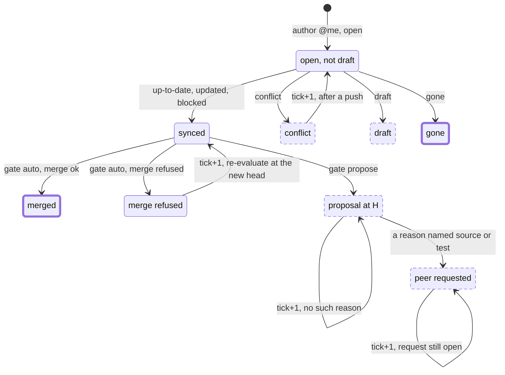

The single most surprising edge is the self-loop on `proposal at H`. `stabilize` reports `blocked`, `expedite` reports `already-proposed`, `pr_request_review` is skipped, and the flow reports `{"stabilize":"blocked","expedite":"already-proposed","requested":"skipped"}`. That is a fixed point that produces no merge, no reviewer, and no attention line, for as long as the head does not move.

| stabilize | expedite | does step 3 fire? | reported | next tick |
|---|---|---|---|---|
| `gone` | skipped | no | `gone / skipped / skipped` | not discovered again |
| `draft` | skipped | no | `draft / skipped / skipped` | filtered out at discovery |
| `conflict` | skipped, reported as `escalate-human` | no | `conflict / escalate-human / skipped` | identical every tick until the author pushes. Loud: the summarizer raises it |
| `up-to-date`, `updated`, or `blocked` | `merged` | no | `… / merged / skipped` | gone |
| same | `proposed` or `already-proposed`, and a reason begins `not auto-eligible:` naming source or test | **yes** | `… / … / requested` or `already-requested` | re-requested on the next tick, see the gap below |
| same | `proposed` or `already-proposed`, no such reason | no | `… / … / skipped` | fixed point, and silent |
| same | `blocked` | no | `… / blocked / skipped` | retried next tick |
| same | `not-eligible` | no | `… / not-eligible / skipped` | reachable only on a race, since `stabilize` returns `gone` or `draft` first |

:::caution Known gaps on this diagram

- **Only rail 1 reaches a human.** `instructions.md` step 3 requests a peer review only when a gate reason begins with `not auto-eligible:` and names source or test paths, and rail 1 is the only rail that produces that prefix. A failure of rails 2 to 7 or 9 yields no merge, no reviewer, and no attention line: [#51](https://github.com/input-output-hk/agent-peer-review/issues/51).
- **The self-loop on `peer requested` is not really idempotent across ticks.** `requestPeerReview` returns `already-requested` only while a target reviewer still holds an *open* request, and submitting a review clears that request natively. So the tick after the peer answers re-requests, with no push in between: [#52](https://github.com/input-output-hk/agent-peer-review/issues/52).
- **`stabilize = updated` moves `H` inside the tick.** `expedite` re-reads the pull request, so it evaluates the new head and `postProposal` deletes the proposal at the old one. Nothing else is re-pinned.
- **A non-allowlisted bot's pull request reaches no flow at all.** The requester filters on `--author @me`, the steward on its dependency-bot authors, and the reviewer needs someone to have asked already: [#51](https://github.com/input-output-hk/agent-peer-review/issues/51), item 5.
:::

### pr-reviewer

`discover.mjs` unions two GitHub searches, `review-requested:@me` and `reviewed-by:@me`, over open pull requests only. An item in both buckets is classified `requested`, because "a live request outranks a follow-up".

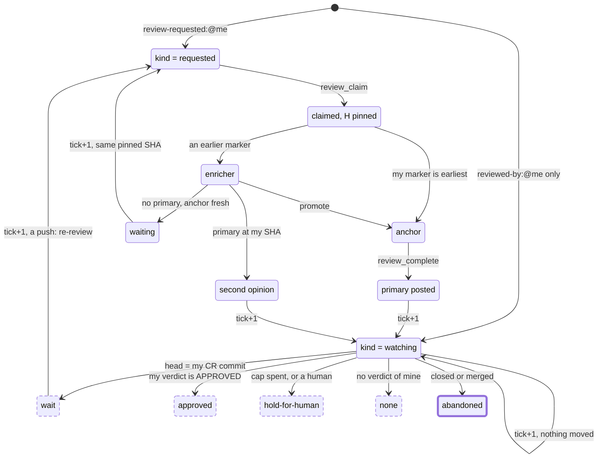

`kind = requested`, per tick:

| role from `claimReview` | call | what is written | next tick |
|---|---|---|---|
| `anchor` | `review_complete` | a review at the **pinned** SHA, tagged with the primary marker; then every one of my claim markers is deleted | `reviewed-by:@me` puts it in `watching` |
| `enricher`, a primary exists at my pinned SHA | `review_enrich`, status `enriched` | a `COMMENT` review at the primary's commit; my markers deleted | `watching`; `pr_watch` then answers `none` forever, since a `COMMENT` carries no verdict |
| `enricher`, no primary, the anchor's claim is under 30 minutes old | `review_enrich`, status `waiting` | **nothing at all** | the request is still open, so `requested` again, at the same pinned SHA |
| `enricher`, no primary, the anchor's claim is over 30 minutes old and I am the earliest survivor | `review_enrich`, status `promote` | the stale anchor's marker is deleted | I call `review_complete` at my pinned SHA |

`kind = watching`, per tick. This is `watchAndReReview` exactly, and it writes nothing:

| state | action | why it is where it is |
|---|---|---|
| not open | `abandoned` | terminal, correctly |
| no reviews of mine | `none` | not reachable from the flow: `reviewed-by:@me` is how the item got here |
| reviews of mine, none `APPROVED` or `CHANGES_REQUESTED` | `none` | terminal in practice. An enricher's `COMMENT`-only history never escapes this |
| latest verdict `APPROVED`, `commitId === H` | `approved` | fixed point while `H` holds |
| latest verdict `APPROVED`, `commitId !== H` | `approved`, with "the head has since moved" in the reason | terminal: the new code is never reviewed. See the gap below |
| latest verdict `CHANGES_REQUESTED`, `commitId === H` | `wait` | fixed point until the author pushes |
| latest `CHANGES_REQUESTED`, `commitId !== H`, my review count at or over the cap | `hold-for-human` | terminal: the count only grows |
| latest `CHANGES_REQUESTED`, `commitId !== H`, under the cap, a human is in flight | `hold-for-human` | terminal: nothing removes a review, so this never clears |
| latest `CHANGES_REQUESTED`, `commitId !== H`, under the cap, no human | `re-review` | a full claim / review / complete round |

The round cap is tested **before** the human-in-flight test, so an agent that has spent its rounds hands over for that reason whether or not a human happens to be looking.

:::caution Known gaps on this diagram

- **The round cap is unreachable from the `requested` branch.** `DEFAULT_MAX_REVIEW_ROUNDS` (3) lives only in `watchAndReReview`, and `discover.mjs` classifies an item present in both buckets as `requested`. A standing request therefore keeps the item off the branch that would stop it: [#52](https://github.com/input-output-hk/agent-peer-review/issues/52).
- **The cap counts reviews that carry no verdict.** `watchAndReReview` counts every review by the acting login, `COMMENTED` included, which is exactly what an enricher's second opinion is. Two second opinions plus one verdict exhaust a cap meant for three rounds: [#52](https://github.com/input-output-hk/agent-peer-review/issues/52), item 3.
- **A claim marker is a permanent pin.** `claimReview` reuses an existing marker's SHA and nothing re-pins it; only completing or enriching deletes one. A `waiting` enricher therefore re-claims the same commit indefinitely, and a review posted at a commit the branch has left reads to `pr_watch` as an author push, which starts another round with no author action: [#52](https://github.com/input-output-hk/agent-peer-review/issues/52), item 2.
- **`approved` with a moved head has no attention line.** `summarize.mjs` raises `hold-for-human`, any `error`, and `verdict = request-changes`. Not `approved`, and not `none`: [#53](https://github.com/input-output-hk/agent-peer-review/issues/53).
- **An unlisted agent login pins `hold-for-human` permanently.** Identity comes only from `knownAgentLogins`; anything else is a human, and a GitHub review is permanent history, so the rail can never clear: [#51](https://github.com/input-output-hk/agent-peer-review/issues/51), item 4.
:::

### pr-steward

One tool call, `pr_approve_dep_upgrade`, and nothing else. `discover.mjs` runs `gh pr list --author <bot> --state open` per configured bot author (default `app/dependabot`) and skips drafts.

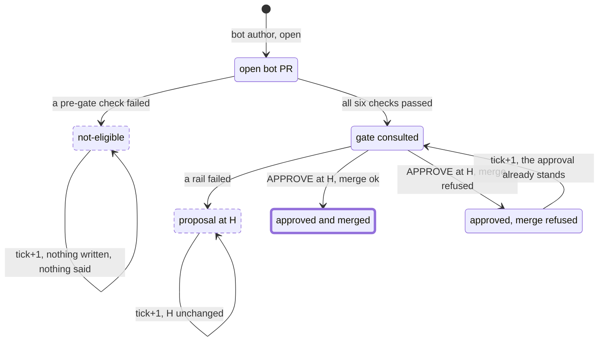

The six pre-gate checks, in the order the code applies them. Every one of them writes nothing:

| check | fails to |
|---|---|
| the pull request is open | `not-eligible` |
| `pull.author` is in `botAllowlist`, compared as an exact string | `not-eligible` |
| `getActorType(author) === "Bot"` | `not-eligible` |
| not a draft | `not-eligible` |
| `classifyDependencyUpgrade(files).eligibleShape` | `not-eligible` |
| the semver level is `patch` or `minor`, so not `major` and not `unknown` | `not-eligible` |

Per tick:

| action | next tick | is anyone told? |
|---|---|---|
| `approved-and-merged` | gone | counted in the summary |
| `proposed` / `already-proposed` | fixed point while `H` holds | counted only |
| `not-eligible` | **fixed point forever**, for a major bump or a non-allowlisted author | counted only, **no attention line** |
| `blocked` | re-evaluated; the approval submitted at `H` still stands | attention line raised |

:::caution Known gaps on this diagram

- **A bot author reaches the code under two name shapes.** `pulls.get` can report `app/renovate`, while `DEFAULT_BOT_ALLOWLIST` holds `renovate[bot]`, and the allowlist test is an exact string compare. Discovery finds the pull request and the operation refuses it on every tick, writing nothing: [#50](https://github.com/input-output-hk/agent-peer-review/issues/50).
- **Rails 4 and 5 are both unsatisfiable for this operation on a protected repository.** Rail 5 wants `approvalsByOthers >= requiredApprovingReviewCount`, which cannot hold *before* the approval this operation would add. Rail 4 wants `mergeableState === "clean"`, and a protected pull request whose required review is missing reports `blocked`. So the `auto` path never fires on exactly the repositories that need it: [#48](https://github.com/input-output-hk/agent-peer-review/issues/48), with the rail-4 half in flight as PR [#49](https://github.com/input-output-hk/agent-peer-review/pull/49).
- **The default size caps reject real lockfile bumps.** `DEFAULT_GATE_POLICY` is 10 files and 200 changed lines, and `pr_approve_dep_upgrade` exposes no policy override. A pnpm or npm lockfile bump routinely exceeds that: [#48](https://github.com/input-output-hk/agent-peer-review/issues/48), item 2.
- **`blocked` hides a standing approval.** The `APPROVE` review is submitted at `H` *before* `mergePull` is attempted, and a refused merge returns `blocked` with a merge-refusal reason. The approval it just wrote is not mentioned in the result.
:::

---

## 2. The operations and their status unions

Five operations decide something. Their status unions are the whole vocabulary the flows reason in, so every value here is a value some `instructions.md` branches on.

No operation throws for a *policy* outcome: every "no" is a status with a reason. A thrown error means the outcome is genuinely unknown, which is why the merge and approve calls are deliberately not caught: a write that is retried can succeed on the server and still surface as an error, so the flow above must re-read state rather than assume nothing happened.

### stabilize

The only operation that writes without consulting the gate. Its one possible mutation is `updateBranch`, merging the base *into* the pull request's branch.

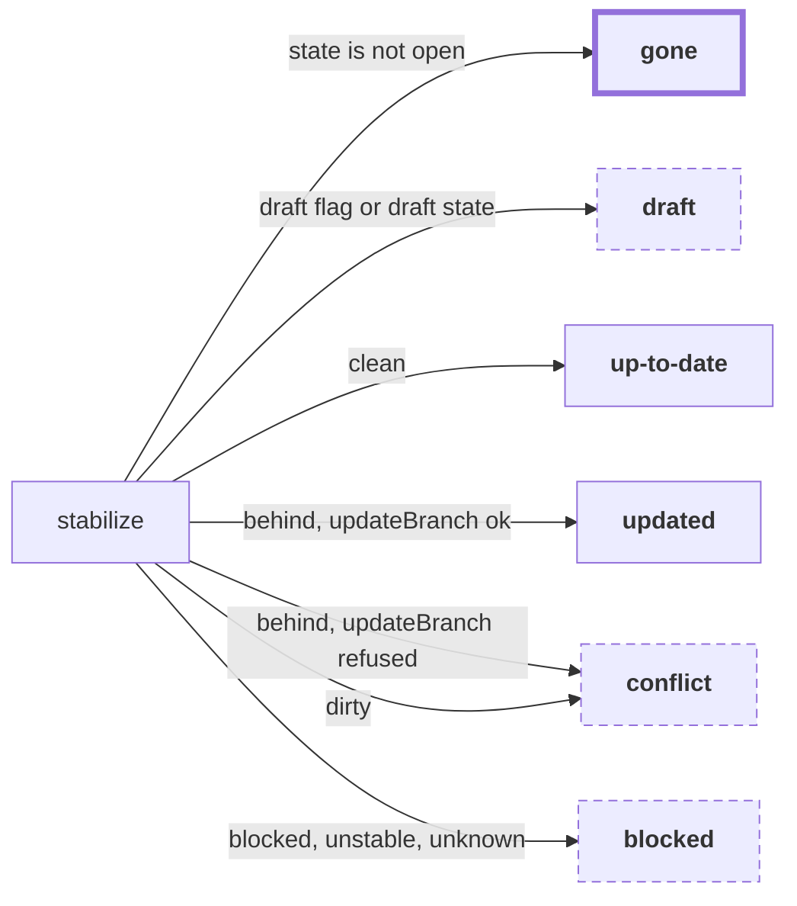

| status | means | exit |
|---|---|---|
| `gone` | closed or merged: nothing left to do with it, ever | none. Terminal |
| `draft` | the author's own "not ready" marker. Nothing is done, not even a base sync | the author marks it ready |
| `up-to-date` | in sync with its base, and mergeable | continue to `expedite` |
| `updated` | the branch was behind and has been updated, so `H` has advanced inside this tick | continue to `expedite`, at the new head |
| `conflict` | conflicts only the author can resolve, or the head moved during the update | the author pushes |
| `blocked` | **open and healthy**, but in a mergeable state syncing cannot change | a review, a check, or GitHub finishing its computation |

`blocked` and `gone` are deliberately separate and must never be conflated. On a protected repository, `blocked` is the everyday state of a pull request whose required review has not been submitted yet, so a caller that treated it as terminal would abandon precisely the pull requests that need a review requested.

### expedite

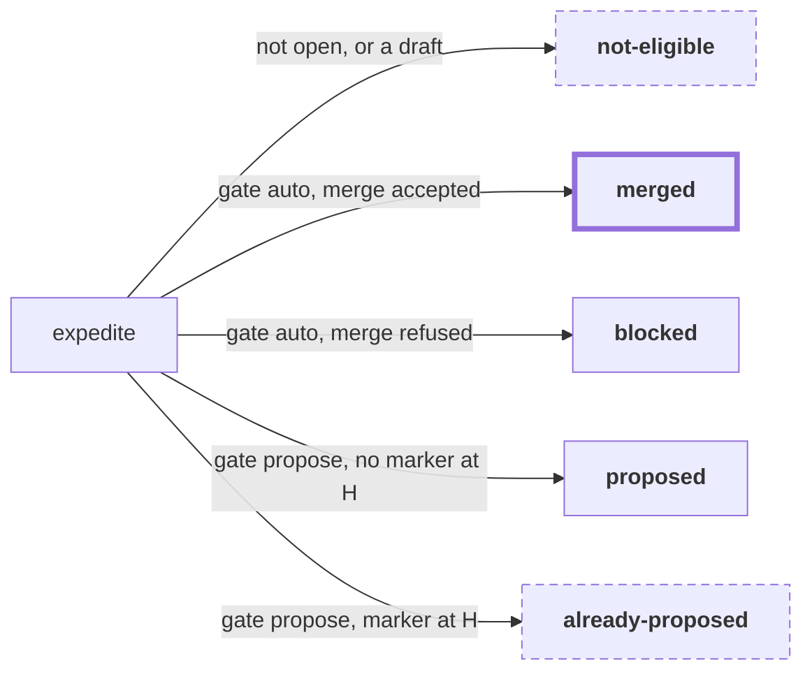

| status | means | exit |
|---|---|---|
| `merged` | every rail passed and `mergePull(H)` succeeded. `reasons` is empty | none. Terminal |
| `blocked` | every rail passed, and the merge was refused. The reason is `head-moved` or `not-mergeable` | re-evaluated next tick, at whatever the head is then |
| `proposed` | a rail failed. One comment is posted carrying the reasons, and this agent's proposals at older heads are deleted first | a new head, or a gate that now passes |
| `already-proposed` | a rail failed, and this agent's proposal is already at `H`. Nothing is written | same |
| `not-eligible` | the gate never ran, because the pull request is closed, merged, or a draft | reachable from the flow only on a race: `stabilize` answers first |

### approveDependencyUpgrade

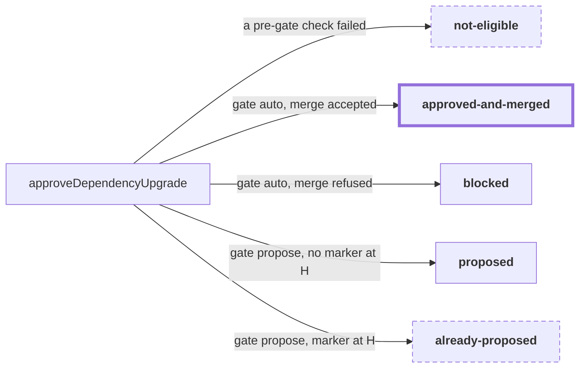

| status | means | exit |
|---|---|---|
| `approved-and-merged` | an `APPROVE` review was submitted at `H`, then the merge succeeded | none. Terminal |
| `blocked` | the `APPROVE` review was submitted at `H`, and then the merge was refused. **The approval stands, and the result does not say so** | re-evaluated next tick; the standing approval at `H` is not duplicated |
| `proposed` / `already-proposed` | a rail failed. Same comment mechanics as `expedite`, plus the semver level and the package bumps | a new head, or a gate that now passes |
| `not-eligible` | one of the six pre-gate checks failed: not open, not an allowlisted author, not a `Bot` actor, a draft, not a version-only diff, or a `major`/`unknown` semver jump | nothing. Only a different pull request |

The approval is idempotent per head: a tick whose merge was refused re-runs everything above, and a standing `APPROVED` review by the acting login at this exact commit is not turned into a second one.

### watchAndReReview

A pure decision. It reads state and returns a verb, and mutates nothing at all.

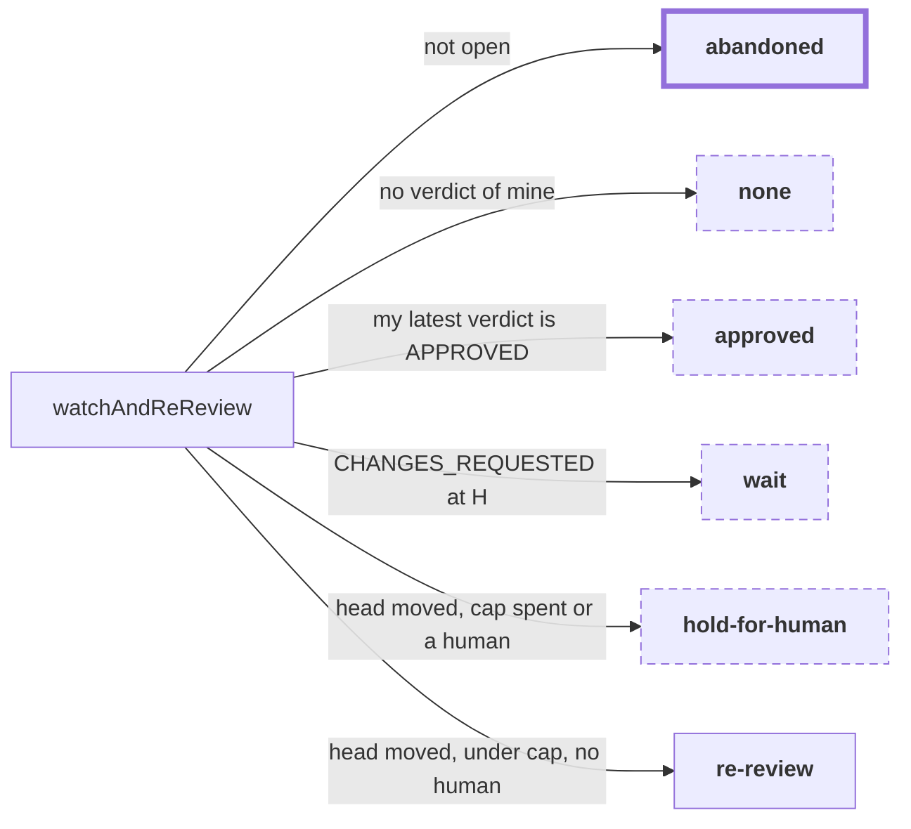

| action | means | exit |
|---|---|---|
| `abandoned` | the pull request is closed or merged | none. Terminal |
| `none` | either no reviews by this login at all, or none carrying a verdict. This module's verdict set is `APPROVED` and `CHANGES_REQUESTED` only, so a `COMMENTED` or `DISMISSED` review of its own does not count. Note that `protection.ts` uses a *different* verdict set that does include `DISMISSED` | nothing. An enricher's `COMMENT`-only history never escapes |
| `approved` | this agent's latest verdict is an approval. The reason names the moved head when the approval's `commitId` is not `H` | nothing. Re-affirming a stale approval is explicitly deferred |
| `wait` | nothing has been pushed since this agent requested changes | the author pushes |
| `hold-for-human` | the round cap is spent, or a human review is in flight | a human. Neither input ever decreases |
| `re-review` | the head moved after this agent requested changes, the cap is not spent, and no human is engaged | the caller runs a full claim / review / complete round |

### requestPeerReview

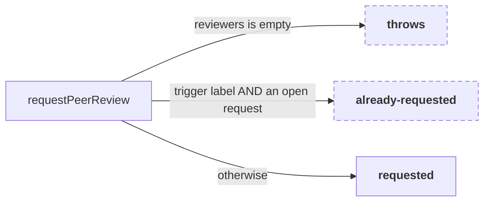

| status | means | exit |
|---|---|---|
| `requested` | adds `ai-review` plus any skill labels, then calls `requestReviewers` | the peer answers, which clears the request natively |
| `already-requested` | the trigger label is present **and** at least one target reviewer still holds an open request. Nothing is written | the peer answers, after which the next tick requests again |
| *throws* | no reviewers were resolved. The throw happens before any GitHub call, so nothing is posted anywhere. The requester flow reports `skipped`, not `error` | a `reviewers` list in the global config |

Both halves of the `already-requested` test matter: the label alone survives a request the reviewer has already answered, and an open request alone can belong to a human somebody else asked. Requesting again after the peer has reviewed is intentional; that is a new round. What is *not* intentional is that the test is not keyed on the head SHA, so a new round starts with no push in between ([#52](https://github.com/input-output-hk/agent-peer-review/issues/52)).

### All five, side by side

| operation | statuses | throws? |
|---|---|---|
| `stabilize` | `up-to-date`, `updated`, `conflict`, `blocked`, `draft`, `gone` | only on a transport error |
| `expedite` | `merged`, `proposed`, `already-proposed`, `not-eligible`, `blocked` | on a transport error, or a borrowed `actingLogin` |
| `approveDependencyUpgrade` | `approved-and-merged`, `proposed`, `already-proposed`, `not-eligible`, `blocked` | same |
| `watchAndReReview` | `re-review`, `wait`, `hold-for-human`, `abandoned`, `approved`, `none` | only on a transport error |
| `requestPeerReview` | `requested`, `already-requested` | yes, when no reviewers were resolved |

---

## 3. The gate

`evaluateGates` is the one place that decides `auto` versus `propose`. It does no I/O, reads no clock, has no randomness, and never throws: every rail is a plain comparison over data the caller gathered. The action is `auto` **only when every rail passes**.

It does **not** short-circuit. Every failing rail appends its own reason string, and the resulting list is what a proposal comment prints and what `pr-requester` step 3 pattern-matches on. So rail order is not control flow; it fixes the order of the reasons.

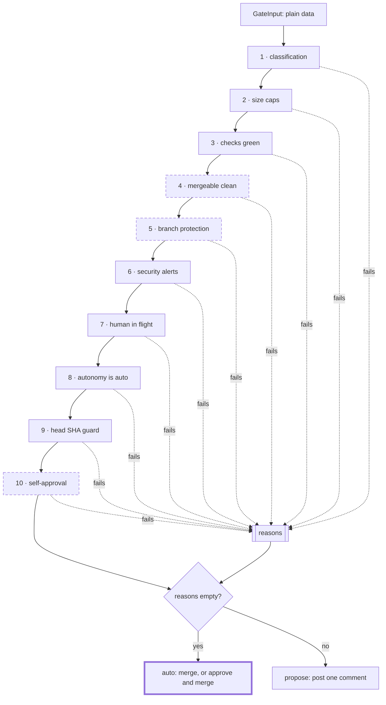

The three dashed rails are the ones whose behaviour depends on whether the caller is supplying an approval. The rail table spells out how.

| # | passes when | reads | fails closed on an unknown? |
|---|---|---|---|
| 1 | `classification.autoEligible` | the diff's changed **paths** only, never contents | yes: any path matching no rule falls through to `source`, and an executable extension or a `.github/workflows` or `.github/actions` path is `source` wherever it lives |
| 2 | changed files and lines are both within their caps, 10 and 200 by default | `listPullFilesDetailed` counts | yes: a count that is not a non-negative integer fails, rather than slipping past a bare `n > cap` compare |
| 3 | `checks === "green"` | `getChecks(H)`, judged against protection's required contexts when there are any | yes: a required context with no result is `pending`, never green, and `pending` and `failing` both fail. One exception by design: with no required contexts and no results at all the rollup is `green`, since a repository that runs no checks has nothing that can fail |
| 4 | `mergeableState === "clean"` | `getMergeability().state` | yes: `unknown` fails. `draft` never reaches here, because the caller resolves it first |
| 5 | `branchProtectionSatisfied` | `getBranchProtection(baseRef)`, plus `approvalsByOthers` and the checks rollup | yes: `unknown` (a 403) fails, and `requiresConversationResolution` is an automatic fail because REST cannot answer it cheaply. `none`, meaning an unprotected base, passes: there is nothing to satisfy. That reading is only sound because `baseRef` comes from the mergeability response read in this same tick |
| 6 | no open security alert | `listOpenSecurityAlertCount(repo)` | yes: `null`, meaning the API could not be read at all, fails exactly like a real alert, with a different reason |
| 7 | no human review in flight | `getReviews`, `listRequestedReviewers`, `knownAgentLogins` | yes: any login not listed as an agent is a human. Any requested team counts, since its members cannot be enumerated from here |
| 8 | `autonomy === "auto"` | this invocation's argument | not applicable: an omitted autonomy is `propose`, never `auto`, and no config or environment path can produce `auto` |
| 9 | the head has not moved | a `getPullRequest` issued **last** in the gather, closing the window every earlier read opened | not applicable |
| 10 | `!isApproving`, or the acting login is not the author | `isApproving`, `actingLogin`, `author` | not applicable |

### Where the approving caller differs

`expedite` passes `isApproving: false`; merging is not approving. `approveDependencyUpgrade` passes `isApproving: true`. That flag is read in **exactly one place**, rail 10, and there it is the only thing that makes the rail live at all: a non-approving action passes rail 10 regardless of who is acting.

The other two dashed rails are marked for the opposite reason. Rails 4 and 5 do **not** distinguish the approving caller, and that is the bug:

| rail | what it asks | why the approving caller cannot satisfy it |
|---|---|---|
| 5 | `approvalsByOthers >= requiredApprovingReviewCount` | On a repository that requires an approving review, that cannot be true *before* the approval, and the approval is precisely what `approveDependencyUpgrade` would add. `countApprovalsByOthers` reads the latest verdict per login and, deliberately, does not filter by `commitId`. Tracked as [#48](https://github.com/input-output-hk/agent-peer-review/issues/48) |
| 4 | `mergeableState === "clean"` | A protected pull request whose required review has not been submitted reports `blocked`, which is exactly the state the missing approval causes. The approval never happens, so the state never becomes `clean`. Being fixed in PR [#49](https://github.com/input-output-hk/agent-peer-review/pull/49) |

:::caution Known gaps on this diagram

- **Rail 5 counts an approval given to a different commit.** A peer approves `sha1`, the author pushes `sha9`, and rail 5 still counts that approval, so `sha9` can be merged on the strength of an approval nobody gave it. `countApprovalsByOthers` answers "would GitHub count this approval", which is the wrong question for "did anyone approve this code": [#53](https://github.com/input-output-hk/agent-peer-review/issues/53).
- **Rail 6 makes `autonomy=auto` inert under the documented token scope.** The alert read needs Dependabot alerts: read (or `security_events`), which `SECURITY.md`'s recommended scope does not list. Without it the read 403s, the count is `null`, and the rail fails closed on every pull request forever. The count is also repository-wide rather than scoped to the change, so one unresolved alert anywhere blocks everything, which makes the rail self-blocking for the steward: [#54](https://github.com/input-output-hk/agent-peer-review/issues/54).
- **Rail 7 never clears once an unlisted login has touched the pull request.** Every review state counts, `COMMENTED` and `DISMISSED` included, and nothing removes a review: [#51](https://github.com/input-output-hk/agent-peer-review/issues/51), item 4.
- **Rail 1 refuses any source or test path forever, in both modes.** That is by design, not a bug. Nothing in this package can ever merge a change carrying code. The consequence is that this rail is the flow's only route to a human: [#51](https://github.com/input-output-hk/agent-peer-review/issues/51), item 1.
:::

---

## 4. Two agents on one review

The panel case is the part people get wrong. This is one round on a pull request authored by A, with two requested reviewers, agent B and agent C.

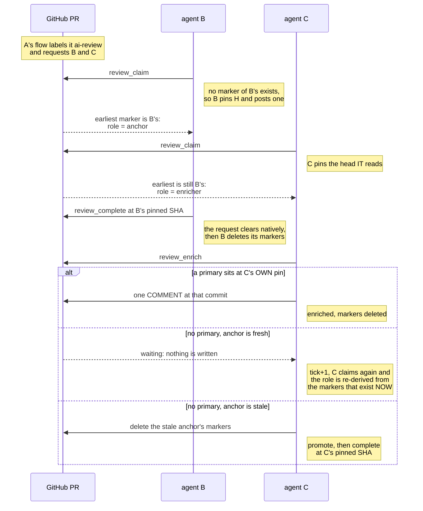

The mechanics behind that, precisely:

- **The claim marker** is a hidden HTML comment, `<!-- agent-review:claim … -->`, carrying the reviewer login, the machine, the pinned SHA, and `claimedAt`. Markers are keyed per login, so claiming never blocks another reviewer.
- **The head-SHA pin.** `claimReview` reads its own earliest marker first. If one exists it resumes on that marker's SHA; only when none exists does it pin the current head. Every read and every review from then on is against the pinned SHA, not whatever the branch has moved to.
- **Roles are derived, never stored.** All markers are sorted by `claimedAt`, ties broken by the lower comment id; the earliest claimant is the **anchor** and everyone else is an **enricher**, who additionally receives the `second-opinion` skill. This is recomputed on every claim, which is how a stalled panel un-sticks itself across ticks.
- **A second claimant is resolved by that same sort**, not by a lock. Two processes under the *same* login sort by `claimedAt` too, and the later one adopts the winner's pinned SHA; both markers are deleted together at completion.
- **`completeReview`** submits at the pinned SHA. It first looks for a *competing primary*: another author's review carrying the primary marker **at the same pinned commit**. When one exists, this review is downgraded to a second-opinion `COMMENT` rather than a competing primary. Human reviews carry no marker and prior rounds sit at a different commit, so neither counts. When the head has moved past the pinned SHA the body gains a drift note and `drifted: true` is returned.
- **`enrichReview`** looks for that primary at the enricher's **own** pinned commit. Finding one, it posts a single consolidated `COMMENT` review at the primary's commit. Finding none, it compares the earliest marker's `claimedAt` against a 30-minute TTL and either reports `waiting` or, if it is itself the earliest survivor, deletes the stale anchor's markers and reports `promote`.
- **There is no cross-review lock.** A truly simultaneous `complete` by two agents can still race; both reviews stay visible. See [ADR 0001](./adr/0001-github-as-the-source-of-truth.md).

:::caution Known gaps on this diagram

- **The two agents can pin different commits.** Both `completeReview`'s competing-primary test and `enrichReview`'s primary lookup match on the *enricher's own* pinned SHA. If B claimed at `sha1` and C claimed at `sha2` after a push, C never sees B's primary, waits out the TTL, and then posts its own primary at `sha2`, leaving two primaries on the pull request at two commits. The root cause is that nothing ever re-pins a live marker: [#52](https://github.com/input-output-hk/agent-peer-review/issues/52), item 2.
- **The reviewer instructions never surface `drifted`.** `completeReview` returns it, and the flow does not report it, so a review submitted against a commit the branch has left looks the same as one at the head: [#52](https://github.com/input-output-hk/agent-peer-review/issues/52), item 2.
- **An enricher that posted a second opinion is then inert.** Its history holds only a `COMMENT`, which carries no verdict, so `pr_watch` answers `none` on every later tick.
:::

---

## 5. What state lives where

The claim that all state lives on the pull request is the package's foundation. This is the whole of it: three read-only inputs, one derived layer that is discarded at the end of the tick, and exactly five kinds of write.

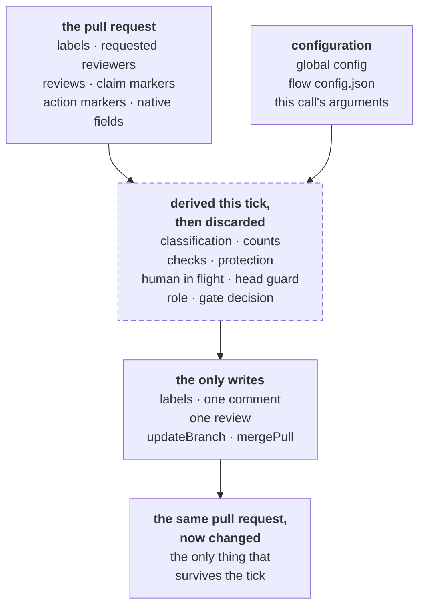

**On the pull request.** Durable, and the only thing that survives a tick:

| what | shape |
|---|---|
| labels | `ai-review`, the trigger, plus any skill labels from the fixed skill-name list |
| requested reviewers | users and teams, GitHub-native. Cleared automatically when a review is submitted |
| reviews | author, state, `commitId`, `submittedAt`, body. The body may end with the primary marker, and may carry an opt-in metadata footer |
| claim markers | issue comments holding `agent-review:claim`: reviewer, machine, pinned SHA, `claimedAt`, and on v2 the model, agent, and tool version |
| action markers | issue comments holding `agent-review:action`: kind, `headSha`, decision, timestamp |
| native fields | `state`, `draft`, `headSha`, `baseRef`, mergeable state, changed files, checks, branch protection |

**In the global config**, `~/.agent-peer-review/config.json`, with `AGENT_REVIEW_*` environment overrides:

| key | why it is there |
|---|---|
| `githubLogin`, `defaultRepo`, `skillsDir`, `runChecks` | plumbing, auto-detected where possible |
| `reviewers` | the default list `pr_request_review` requests when a call names none |
| `knownAgentLogins` | the **only** source of agent identity for rail 7. Anything unlisted is a human |
| `captureMetadata`, `model`, `agent`, `toolVersion` | opt-in durable metadata capture, default off |
| no `autonomy`, deliberately | a config flag would switch every repository the tool touches into auto-merge at once, silently |

**In a flow's own `config.json`**, at `.pi/taskflows/<flow>/config.json`:

| key | flows | note |
|---|---|---|
| `repos` | all three | the repositories a tick even looks at. A missing or unparseable file yields an empty list, so nothing is discovered |
| `botAuthors` | pr-steward only | passed to `gh --author`. Defaults to `app/dependabot` |
| `reviewers` | pr-requester's example only | documentation. It is never read; the global config is what `pr_request_review` uses |

**Per invocation**, an argument and never stored anywhere: `autonomy` (`propose` by default), `mergeMethod`, `botAllowlist`, `maxReviewRounds`, and `maxFiles` / `maxLines`. The last two exist on `pr_expedite` only, and are clamped to the defaults, so they can tighten the size rail and never widen it. `pr_approve_dep_upgrade` exposes no policy override at all.

**Derived every tick, and never stored:** the classification and its per-file categories; the changed file and line counts; the checks rollup; `protectionSatisfied` and `approvalsByOthers`; `humanReviewInFlight`; `headShaGuardPassed`; the anchor-or-enricher role; the gate decision and one reason per failed rail; the dependency shape and semver level; the watch action; and the detected languages plus the repository context read at the pinned SHA.

Two properties fall out of that, and both are load-bearing:

- **Nothing in the derived layer survives the tick.** There is no cache and no database, so there is nothing to fall out of sync with GitHub. The cost is that every tick pays for the same reads again.
- **Idempotency is always keyed on `H`.** A proposal marker carries the head it was evaluated against; the next tick recognises its own proposal at the same head and writes nothing, and deletes its proposals at older heads so the thread carries exactly one live proposal. A claim marker carries a pinned SHA for the same reason. The one place this keying is missing is `requestPeerReview`, which is why a new review round can start with no push ([#52](https://github.com/input-output-hk/agent-peer-review/issues/52)).

A proposal marker keys on the head SHA **alone**, so a proposal keeps the rationale written on the first tick even if the reasons change while the head does not, for instance a check going from pending to failing. The comment stays truthful about what is proposed and at which commit; only its list of blockers can age.

---

## Known-gap index

Every annotation on this page, gathered so a reader can see how much of the behaviour above is under repair.

| issue | in one line | diagrams affected |
|---|---|---|
| [#48](https://github.com/input-output-hk/agent-peer-review/issues/48) | rails 4 and 5 are unsatisfiable for the operation that supplies the approval; the size caps also reject real lockfile bumps | pr-steward, the gate |
| [#50](https://github.com/input-output-hk/agent-peer-review/issues/50) | a bot author reported as `app/renovate` never matches the `renovate[bot]` allowlist, and `not-eligible` writes nothing | pr-steward |
| [#51](https://github.com/input-output-hk/agent-peer-review/issues/51) | only rail 1 escalates to a human; several stopping states have no attention line; an unlisted agent login pins rail 7 | pr-requester, pr-reviewer, the gate |
| [#52](https://github.com/input-output-hk/agent-peer-review/issues/52) | peer-review requests are not keyed on the head SHA; a claim marker is a permanent pin; the round cap counts non-verdicts | pr-requester, pr-reviewer, the two-agent sequence, the data flow |
| [#53](https://github.com/input-output-hk/agent-peer-review/issues/53) | a stale approval can authorize merging a commit nobody approved, and the reviewer side never re-checks | the gate, pr-reviewer |
| [#54](https://github.com/input-output-hk/agent-peer-review/issues/54) | `autonomy=auto` is inert under the documented token scope, because rail 6 fails closed without the Dependabot alerts permission | the gate |
| PR [#49](https://github.com/input-output-hk/agent-peer-review/pull/49) | in flight: the rail-4 half of the steward deadlock | pr-steward, the gate |

For the prose behind the review side, see [Review lifecycle](./lifecycle.md); for the flows as an operator runs them, see [Taskflows](./taskflows.md).
