# How it works

Every diagram on this page is drawn from the code on `main`, not from the design's intentions. A diagram that documents behaviour the code does not have is worse than no diagram, so anything unverified is left out.

Each diagram carries the shape; the table beside it carries the detail, because a table is checkable in a way a diagram is not. The status vocabulary in [the side-by-side table](#all-nine-side-by-side) is checked mechanically: `test/taskflows.test.ts` reads each operation's TypeScript union out of its own source and fails the build unless this page names exactly those values.

This page describes what the code does, and nothing else. It carries no catalogue of the bugs under repair, because a document that embeds one has to be revised on every fix and nothing forces that: four separate claims on this page outlived the code they described. The open work lives where it is maintained, in [the issue list](https://github.com/input-output-hk/agent-peer-review/issues), and the sections below link it where a reader would otherwise wonder whether a limit is deliberate.

## The one idea to hold on to

**Loops live across ticks; state lives on the pull request.**

A **tick** is one run of one flow over one pull request. Inside a tick, a flow reads GitHub, decides, writes at most a comment, a label, a review, or a merge, and exits. It keeps nothing. Every value a decision depends on is either read from the pull request in that same tick or derived from what was read and then thrown away.

So the machines below have no memory of their own. A "state" is an observable tuple on the pull request, re-derived from scratch on the next tick. That is why so many edges in the diagrams cannot happen inside one tick at all: they need the flow to run again, against a pull request that something else has changed in the meantime.

### Reading the diagrams

| convention | meaning |
|---|---|
| an unprefixed edge label | happens inside a single tick |
| an edge label starting `tick+1` | **cannot** happen inside a tick; the flow has to run again |
| a thick border | terminal by design: the machine is finished, correctly |
| a dashed border | terminal only because a human has to act; nothing in the code will move it |
| `H` | the head SHA read at the start of the tick, and the only SHA that tick will act on |

### The observable state tuple

Every field a decision reads, where it comes from, and who reads it. Nothing here is stored by this package.

| field | read from | read by |
|---|---|---|
| `state` (open / closed / merged) | `getPullRequest` | every operation, first thing it does |
| `draft` | `getMergeability().draft`, or `.state === "draft"` | `stabilize`, `expedite`, `approveDependencyUpgrade` |
| `headSha` (`H`) | `getPullRequest().headSha` | everything; pinned for the whole tick |
| `mergeableState` | `getMergeability().state` | `stabilize`'s own switch, and gate rail 4 |
| `baseRef` | `getMergeability().baseRef` | the branch-protection lookup |
| `labels` | `getPullRequest().labels` | `requestPeerReview` (the `ai-review` trigger), `claimReview` (skill labels) |
| requested reviewers (users, teams) | `listRequestedReviewers` | `requestPeerReview` idempotency, gate rail 7, `watchAndReReview` |
| reviews: author, state, `commitId`, `submittedAt`, body | `getReviews` | gate rails 5 and 7, `watchAndReReview`, `completeReview`, `enrichReview` |
| checks | `getChecks(H)` | gate rail 3, and rail 5 through `protectionSatisfied` |
| protection (`none`, `unknown`, or a summary) | `getBranchProtection(baseRef)` | gate rail 5, and the required-context list for rail 3 |
| open security alert count (a number, or `null`) | `listOpenSecurityAlertCount(repo)` | gate rail 6. Repository-wide, not per pull request |
| changed files with additions and deletions | `listPullFilesDetailed` | gate rails 1 and 2, `classifyDependencyUpgrade` |
| claim markers | issue comments matching `agent-review:claim` | `claimReview`, `completeReview`, `enrichReview` |
| self-review markers | author-owned issue comments matching `agent-review:self-review` | `createReview`, `requestPeerReview`, `recordSelfReview` |
| follow-up links and issues | author-owned `agent-review:follow-up` comments and one repository issue keyed to the source PR | `createFollowUp`; reviewers consume its URL through structured findings |
| proposal markers | the acting login's own comments matching `agent-review:action` | `postProposal` |
| `autonomy` | the tick's own argument | gate rail 8 |

---

## 1. The three flows

### pr-requester

The order is `pr_stabilize`, successful exact-head `pr_self_review`, `pr_expedite`, then possibly `pr_request_review`. A meaningful disproportionate change may create the PR's one `pr_create_followup` issue during self-review. `discover.mjs` selects with `gh pr list --author @me --state open` and skips drafts.

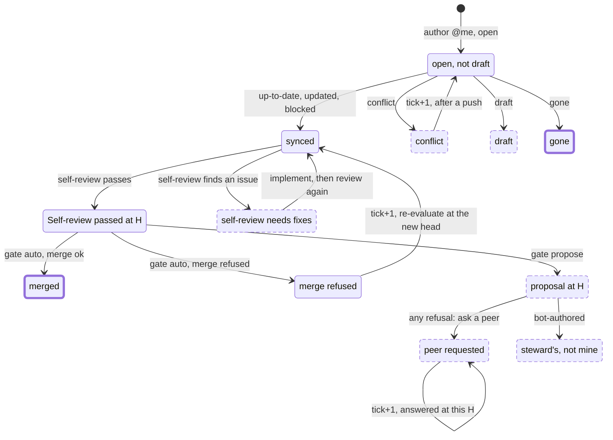

The edge worth reading twice is `P --> Q`. The peer request requires both a successful self-review and a gate refusal; the refusal still applies whatever rail produced it. `pr_request_review` then decides whether anybody is already engaged.

| stabilize | self-review | expedite / request | next tick |
|---|---|---|---|
| `gone`, `draft`, or `conflict` | skipped | skipped | terminal or wait for author action |
| healthy | `needs-changes` | skipped | implement fixes, then self-review the new head |
| healthy | `recorded` / `already-recorded` | `merged` | gone |
| healthy | passed | `proposed` then `requested` / `already-requested` | the peer reviews this head |
| healthy | passed | `self-review-required` | fail closed and repeat self-review at the current head |
| healthy | passed | `bot-authored` | the steward path owns it |

Two things about this diagram are worth stating because they are easy to misread:

- **`stabilize = updated` moves `H` inside the tick.** `expedite` re-reads the pull request, so it evaluates the new head and `postProposal` deletes the proposal at the old one. Nothing else is re-pinned.
- **A bot outside the steward's allowlist reaches no flow on its own.** The requester filters on `--author @me`, the steward on its configured `botAuthors`, and the reviewer needs someone to have asked already. Bringing a codegen or release bot's pull request in takes a deliberate act: name it in the steward's `botAuthors`, or have someone request your agent as a reviewer ([#51](https://github.com/input-output-hk/agent-peer-review/issues/51), item 5).

### pr-reviewer

`discover.mjs` unions two GitHub searches, `review-requested:@me` and `reviewed-by:@me`, over open pull requests only. An item in both buckets is classified `requested`, because "a live request outranks a follow-up".

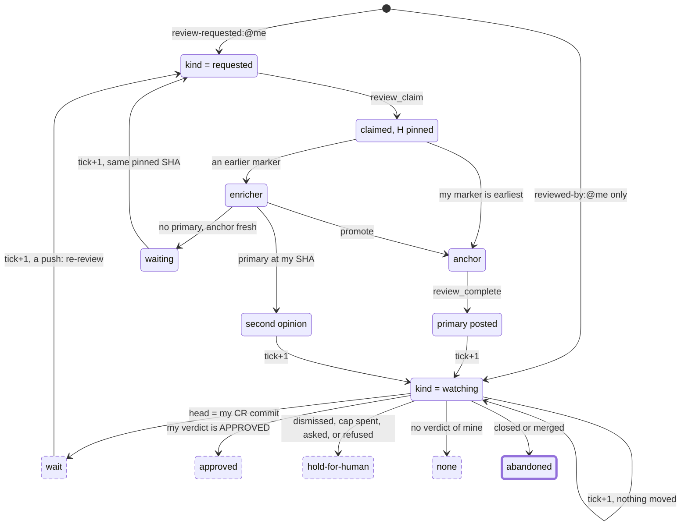

`kind = requested`, per tick:

| role from `claimReview` | call | what is written | next tick |
|---|---|---|---|
| `anchor` | `review_complete` | a review at the **pinned** SHA, tagged with the primary marker; then every one of my claim markers is deleted | `reviewed-by:@me` puts it in `watching` |
| `enricher`, a primary exists at my pinned SHA | `review_enrich`, status `enriched` | a `COMMENT` review at the primary's commit; my markers deleted | `watching`; `pr_watch` then answers `none` forever, since a `COMMENT` carries no verdict |
| `enricher`, no primary, the anchor's claim is under 30 minutes old | `review_enrich`, status `waiting` | **nothing at all** | the request is still open, so `requested` again. `claimReview` re-pins my marker to whatever the head is then |
| `enricher`, no primary, the anchor's claim is over 30 minutes old and I am the earliest survivor | `review_enrich`, status `promote` | the stale anchor's marker is deleted | I call `review_complete` at my pinned SHA |

`kind = watching`, per tick. This is `watchAndReReview` exactly, and it writes nothing:

| state | action | why it is where it is |
|---|---|---|
| not open | `abandoned` | terminal, correctly |
| no reviews of mine | `none` | not reachable from the flow: `reviewed-by:@me` is how the item got here |
| reviews of mine, none `APPROVED`, `CHANGES_REQUESTED`, or `DISMISSED` | `none` | terminal in practice. An enricher's `COMMENT`-only history never escapes this |
| latest verdict `DISMISSED` | `hold-for-human`, and `headMoved` says whether its commit is stale | a maintainer retired this agent's verdict; only a human decides whether to replace it |
| latest verdict `APPROVED`, `commitId === H` | `approved`, `headMoved: false` | fixed point while `H` holds |
| latest verdict `APPROVED`, `commitId !== H` | `approved`, `headMoved: true`, and the reason names the moved head | the approval is stale, so gate rail 5 will not count it either. Re-affirming one is a deferred phase ([#39](https://github.com/input-output-hk/agent-peer-review/issues/39)) |
| latest verdict `CHANGES_REQUESTED`, `commitId === H` | `wait` | fixed point until the author pushes |
| latest `CHANGES_REQUESTED`, `commitId !== H`, my **verdict** count at or over the cap | `hold-for-human` | terminal: the count only grows. `COMMENTED` reviews do not spend it |
| latest `CHANGES_REQUESTED`, `commitId !== H`, under the cap, a human has an open request (or any team does) | `hold-for-human` | clears natively when they answer: submitting a review retires the request |
| latest `CHANGES_REQUESTED`, `commitId !== H`, under the cap, a human's standing verdict is `CHANGES_REQUESTED` | `hold-for-human` | clears when that person replaces the verdict with another one |
| latest `CHANGES_REQUESTED`, `commitId !== H`, under the cap, no human engaged | `re-review` | a full claim / review / complete round |

`hold-for-human` has **four** causes, and the flow's instructions copy the `reason` into the result for that reason: they read identically in a count and mean different things. A dismissed verdict is tested first, then the round cap, then the two human tests, so an explicit dismissal cannot be misreported as no verdict and an agent that has spent its rounds hands over for that reason whether or not a human happens to be looking. A human's finished `APPROVED`, and a `COMMENTED` review from anyone, hold nothing: neither is somebody mid-review and neither is a refusal, and reading them as one froze this operation permanently on any pull request a human had ever touched.

`headMoved` is on every answer, not only the ones above that mention it, so a flow can branch on a stale verdict without parsing prose. It is false whenever there is no standing verdict of this agent's for the head to have moved past.

Two limits here are deliberate rather than accidental:

- **The round cap is unreachable from the `requested` branch.** `DEFAULT_MAX_REVIEW_ROUNDS` (3) lives only in `watchAndReReview`, and `discover.mjs` classifies an item present in both buckets as `requested`, so a standing request keeps the item off the branch that would stop it. Deciding `wait` / `approved` / `none` in `discover.mjs` instead is tracked as the discovery half of [#51](https://github.com/input-output-hk/agent-peer-review/issues/51).
- **`approved` with a moved head raises no attention line.** `summarize.mjs` raises `hold-for-human`, any `error`, and `verdict = request-changes`. Not `approved`, and not `none`. `headMoved` exists so a re-affirmation round can be built on it ([#39](https://github.com/input-output-hk/agent-peer-review/issues/39)).

### pr-steward

One tool call, `pr_approve_dep_upgrade`, and nothing else. `discover.mjs` runs `gh pr list --author <bot> --state open` per configured bot author (default `app/dependabot` and `app/renovate`) and skips drafts.

```mermaid
stateDiagram-v2
  direction TB

  state "open bot PR" as D
  state "not-eligible" as NE
  state "gate consulted" as GA
  state "proposal at H" as P
  state "APPROVE at H" as AV
  state "approved and merged" as M
  state "approved, not merged" as X

  [*] --> D : bot author, open
  D --> NE : a pre-gate check failed
  D --> GA : all six checks passed
  GA --> P : a rail failed
  GA --> AV : every rail passed
  AV --> M : re-run the gate: auto, merge ok
  AV --> X : re-run the gate: refused, or merge refused
  P --> P : tick+1, H unchanged
  NE --> NE : tick+1, nothing written; the summary says so
  X --> GA : tick+1, the approval already stands

  class M terminal
  class NE,P,X pending
  classDef terminal stroke-width:4px
  classDef pending stroke-dasharray: 6 4
```

The six pre-gate checks, in the order the code applies them. Every one of them writes nothing:

| check | fails to |
|---|---|
| the pull request is open | `not-eligible` |
| `pull.author` is in `botAllowlist`, both sides folded by `normalizeBotAuthor` | `not-eligible` |
| `confirmsBotAuthor`: GitHub says `Bot`, or says nothing and the name carries `[bot]` or `app/` | `not-eligible` |
| not a draft | `not-eligible` |
| `classifyDependencyUpgrade(files).eligibleShape` | `not-eligible` |
| the semver level is `patch` or `minor`, so not `major` and not `unknown` | `not-eligible` |

The allowlist is a list of **bots**, not of strings. One bot reaches this package under two names, `renovate[bot]` from the pulls API and `app/renovate` from GraphQL and the `gh` CLI, so both sides of the comparison are folded to `renovate`: lowercase, then strip one `app/` prefix and one `[bot]` suffix, and never fold a name that is nothing but an affix. GitHub's own answer still wins wherever it has one, so an allowlisted name taken by a `User` account is refused; the name shape is consulted only for `unknown`, which is what `GET /users/app/renovate` returns.

Per tick:

| action | next tick | is anyone told? |
|---|---|---|
| `approved-and-merged` | gone | counted in the summary |
| `proposed` / `already-proposed` | fixed point while `H` holds | counted, plus an attention line when a review the gate reads as a human's is what held it |
| `approved` | re-evaluated; the approval submitted at `H` still stands and is not duplicated | counted apart from `approved-and-merged`, with an attention line naming the rail that refused |
| `not-eligible` | **fixed point forever**, for a major bump or a non-allowlisted author | counted, **and an attention line**: the operation writes nothing on the pull request, so the summary is the only place this hand-off can be seen |
| `blocked` | same as `approved` | attention line raised. Not reachable from today's auto path, which always approves first; kept so a future branch that merges without approving reports that truthfully |

Rails 4 and 5 are what make this flow different from the other two, because this is the one path that **approves** rather than merely merging. Both count the approval this call is about to submit, and only for this call. See [Where the approving caller differs](#where-the-approving-caller-differs).

---

## 2. The operations and their status unions

Five expedition operations decide something, and four review/author operations report a status or verdict of their own. Their unions are the whole vocabulary the flows reason in, so every value here is a value some `instructions.md` branches on, and [the side-by-side table](#all-nine-side-by-side) is checked against the TypeScript by a test rather than by a reader.

No operation throws for a *policy* outcome: every "no" is a status with a reason. A thrown error means the outcome is genuinely unknown, which is why the merge and approve calls are deliberately not caught: a write that is retried can succeed on the server and still surface as an error, so the flow above must re-read state rather than assume nothing happened.

### stabilize

The only operation that writes without consulting the gate. Its one possible mutation is `updateBranch`, merging the base *into* the pull request's branch.

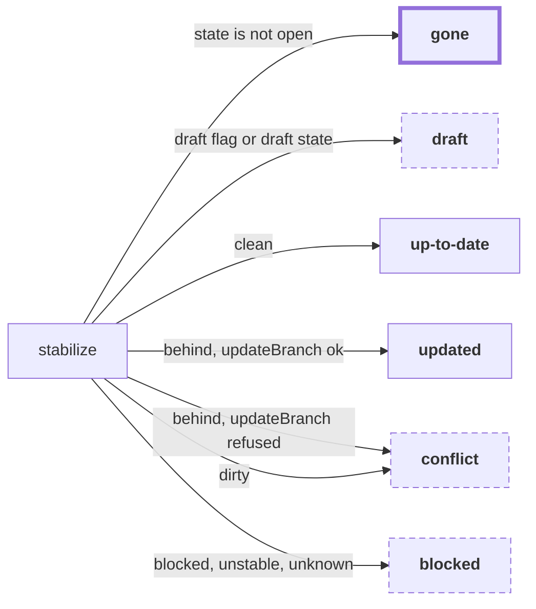

| status | means | exit |
|---|---|---|
| `gone` | closed or merged: nothing left to do with it, ever | none. Terminal |
| `draft` | the author's own "not ready" marker. Nothing is done, not even a base sync | the author marks it ready |
| `up-to-date` | in sync with its base, and mergeable | continue to `expedite` |
| `updated` | the branch was behind and has been updated, so `H` has advanced inside this tick | continue to `expedite`, at the new head |
| `conflict` | conflicts only the author can resolve, or the head moved during the update | the author pushes |
| `blocked` | **open and healthy**, but in a mergeable state syncing cannot change | a review, a check, or GitHub finishing its computation |

`blocked` and `gone` are deliberately separate and must never be conflated. On a protected repository, `blocked` is the everyday state of a pull request whose required review has not been submitted yet, so a caller that treated it as terminal would abandon precisely the pull requests that need a review requested.

### expedite

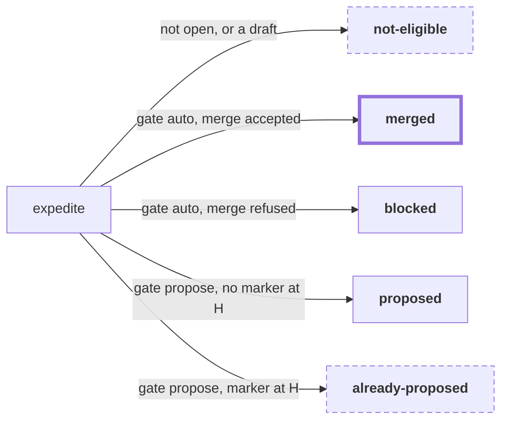

| status | means | exit |
|---|---|---|
| `merged` | every rail passed and `mergePull(H)` succeeded. `reasons` is empty | none. Terminal |
| `blocked` | every rail passed, and the merge was refused. The reason is `head-moved` or `not-mergeable` | re-evaluated next tick, at whatever the head is then |
| `proposed` | a rail failed. One comment is posted carrying the reasons, and this agent's proposals at older heads are deleted first | a new head, or a gate that now passes |
| `already-proposed` | a rail failed, and this agent's proposal is already at `H`. Nothing is written | same |
| `not-eligible` | the gate never ran, because the pull request is closed, merged, or a draft | reachable from the flow only on a race: `stabilize` answers first |

### approveDependencyUpgrade

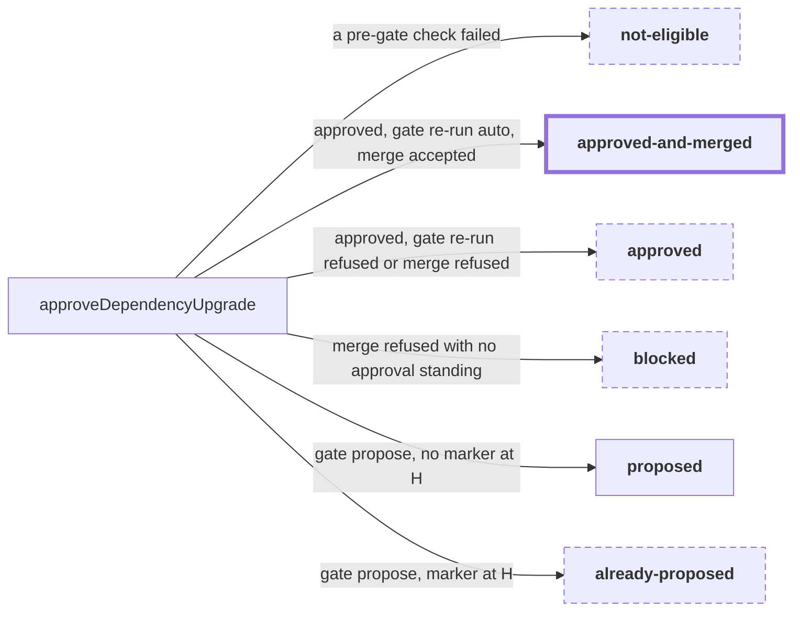

| status | means | exit |
|---|---|---|
| `approved-and-merged` | an `APPROVE` review was submitted at `H`, the **whole gate** was then re-run without the pending-approval allowance and still said `auto`, and the merge succeeded | none. Terminal |
| `approved` | the approval was submitted at `H` (or already stood) and the merge did not happen: the second gate evaluation refused, or `mergePull` did. `reasons` leads with "the approval stands at `H`, but the merge did not happen" and then names what blocked it | re-evaluated next tick; the standing approval at `H` is not duplicated, and a later tick merges once GitHub has recomputed the state |
| `proposed` / `already-proposed` | a rail failed. Same comment mechanics as `expedite`, plus the semver level and the package bumps | a new head, or a gate that now passes |
| `not-eligible` | one of the six pre-gate checks failed: not open, not an allowlisted author, not confirmed a bot, a draft, not a version-only diff, or a `major`/`unknown` semver jump | nothing. Only a different pull request |
| `blocked` | a merge was refused and no approval of this agent's stands. Today's auto path cannot produce it, since every exit above happens after an approval stands | kept as the fail-safe answer, so a future branch that merges without approving cannot report an approval it never made |

The approval is idempotent per head: a tick whose merge was refused re-runs everything above, and a standing `APPROVED` review by the acting login at this exact commit is not turned into a second one. A review of this agent's own that a maintainer has **dismissed** at the current commit is a hard stop, since re-approving would override an explicit human refusal no other rail can see.

Approving and merging are judged separately, on purpose. Rails 4 and 5 count the approval this call is about to add, which is what makes the decision to approve possible at all on a protected repository; letting that same arithmetic authorize the *merge* would be a different and much larger claim. So the operation approves, re-reads every rail input, and puts the whole gate to the question again with both allowances off. A human review arriving in that window, a check going red, a new security alert, a moved head, or protection the approval turned out not to satisfy each stop the merge and yield `approved`.

### watchAndReReview

A pure decision. It reads state and returns a verb plus a `headMoved` flag, and mutates nothing at all.

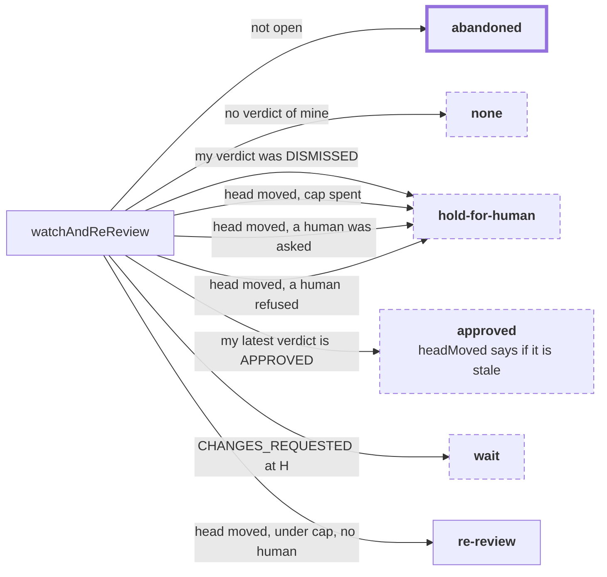

| action | means | exit |
|---|---|---|
| `abandoned` | the pull request is closed or merged | none. Terminal |
| `none` | either no reviews by this login at all, or none carrying a verdict. `COMMENTED` and `PENDING` are not verdicts | nothing. An enricher's `COMMENT`-only history never escapes |
| `approved` | this agent's latest verdict is an approval. `headMoved` is true, and the reason names the moved head, when the approval's `commitId` is not `H` | nothing yet. Re-affirming a stale approval is a deferred phase, and `headMoved` is what a flow would branch on to build it |
| `wait` | nothing has been pushed since this agent requested changes | the author pushes |
| `hold-for-human` | one of four: this agent's standing verdict was `DISMISSED`, the round cap is spent, a human has an open review request (or any team does), or a human's standing verdict is `CHANGES_REQUESTED`. The `reason` says which | a human must decide whether to replace a dismissed verdict; the cap never decreases; an open request clears when the person answers; a standing refusal clears when they replace it |
| `re-review` | the head moved after this agent requested changes, the cap is not spent, and no human is engaged | the caller runs a full claim / review / complete round |

Every answer carries `headMoved`, not only `approved`. It is false whenever this agent holds no standing verdict for the head to have moved past. The field exists so a flow never has to read the `reason` prose to learn that a verdict is about a commit that is gone, which is exactly what gate rail 5 refuses to count.

### requestPeerReview

The direct `createReview` operation used by CLI `request` and MCP/Pi `review_create` applies the same author gate before its first write: if the authenticated caller authored the PR, a successful authenticated `Self-review` must exist at the current head. It throws when that pass is absent; callers requesting a review of somebody else's PR are unchanged.

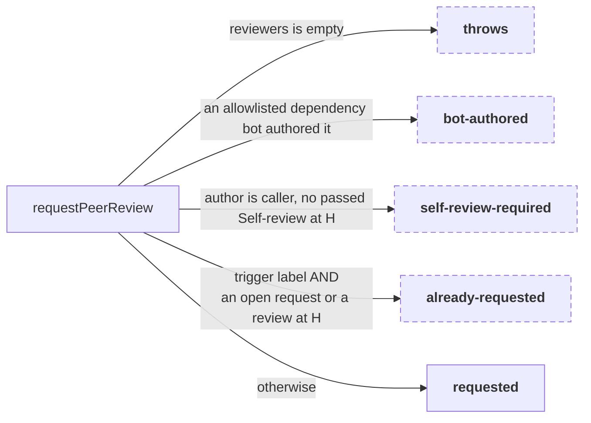

| status | means | exit |
|---|---|---|
| `requested` | adds `ai-review` plus any skill labels, then calls `requestReviewers` | the peer answers, which clears the request natively |
| `already-requested` | the trigger label is present **and** at least one target reviewer either still holds an open request or has left a review at `H`. Nothing is written | the author pushes, which makes the next tick a genuine new round |
| `bot-authored` | the author is a dependency bot on the same allowlist the steward accepts, confirmed by GitHub or by the name shape. **Nothing at all is written**: no label, no request | nothing here. `pr-steward` owns it, and may review and approve it itself |
| `self-review-required` | the implementing caller is the PR author and no authenticated successful `Self-review` exists at `H`. Nothing is requested | fix any issue found, record the successful pass, then retry |
| *throws* | no reviewers were resolved. The throw happens before any GitHub call, so nothing is posted anywhere. The requester flow reports `unconfigured` and the summary names the field to set | a `reviewers` list in the global config, or `AGENT_REVIEW_REVIEWERS` |

Every part of the `already-requested` test is load-bearing. The label alone is not enough: it survives forever. An open request alone is not enough either, and that was a livelock: submitting a review clears the request natively, so the tick after the peer answered saw a labeled pull request with no outstanding request, asked again, and the peer reviewed again, forever, with the head never moving ([#52](https://github.com/input-output-hk/agent-peer-review/issues/52)). Keyed on the head, the loop converges after one round and a genuine author push is still a genuine new round. Any review state at the head counts, `COMMENTED` included, because the question here is whether this exact diff has been looked at; the round **cap** in `watchAndReReview` asks a different question and so counts only verdicts.

The `bot-authored` refusal is deliberately narrow. Any *other* bot is still requestable, and must be: a codegen or release bot opens pull requests carrying real source changes, which no automated path here may approve or merge, so a peer review is exactly what they need.

### All nine, side by side

The whole reported vocabulary of this package, in one place. Each row is read out of the operation's own TypeScript by `test/taskflows.test.ts`, which asserts set equality in both directions: a status added, renamed, or removed in the code fails the build here rather than aging quietly in this table. Four separate values on this page went stale before that test existed.

| operation | reported values | declared in | throws? |
|---|---|---|---|
| `stabilize` | `up-to-date`, `updated`, `conflict`, `blocked`, `draft`, `gone` | `core/operations/stabilize.ts` | only on a transport error |
| `expedite` | `merged`, `proposed`, `already-proposed`, `not-eligible`, `blocked` | `core/operations/expedite.ts` | on a transport error, or a borrowed `actingLogin` |
| `approveDependencyUpgrade` | `approved-and-merged`, `approved`, `proposed`, `already-proposed`, `not-eligible`, `blocked` | `core/operations/approve-dependency-upgrade.ts` | same |
| `watchAndReReview` | `re-review`, `wait`, `hold-for-human`, `abandoned`, `approved`, `none` | `core/operations/watch-and-re-review.ts` | only on a transport error |
| `requestPeerReview` | `requested`, `already-requested`, `bot-authored`, `self-review-required` | `core/operations/request-peer-review.ts` | yes, when no reviewers were resolved |
| `recordSelfReview` | `recorded`, `already-recorded` | `core/operations/record-self-review.ts` | yes, for a non-author, dirty checkout, or moved head |
| `createFollowUp` | `created`, `already-exists` | `core/operations/create-follow-up.ts` | yes, for issue-shaped noise, a non-author caller, dirty checkout, or moved head |
| `enrichReview` | `enriched`, `waiting`, `promote` | `core/operations/enrich.ts` | yes, when this login holds no claim |
| `completeReview` | `approve`, `request-changes`, `comment` | `core/model.ts` (`ReviewResultSchema.event`) | yes, when this login holds no claim |

`completeReview` is the one row that is not a status union. It reports the review **event** it submitted, taken from the caller, plus two booleans: `drifted` is retained for response compatibility and is always false because a moved head is rejected, while `superseded` is true when a competing primary at the same commit downgraded this review to a second opinion. `watchAndReReview` carries a third boolean of its own, `headMoved`.

---

## 3. The gate

`evaluateGates` is the one place that decides `auto` versus `propose`. It does no I/O, reads no clock, has no randomness, and never throws: every rail is a plain comparison over data the caller gathered. The action is `auto` **only when every rail passes**.

It does **not** short-circuit. Every failing rail appends its own reason string, and the resulting list is what a proposal comment prints and what `pr-requester` step 3 pattern-matches on. So rail order is not control flow; it fixes the order of the reasons.

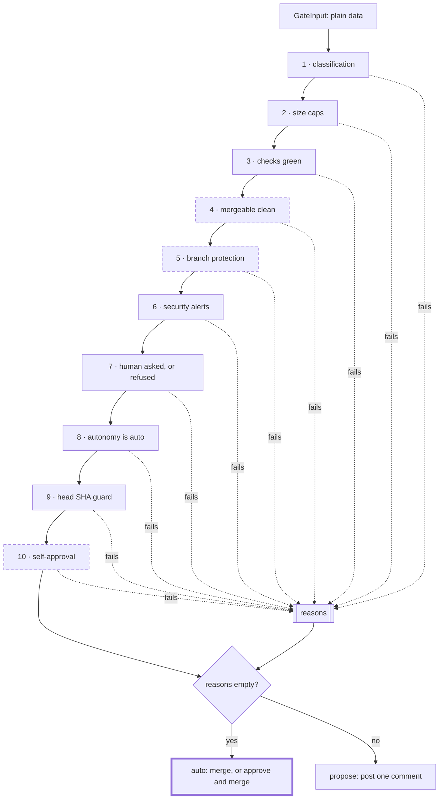

The three dashed rails are the ones whose behaviour depends on whether the caller is supplying an approval. The rail table spells out how.

| # | passes when | reads | fails closed on an unknown? |
|---|---|---|---|
| 1 | `classification.autoEligible` | the diff's changed **paths** only, never contents | yes: any path matching no rule falls through to `source`, and an executable extension or a `.github/workflows` or `.github/actions` path is `source` wherever it lives |
| 2 | changed files and lines are both within their caps: `DEFAULT_GATE_POLICY`, 10 files and 200 lines, except for `approveDependencyUpgrade`, which defaults to `DEPS_GATE_POLICY`, 10 files and 4000 lines | `listPullFilesDetailed` counts | yes: a count that is not a non-negative integer fails, rather than slipping past a bare `n > cap` compare |
| 3 | `checks === "green"` | `getChecks(H)`, judged against protection's required contexts when there are any | yes: a required context with no result is `pending`, never green, and `pending` and `failing` both fail. One exception by design: with no required contexts and no results at all the rollup is `green`, since a repository that runs no checks has nothing that can fail |
| 4 | `mergeableState === "clean"`, or `blocked` when this call is the approval about to clear it | `getMergeability().state`, plus `isApproving` and `pendingApprovalFromActor` | yes: `unknown` fails, and so do `dirty`, `unstable`, and `behind`, since approving would not change any of them. `draft` never reaches here, because the caller resolves it first |
| 5 | `branchProtectionSatisfied` | `getBranchProtection(baseRef)`, plus `approvalsByOthers` (scoped to `H`) and the checks rollup | yes: `unknown` (a 403) fails, and `requiresConversationResolution` is an automatic fail because REST cannot answer it cheaply. `none`, meaning an unprotected base, passes: there is nothing to satisfy. That reading is only sound because `baseRef` comes from the mergeability response read in this same tick |
| 6 | no open security alert | `listOpenSecurityAlertCount(repo)` | yes: `null`, meaning the API could not be read at all, fails exactly like a real alert, with a different reason |
| 7 | `!humanReviewPending && !humanChangesRequested`: no human holds an open review request, and no human's standing verdict is `CHANGES_REQUESTED` | `getReviews`, `listRequestedReviewers`, `knownAgentLogins` | yes: any login not listed as an agent is a human. Any requested team counts, since its members cannot be enumerated from here |
| 8 | `autonomy === "auto"` | this invocation's argument | not applicable: an omitted autonomy is `propose`, never `auto`, and no config or environment path can produce `auto` |
| 9 | the head has not moved | a `getPullRequest` issued **last** in the gather, closing the window every earlier read opened | not applicable |
| 10 | `!isApproving`, or the acting login is not the author | `isApproving`, `actingLogin`, `author` | not applicable |

### Where the approving caller differs

`expedite` passes `isApproving: false`; merging is not approving. `approveDependencyUpgrade` passes `isApproving: true`. That flag is read in **exactly one place**, rail 10, and there it is the only thing that makes the rail live at all: a non-approving action passes rail 10 regardless of who is acting.

The other two dashed rails are marked because each one accounts for the approval the caller is **about to submit**, and only then. Every rail is read before anything is written, so on a repository that requires an approving review the required approval is by definition absent at that moment. Demanding it there made the operation that supplies the approval unable to satisfy the requirement its own approval exists to satisfy, and GitHub states the same missing review in two places, so it failed twice:

| rail | what it asks | the allowance, and what it does not relax |
|---|---|---|
| 5 | `approvalsByOthers >= requiredApprovingReviewCount` | `protectionSatisfied` adds one for `pendingApprovalFromActor`. Exactly one, so two required approvals with none present still fails; unreadable protection, required conversation resolution, and red or pending required checks all still fail closed; and a malformed count is rejected *before* the increment applies. `gatherRails` withholds the flag entirely when the acting login is the author or already holds a standing approval, so one approval is never counted twice |
| 4 | `mergeableState === "clean"` | `blocked` is tolerated, and nothing else, when `isApproving` and `pendingApprovalFromActor` are both true. `dirty`, `unstable`, `behind`, and `unknown` all still refuse, because approving would not change any of them. The honest caveat: `mergeStateStatus` does not say *why* it is blocked, so the tolerance buys the approval and never the merge |

Because both allowances describe a state that does not yet exist, they authorize the approval and nothing more. `approveDependencyUpgrade` approves, re-reads every rail input, and runs the **whole gate** again with both allowances off, merging only if that second evaluation returns `auto`. Putting the gate itself to the question, rather than a chosen list of rails, is deliberate: a rail added later is re-checked here without anyone having to remember it.

### Rail 7 is two facts, not one

"Do not race a human" and "do not act against a human's refusal" are different questions with different answers, and the rail reads them separately, with one reason string each so a proposal comment explains itself accurately:

| the fact | fails as | clears when |
|---|---|---|
| a human holds an **open review request** | `a human review is in flight` | they answer. Submitting a review clears the request natively |
| a human's **standing verdict** is `CHANGES_REQUESTED` | `a human has requested changes` | they replace that verdict with another one |

A human's standing `APPROVED` does **not** block: it is the outcome the workflow wants, and it already counts toward rail 5. A `COMMENTED` review never blocks either, whoever left it and whenever, because a comment states no position, which is already this package's rule everywhere else. A `DISMISSED` review retires a verdict, so there is no position left to respect; the dangerous case, a maintainer dismissing *this agent's own* approval, is invisible here (dismissing creates no review by the dismisser) and is handled by `approveDependencyUpgrade`, which can see it.

Both facts are read from `standingVerdicts` in `protection.ts`, the same function rail 5 counts approvals with, so rails 5 and 7 cannot disagree about which of a login's reviews is the live one. An unlisted login is still assumed to be a human.

### Rail 5 counts approvals of the code that would merge

`countApprovalsByOthers` takes an `ApprovalScope`: the head commit, and the base branch's `dismiss_stale_reviews`. An approving review whose `commitId` is not the head is not counted, because a peer's approval of `sha0001` says nothing about the `sha0009` that would merge. The exception is a branch that dismisses stale reviews itself, where GitHub retires approvals on every push and has therefore already answered the question.

Refusals are scoped the other way on purpose: an approval of an old commit does not **count**, while a `CHANGES_REQUESTED` on an old commit still **blocks**. Each rule fails toward not acting. `hasStandingApproval` applies the same scope as the count, so an operation holding a stale approval of its own does not withhold the pending approval rail 5 needs.

Two limits on this diagram are worth naming, because a reader will otherwise wonder:

- **The expedition gate needs four reads beyond the base review scope.** Checks, Commit statuses, Administration (branch protection), and Dependabot alerts read access are needed in propose mode as well as auto mode. Each fails closed when unreadable; checks/statuses become a synthetic failure rather than throwing. `init` preflights all four against the first repository and warns. Contents write is separate and needed only for the auto path's merge. The alert count is repository-wide rather than scoped to the change, so one unresolved alert anywhere blocks everything; that half is open as [#54](https://github.com/input-output-hk/agent-peer-review/issues/54).
- **Rail 1 refuses any source or test path forever, in both modes.** That is by design. Nothing in this package can ever merge a change carrying code, which is why the flows escalate to a human on any refusal rather than treating rail 1 as the route out.

---

## 4. Two agents on one review

The panel case is the part people get wrong. This is one round on a pull request authored by A, with two requested reviewers, agent B and agent C.

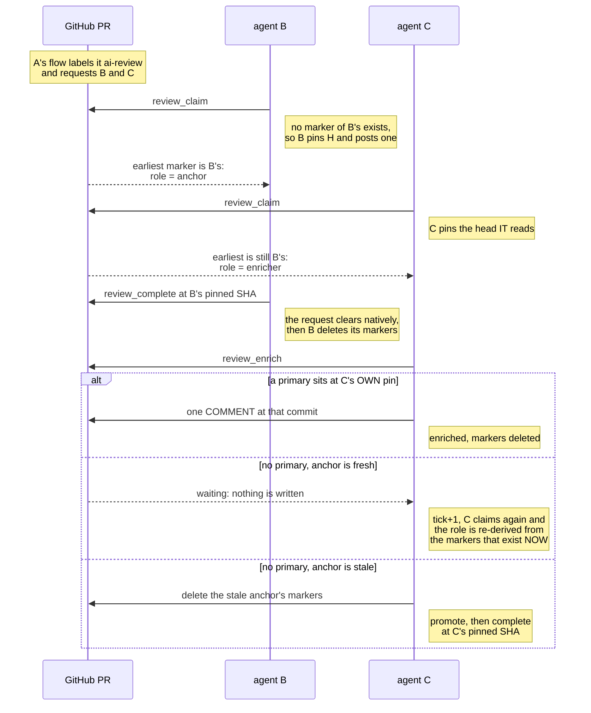

The mechanics behind that, precisely:

- **The claim marker** is a hidden HTML comment, `<!-- agent-review:claim … -->`, carrying the reviewer login, the pinned SHA, and `claimedAt`. With `captureMetadata` on it also carries the reviewing machine and the v2 metadata fields; with capture off the hostname is omitted. Markers are keyed per login, so claiming never blocks another reviewer.
- **The head-SHA pin, and the re-pin.** `claimReview` reads its own earliest marker first. If that marker already names the head, it resumes on it. If it names an older commit, the claim is **re-pinned** to the current head: every marker of this login's is deleted and one is posted carrying the new SHA, in that order (posting first and failing to delete would leave two markers and re-pin once per tick forever). Only the SHA changes, and `claimedAt` in particular is carried over, so a re-pin cannot reorder the panel and an anchor stays the anchor. With no marker at all, the current head is pinned fresh. Every read and every review from then on is against the pinned SHA.
- **Roles are derived, never stored.** All markers are sorted by `claimedAt`, ties broken by the lower comment id; the earliest claimant is the **anchor** and everyone else is an **enricher**, who additionally receives the `second-opinion` skill. This is recomputed on every claim, which is how a stalled panel un-sticks itself across ticks.
- **A second claimant is resolved by that same sort**, not by a lock. Two processes under the *same* login sort by `claimedAt` too, and the later one adopts the winner's pinned SHA; both markers are deleted together at completion.
- **`completeReview`** verifies local HEAD, the clean index/worktree, the claim SHA, and remote PR head before writing. It then looks for a *competing primary* at that same commit and downgrades a losing anchor to a second-opinion `COMMENT`. A moved or dirty state is rejected; successful responses retain `drifted: false` for compatibility.
- **`enrichReview`** looks for that primary at the enricher's **own** pinned commit. Finding one, it posts a single consolidated `COMMENT` review at the primary's commit. Finding none, it compares the earliest marker's `claimedAt` against a 30-minute TTL and either reports `waiting` or, if it is itself the earliest survivor, deletes the stale anchor's markers and reports `promote`.
- **There is no cross-review lock.** A truly simultaneous `complete` by two agents can still race; both reviews stay visible. See [ADR 0001](./adr/0001-github-as-the-source-of-truth.md).

Three consequences of that design, none of them accidental:

- **Two agents can still pin different commits.** Both `completeReview`'s competing-primary test and `enrichReview`'s primary lookup match on the *enricher's own* pinned SHA, so if B pinned `sha1` and C pinned `sha2` after a push, C never sees B's primary, waits out the TTL, and posts its own primary at `sha2`. The re-pin narrows the window (a stalled claim now catches up to the head on its next tick instead of never) without closing it: [#62](https://github.com/input-output-hk/agent-peer-review/issues/62).
- **Stale evidence never posts.** The complete and enrich operations refuse a moved remote head, mismatched local HEAD, or dirty checkout, so a review cannot silently describe code the branch has left.
- **An enricher that posted a second opinion is then inert.** Its history holds only a `COMMENT`, which carries no verdict, so `pr_watch` answers `none` on every later tick.

---

## 5. What state lives where

The claim that all state lives on the pull request is the package's foundation. This is the whole of it: three read-only inputs, one derived layer that is discarded at the end of the tick, and exactly five kinds of write.

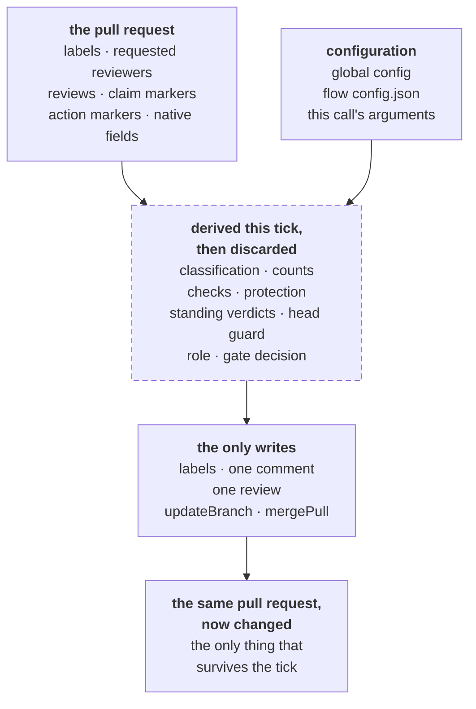

**On the pull request.** Durable, and the only thing that survives a tick:

| what | shape |
|---|---|
| labels | `ai-review`, the trigger, plus any skill labels from the fixed skill-name list |
| requested reviewers | users and teams, GitHub-native. Cleared automatically when a review is submitted |
| reviews | author, state, `commitId`, `submittedAt`, body. The body may carry the structured result record, end with the primary marker, and carry an opt-in metadata footer |
| claim markers | issue comments holding `agent-review:claim`: reviewer, pinned SHA, `claimedAt`, and with metadata capture on, machine, model, agent, and tool version |
| self-review marker | the author-owned issue comment holding `agent-review:self-review`, exact head, and successful status |
| review follow-up | at most one author-owned PR link marker plus one repository issue keyed to the source PR |
| action markers | issue comments holding `agent-review:action`: kind, `headSha`, decision, timestamp |
| native fields | `state`, `draft`, `headSha`, `baseRef`, mergeable state, changed files, checks, branch protection |

**In the global config**, `~/.agent-peer-review/config.json`, with `AGENT_REVIEW_*` environment overrides:

| key | why it is there |
|---|---|
| `githubLogin`, `defaultRepo`, `skillsDir` | plumbing. Only `githubLogin` is auto-detected, from the token; the other two are yours to set |
| `reviewers` | the default list `pr_request_review` requests when a call names none |
| `knownAgentLogins` | the **only** source of agent identity for rail 7. Anything unlisted is a human |
| `mergeMethodByRepo` | `owner/name` to `merge`, `squash`, or `rebase`. Read by the pi adapter when an auto-merge call omits `mergeMethod`, so a squash-only repository does not 405 on every attempt. An explicit per-call `mergeMethod` wins over it, and it wins over the adapter's own read of the repository's allowed methods |
| `captureMetadata`, `model`, `agent`, `toolVersion` | opt-in durable metadata capture, default off |
| no `autonomy`, deliberately | a config flag would switch every repository the tool touches into auto-merge at once, silently |

**In a flow's own `config.json`**, at `.pi/taskflows/<flow>/config.json`:

| key | flows | note |
|---|---|---|
| `repos` | all three | the repositories a tick even looks at. A missing or unparseable file yields an empty list, so nothing is discovered |
| `botAuthors` | pr-steward only | passed to `gh --author`. Defaults to `app/dependabot` and `app/renovate` |
| `reviewers` | pr-requester's example only | documentation. It is never read; the global config is what `pr_request_review` uses |

**Per invocation**, an argument and never stored anywhere: `autonomy` (`propose` by default), `mergeMethod`, `botAllowlist` (`pr_approve_dep_upgrade` only), `maxReviewRounds` (`pr_watch` only), and `maxFiles` / `maxLines`. `botAllowlist` is intersected with `DEFAULT_BOT_ALLOWLIST`, so it can remove a trusted bot but never add one. `maxReviewRounds` is clamped to `DEFAULT_MAX_REVIEW_ROUNDS` (3), so it can hand off earlier but never defer the human handoff. Both merge-capable tools expose the size caps, and both clamp them to their own policy: `pr_expedite` to `DEFAULT_GATE_POLICY` (10 files, 200 lines) and `pr_approve_dep_upgrade` to `DEPS_GATE_POLICY` (10 files, 4000 lines). Every caller-supplied trust, handoff, or size input is therefore tighten-only: a model cannot widen its own blast radius in the same call that asks for a merge.

**Derived every tick, and never stored:** the classification and its per-file categories; the changed file and line counts; the checks rollup; `protectionSatisfied` and `approvalsByOthers`; `humanReviewPending` and `humanChangesRequested`, both read from `standingVerdicts`; `headShaGuardPassed`; the anchor-or-enricher role; the gate decision and one reason per failed rail; the dependency shape and semver level; the watch action and its `headMoved`; and the detected languages plus the repository context read at the pinned SHA.

Two properties fall out of that, and both are load-bearing:

- **Nothing in the derived layer survives the tick.** There is no cache and no database, so there is nothing to fall out of sync with GitHub. The cost is that every tick pays for the same reads again.
- **Idempotency is always keyed on `H`.** A proposal marker carries the head it was evaluated against; the next tick recognises its own proposal at the same head and writes nothing, and deletes its proposals at older heads so the thread carries exactly one live proposal. Claim and self-review markers carry a pinned SHA for the same reason; a claim re-pins when it falls behind, while a push requires a fresh self-review. `requestPeerReview` keys on the head too: a target reviewer's open request *or* a review of the current head means this round is answered, so the tick after a peer replies does not ask again. The one follow-up issue is PR-scoped rather than head-scoped so a push cannot manufacture another issue.

A proposal marker keys on the head SHA **alone**, so a proposal keeps the rationale written on the first tick even if the reasons change while the head does not, for instance a check going from pending to failing. The comment stays truthful about what is proposed and at which commit; only its list of blockers can age.

---

## What is still open

This page used to carry a catalogue of the bugs under repair, one annotation per diagram plus an index. That was the wrong place for it: a live bug list has to be revised on every fix, nothing forced that, and several entries went on describing behaviour the code no longer had. The open work is tracked where it is maintained, on [the issue list](https://github.com/input-output-hk/agent-peer-review/issues), and the sections above link an issue only where a reader would otherwise take a deliberate limit for an oversight.

Before turning `autonomy=auto` on anywhere, read [issue #39](https://github.com/input-output-hk/agent-peer-review/issues/39), which is the checklist that gates it.

For the prose behind the review side, see [Review lifecycle](./lifecycle.md); for the flows as an operator runs them, see [Taskflows](./taskflows.md).
