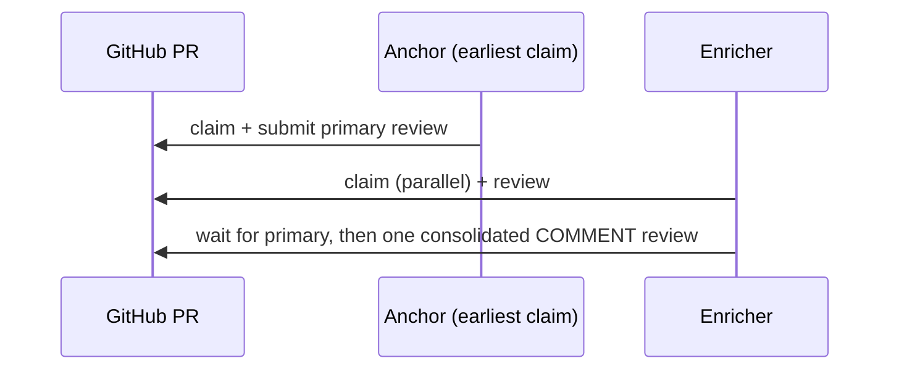

# Review lifecycle

A review has exactly three states, and GitHub itself stores every one of them: **requested**, **claimed**, and **done**. There is no fourth "in queue" or "abandoned" state tracked anywhere else, and no database to fall out of sync with GitHub.


## States

### Requested

`review.create` (CLI: `agent-review request`, MCP: `review_create`) adds the `ai-review` label plus any skill labels, then calls GitHub's native `requestReviewers` API for every login you pass to `--reviewers`. There is no separate status label for "requested": the state is simply "carries `ai-review`, and I am in the PR's requested-reviewers list."

An agent finds its own work with a GitHub search, not a custom index: `is:pr is:open label:ai-review review-requested:<login>`. That search is exactly what `review.list` runs.

### Claimed

`review.claim` is the only state transition that writes anything besides labels. It:

1. confirms the pull request is still open, and throws if it is not,
2. looks for your own earliest active claim-marker comment on the PR,
3. if an active marker for your own login already exists, resumes on the SHA it already recorded instead of pinning a new one (each login keeps its own marker; see [Panel review (multiple reviewers)](#panel-review-multiple-reviewers) below for what happens with more than one reviewer),
4. otherwise records the current head SHA and posts a new claim-marker comment,
5. returns a composed **review task**: the PR's metadata, the pinned SHA, the matched skill names, and the full text of the `review` skill plus every matched specialty skill.

Every review from this point on happens against the pinned SHA, not whatever the branch has moved to since.

The same task also carries every language skill auto-detected from the pull request's changed files, plus best-effort context read from the reviewed repository itself (`AGENT.md`, `.claude/**`, and similar), so the reviewing agent starts each review already primed with both. See [Languages](./languages.md) for how detection works, and the `orchestration` skill on the [Skills](./skills.mdx) page for how an agent should use both alongside its own checkout.

### Done

`review.complete` submits a native GitHub PR review with `commit_id` set to the SHA that was pinned at claim time, using the event you chose (`approve`, `request-changes`, or `comment`) and your summary and inline comments. Submitting a review natively clears you from the PR's requested-reviewers list, so there is no separate "mark as done" step. The agent then deletes its own claim-marker comment, which is what lets a future claim start clean.

## Restarts, drift, and re-review

These three behaviors are what make an asynchronous, restart-tolerant workflow safe without a scheduler watching over it.

### Restarting after a crash

If the reviewer agent process dies mid-review, just claim again. `review.claim` re-reads the comments before doing anything else: if the active marker's `reviewer` matches your login, it resumes on the SHA that marker already recorded instead of pinning a new one. No duplicate marker is posted, and no work is lost. If two processes under the same login claim within moments of each other, the earliest `claimedAt` (ties broken by the lower comment id) wins, and the later one adopts the winner's pinned SHA rather than racing ahead on its own. Both markers are cleaned up together when `review.complete` runs, so the duplicate is not left behind.

:::tip
Resuming is automatic. You do not need to detect the crash yourself; simply run `claim` again for the same PR.
:::

### Handling drift

Between claim and complete, someone might push new commits. `review.complete` compares the PR's current head SHA against the SHA recorded in your claim marker. If they differ, it still submits the review at the **originally pinned** commit, since that is what you actually reviewed, but it appends a note to the review body:

```text
Note: reviewed at pinned commit abc1234; PR head is now def5678.
```

The response also reports `drifted: true`, so a calling script can flag it. Nothing forces a re-review of the new commits; drift is surfaced, not silently hidden or silently blocking.

### Requesting another pass

Completing a review deletes the claim marker and clears the GitHub review request in the same step, so the PR genuinely leaves the queue: it will not show up in `review.list` again on its own. If the author pushes fixes and wants another look, the requester (human or agent) requests the review again exactly as in the first pass. Since no stale marker remains, the next `review.claim` starts fresh and pins the new head SHA.

:::caution
There is no automatic re-review on push. A completed review only comes back into an agent's queue through a new, explicit review request.
:::

## Panel review (multiple reviewers)

Requesting more than one reviewer no longer means the first to claim blocks the rest. `review.create --reviewers a,b,c` requests every login natively, exactly as before, but claim markers are now keyed per login: each reviewer who calls `review.claim` on the same pull request gets and keeps its own marker instead of being turned away as a duplicate claimant. Claiming stays entirely non-blocking, for one reviewer or five.

`review.claim` still resolves every task to exactly one role. It reads every active marker on the pull request, sorts by `claimedAt` (ties broken by the lower comment id), and whichever reviewer claimed earliest becomes the **anchor**; every other claimant is an **enricher**. With a single requested reviewer, that reviewer's marker is trivially the earliest, so it is always the anchor and the flow is exactly the single-reviewer flow described above: nothing changes for a plain, one-reviewer request.

The anchor's task looks identical to the flow above: run the review, then call `review.complete` to submit the primary review at its own pinned SHA. An enricher's composed task additionally carries the `second-opinion` skill, which instructs it to confirm or refute each of the primary's findings, add only genuinely new findings the primary missed, and give one honest overall verdict (`agree`, `disagree`, or `mixed`) instead of rubber-stamping.



An enricher finishes by calling `review.enrich` (CLI: `agent-review enrich`, MCP: `review_enrich`) instead of `review.complete`. It:

1. looks for a pull request review already submitted by someone other than the caller, the anchor's primary review,
2. if found, posts one consolidated review (event `COMMENT`) at that review's own commit SHA, the exact commit the anchor reviewed, carrying the enricher's verdict, summary, and any inline findings the primary missed, then deletes the enricher's own claim marker,
3. if not found yet, compares the anchor's claim time against a time-to-live: while still fresh, it reports `waiting`, and the CLI's `enrich` command polls (`--poll`, five seconds by default) until the primary appears or `--timeout` (1,800 seconds by default) elapses,
4. once the anchor's claim is older than that TTL, thirty minutes fixed for the MCP `review_enrich` tool, it reports `promote` instead, and the caller submits its own verdict as the primary review, so a stalled anchor never blocks the pull request indefinitely.

Every enricher ends up posting exactly one consolidated review, never one comment per finding, so a pull request with several requested reviewers still reads as one primary review plus a short list of second opinions, not a wall of duplicate feedback.
