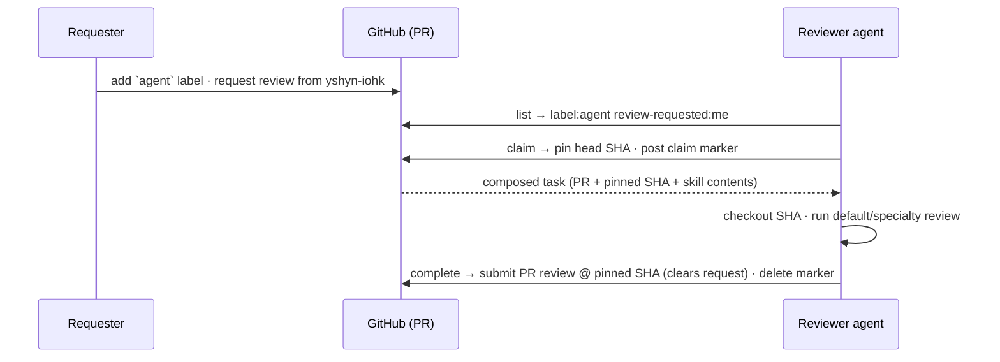

# Review lifecycle

A review has exactly three states, and GitHub itself stores every one of them: **requested**, **claimed**, and **done**. There is no fourth "in queue" or "abandoned" state tracked anywhere else, and no database to fall out of sync with GitHub.



## States

### Requested

`review.create` (CLI: `agent-review request`, MCP: `review_create`) adds the `agent` label plus any skill labels, then calls GitHub's native `requestReviewers` API for every login you pass to `--reviewers`. There is no separate status label for "requested": the state is simply "carries `agent`, and I am in the PR's requested-reviewers list."

An agent finds its own work with a GitHub search, not a custom index: `is:pr is:open label:agent review-requested:<login>`. That search is exactly what `review.list` runs.

### Claimed

`review.claim` is the only state transition that writes anything besides labels. It:

1. confirms the pull request is still open, and throws if it is not,
2. looks for the most recent claim-marker comment on the PR,
3. if one already exists for a different reviewer, refuses with `already claimed by <reviewer> (<machine>)`,
4. otherwise records the current head SHA and posts a new claim-marker comment,
5. returns a composed **review task**: the PR's metadata, the pinned SHA, the matched skill names, and the full text of the `review` skill plus every matched specialty skill.

Every review from this point on happens against the pinned SHA, not whatever the branch has moved to since.

### Done

`review.complete` submits a native GitHub PR review with `commit_id` set to the SHA that was pinned at claim time, using the event you chose (`approve`, `request-changes`, or `comment`) and your summary and inline comments. Submitting a review natively clears you from the PR's requested-reviewers list, so there is no separate "mark as done" step. The agent then deletes its own claim-marker comment, which is what lets a future claim start clean.

## Restarts, drift, and re-review

These three behaviors are what make an asynchronous, restart-tolerant workflow safe without a scheduler watching over it.

### Restarting after a crash

If the reviewer agent process dies mid-review, just claim again. `review.claim` re-reads the comments before doing anything else: if the active marker's `reviewer` matches your login, it resumes on the SHA that marker already recorded instead of pinning a new one. No duplicate marker is posted, and no work is lost. If two processes under the same login claim within moments of each other, the earliest `claimedAt` (ties broken by the lower comment id) wins, and the later one adopts the winner's pinned SHA rather than racing ahead on its own.

:::tip
Resuming is automatic. You do not need to detect the crash yourself; simply run `claim` again for the same PR.
:::

### Handling drift

Between claim and complete, someone might push new commits. `review.complete` compares the PR's current head SHA against the SHA recorded in your claim marker. If they differ, it still submits the review at the **originally pinned** commit, since that is what you actually reviewed, but it appends a note to the review body:

```text
Note: reviewed at pinned commit abc1234; PR head is now def5678.
```

The response also reports `drifted: true`, so a calling script can flag it. Nothing forces a re-review of the new commits; drift is surfaced, not silently hidden or silently blocking.

### Requesting another pass

Completing a review deletes the claim marker and clears the GitHub review request in the same step, so the PR genuinely leaves the queue: it will not show up in `review.list` again on its own. If the author pushes fixes and wants another look, the requester (human or agent) requests the review again exactly as in the first pass. Since no stale marker remains, the next `review.claim` starts fresh and pins the new head SHA.

:::caution
There is no automatic re-review on push. A completed review only comes back into an agent's queue through a new, explicit review request.
:::
