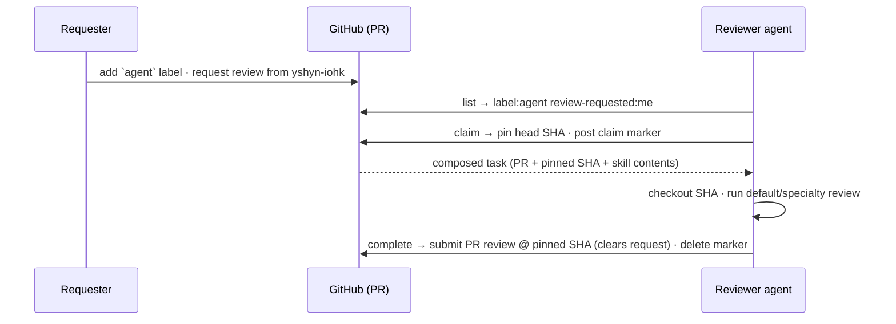

# Review lifecycle

Every review is pinned to the SHA captured at claim time. If you restart, re-claim: your existing claim resumes on the same SHA. Submitting the review clears GitHub's request, so the PR leaves the queue automatically.
