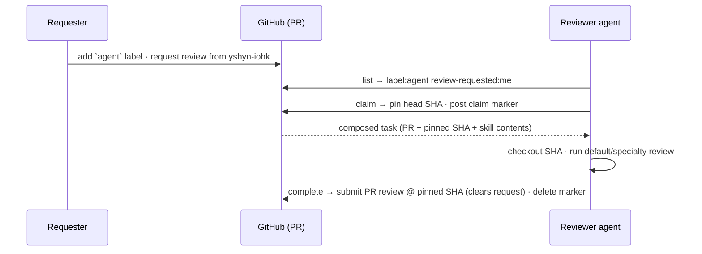

# Agent Peer Review Implementation Plan

> **For agentic workers:** REQUIRED SUB-SKILL: Use superpowers:subagent-driven-development (recommended) or superpowers:executing-plans to implement this plan task-by-task. Steps use checkbox (`- [ ]`) syntax for tracking.

**Goal:** Ship a minimal async PR-review workflow over GitHub — one TypeScript package exposing a CLI (primary) and an MCP server (secondary) over a shared `core`, plus label-selected review skills and a Docusaurus docs site.

**Architecture:** All GitHub + domain logic lives in a pure `core` library behind a `GitHubGateway` interface (so unit tests run against a fake, no network). `cli/` and `mcp/` are thin adapters over `core`. Routing is **native**: a request is the `agent` label + a GitHub requested-reviewer; the agent finds work via `label:agent review-requested:<its-login>`. A claim-marker comment pins the reviewed SHA and survives restarts; completion submits a native PR review at the pinned SHA (which clears the request) and deletes the marker. `claim` returns the composed skill content so every host behaves identically.

**Tech Stack:** TypeScript (ESM, NodeNext) · Node ≥20 · zod (single source of truth for schemas + types) · `zod-to-json-schema` (generates `schemas/*.json`) · `@octokit/rest` · `commander` · `@modelcontextprotocol/sdk` · Vitest · Docusaurus.

## Global Constraints

Every task's requirements implicitly include these:

- **Package name:** `@input-output-hk/agent-review`; **bins:** `agent-review` (CLI) + `agent-review-mcp` (MCP stdio server).
- **Module system:** ESM everywhere (`"type": "module"`), TypeScript `module`/`moduleResolution` = `NodeNext`, `target` ES2022, `strict: true`.
- **Node:** `engines.node >= 20`.
- **License:** Apache-2.0 (already present).
- **Distribution:** GitHub Packages, registry `https://npm.pkg.github.com`; `files` allowlist ships only `dist/`, `skills/`, `schemas/`.
- **State model (native-first):** request = `agent` label + native requested-reviewer (+ optional bare skill labels); claim = marker comment pinning the SHA; done = native PR review at `commit_id = pinned SHA`, which clears the request. No terminal label.
- **Label profile, exact colors:** `agent` = `0e8a16` (required trigger); bare skill labels `security, architecture, performance, testing, api, rust, react-native, did, oid4vc, cryptography, documentation` = `5319e7`. **No** `review` / `reviewer:*` / `skill:*` / `status:*` / `reviewed` labels. Routing is native requested-reviewers, not a label.
- **Skill names (11):** the list above. Plus non-specialty `review` (default) and `orchestration` skill files. Bare labels are matched only against this known set; any other label is ignored.
- **Identity:** GitHub login is auto-detected from the token (`users.getAuthenticated`) when `githubLogin` is unset — agents can run zero-config.
- **Security default:** static review; `runChecks` defaults to `false`.
- **Claim marker format:** a human-readable line followed by `<!-- agent-review:claim {json} -->`; JSON validates against `claim-marker.schema.json`.
- **MCP tool ids use underscores** (`review_create`, `review_list`, `review_claim`, `review_complete`, `labels_bootstrap`); docs refer to the logical `review.create` etc.
- **Commits:** every commit uses `git commit -S -s` (GPG sign + DCO). Do NOT add a manual `Signed-off-by:` line (the `-s` flag adds it).

---

## File Structure

```text
package.json · tsconfig.json · vitest.config.ts · .gitignore · .npmrc
core/
  model.ts          zod schemas + inferred types (Config, ReviewRequest, ClaimMarker, ReviewResult, LabelSpec) + domain types (PullRequest, IssueComment, ReviewSummary, ReviewTask)
  paths.ts          findPackageRoot(), skillsRoot(config), schemasRoot()
  labels.ts         SKILL_NAMES, TRIGGER, COLORS, parseSkills, composeRequestLabels, buildProfile
  claim-marker.ts   serialize/parse the claim comment
  skills.ts         hasSkill, loadSkill, composeInstructions (imports SKILL_NAMES from labels)
  config.ts         config resolution (all fields optional)
  github.ts         GitHubGateway interface + OctokitGateway impl + resolveToken()
  operations/
    bootstrap.ts · create.ts · list.ts · claim.ts · complete.ts
  index.ts          barrel export
cli/
  index.ts          commander program + bin shebang
  render.ts         output helpers
mcp/
  server.ts         buildServer() registering 5 tools
  index.ts          stdio bin shebang
scripts/
  gen-schemas.ts    emit schemas/*.json from core/model zod schemas
schemas/            *.json (generated, committed)
skills/             orchestration.md, review.md, + 11 specialty .md
examples/           config.json, review-request.json, review-result.json
test/fakes/
  fake-github.ts    in-memory GitHubGateway for tests
docs/               Docusaurus site (superpowers/** excluded from build)
.github/workflows/  ci.yml · pages.yml · publish.yml
```

---

## Phase 0 — Scaffolding

### Task 1: Project scaffold (package.json, tsconfig, vitest, dirs)

**Files:**
- Create: `package.json`, `tsconfig.json`, `vitest.config.ts`, `.gitignore`, `.npmrc`

**Interfaces:**
- Produces: npm scripts `build`, `test`, `typecheck`, `gen:schemas`, `check:schemas`, `serve`; bin names `agent-review`, `agent-review-mcp`.

- [ ] **Step 1: Create `package.json`**

```json
{
  "name": "@input-output-hk/agent-review",
  "version": "0.1.0",
  "description": "Minimal asynchronous PR-review workflow over GitHub for Claude, Codex, and pi.dev agents.",
  "license": "Apache-2.0",
  "type": "module",
  "engines": { "node": ">=20" },
  "bin": {
    "agent-review": "dist/cli/index.js",
    "agent-review-mcp": "dist/mcp/index.js"
  },
  "files": ["dist", "skills", "schemas"],
  "publishConfig": { "registry": "https://npm.pkg.github.com" },
  "scripts": {
    "build": "tsc -p tsconfig.json",
    "typecheck": "tsc -p tsconfig.json --noEmit",
    "test": "vitest run",
    "gen:schemas": "tsx scripts/gen-schemas.ts",
    "check:schemas": "tsx scripts/gen-schemas.ts && git diff --exit-code -- schemas",
    "serve": "node dist/mcp/index.js"
  },
  "dependencies": {
    "@modelcontextprotocol/sdk": "^1.0.0",
    "@octokit/rest": "^21.0.0",
    "commander": "^12.0.0",
    "zod": "^3.23.0",
    "zod-to-json-schema": "^3.23.0"
  },
  "devDependencies": {
    "@types/node": "^20.0.0",
    "tsx": "^4.0.0",
    "typescript": "^5.5.0",
    "vitest": "^2.0.0"
  }
}
```

- [ ] **Step 2: Create `tsconfig.json`**

```json
{
  "compilerOptions": {
    "target": "ES2022",
    "module": "NodeNext",
    "moduleResolution": "NodeNext",
    "outDir": "dist",
    "declaration": true,
    "strict": true,
    "esModuleInterop": true,
    "skipLibCheck": true,
    "resolveJsonModule": true,
    "forceConsistentCasingInFileNames": true
  },
  "include": ["core", "cli", "mcp"],
  "exclude": ["node_modules", "dist", "**/*.test.ts", "test", "scripts", "docs", "website"]
}
```

- [ ] **Step 3: Create `vitest.config.ts`**

```ts
import { defineConfig } from "vitest/config";

export default defineConfig({
  test: { include: ["core/**/*.test.ts", "test/**/*.test.ts", "scripts/**/*.test.ts"], environment: "node" },
});
```

- [ ] **Step 4: Create `.gitignore`**

```gitignore
node_modules/
dist/
docs/build/
docs/.docusaurus/
*.tsbuildinfo
.DS_Store
```

- [ ] **Step 5: Create `.npmrc`** (registry mapping; token supplied by environment, never committed)

```ini
@input-output-hk:registry=https://npm.pkg.github.com
```

- [ ] **Step 6: Install and verify**

Run: `npm install`
Expected: dependencies install cleanly.

Run: `npx vitest run`
Expected: "No test files found" (exit 0 or a clear no-tests message) — confirms the runner works.

- [ ] **Step 7: Commit**

```bash
git add package.json tsconfig.json vitest.config.ts .gitignore .npmrc package-lock.json
git commit -S -s -m "chore: scaffold TypeScript package (build, test, bins)"
```

---

## Phase 1 — Core model & infrastructure

### Task 2: Domain model (zod schemas + types)

**Files:**
- Create: `core/model.ts`, `core/model.test.ts`

**Interfaces:**
- Produces (imported by nearly every later task):
  - zod schemas `ConfigSchema`, `ReviewRequestSchema`, `ClaimMarkerSchema`, `ReviewResultSchema`, `LabelSpecSchema`
  - inferred types `Config`, `ReviewRequest`, `ClaimMarker`, `ReviewResult`, `LabelSpec`
  - domain types `PullRequest`, `IssueComment`, `ReviewSummary`, `ReviewTask`

- [ ] **Step 1: Write the failing test**

```ts
// core/model.test.ts
import { describe, it, expect } from "vitest";
import { ReviewResultSchema, ReviewRequestSchema, ClaimMarkerSchema, ConfigSchema } from "./model.js";

describe("model", () => {
  it("requires at least one reviewer on a request", () => {
    expect(() => ReviewRequestSchema.parse({ repo: "o/r", pr: 1, reviewers: [] })).toThrow();
    const ok = ReviewRequestSchema.parse({ repo: "o/r", pr: 1, reviewers: ["yshyn-iohk"] });
    expect(ok.skills).toEqual([]);
  });
  it("rejects an unknown review event", () => {
    expect(() => ReviewResultSchema.parse({ repo: "o/r", pr: 1, event: "nope", summary: "x" })).toThrow();
  });
  it("requires claim marker version 1", () => {
    expect(() => ClaimMarkerSchema.parse({ v: 2, reviewer: "y", machine: "m", sha: "abcdefg", claimedAt: "t" })).toThrow();
  });
  it("config defaults are all optional", () => {
    const c = ConfigSchema.parse({});
    expect(c.githubLogin).toBeNull();
    expect(c.runChecks).toBe(false);
  });
});
```

- [ ] **Step 2: Run test to verify it fails**

Run: `npx vitest run core/model.test.ts`
Expected: FAIL — cannot find module `./model.js`.

- [ ] **Step 3: Write `core/model.ts`**

```ts
import { z } from "zod";

export const ConfigSchema = z.object({
  githubLogin: z.string().nullable().default(null),
  defaultRepo: z.string().optional(),
  skillsDir: z.string().nullable().default(null),
  runChecks: z.boolean().default(false),
});
export type Config = z.infer<typeof ConfigSchema>;

export const ReviewRequestSchema = z.object({
  repo: z.string().regex(/^[^/]+\/[^/]+$/),
  pr: z.number().int().positive(),
  skills: z.array(z.string()).default([]),
  reviewers: z.array(z.string().min(1)).min(1),
  note: z.string().optional(),
});
export type ReviewRequest = z.infer<typeof ReviewRequestSchema>;

export const ClaimMarkerSchema = z.object({
  v: z.literal(1),
  reviewer: z.string().min(1),
  machine: z.string().min(1),
  sha: z.string().min(7),
  claimedAt: z.string().min(1),
});
export type ClaimMarker = z.infer<typeof ClaimMarkerSchema>;

export const ReviewResultSchema = z.object({
  repo: z.string().regex(/^[^/]+\/[^/]+$/),
  pr: z.number().int().positive(),
  event: z.enum(["approve", "request-changes", "comment"]),
  summary: z.string().min(1),
  comments: z
    .array(z.object({ path: z.string(), line: z.number().int().positive(), body: z.string() }))
    .optional(),
});
export type ReviewResult = z.infer<typeof ReviewResultSchema>;

export const LabelSpecSchema = z.object({
  name: z.string().min(1),
  color: z.string().regex(/^[0-9a-fA-F]{6}$/),
  description: z.string(),
});
export type LabelSpec = z.infer<typeof LabelSpecSchema>;

// Plain domain types (not validated as input).
export interface PullRequest {
  number: number;
  title: string;
  author: string;
  headSha: string;
  baseSha: string;
  url: string;
  state: "open" | "closed" | "merged";
  labels: string[];
}

export interface IssueComment {
  id: number;
  body: string;
  author: string;
}

export interface ReviewSummary {
  repo: string;
  pr: number;
  url: string;
  title: string;
  skills: string[];
  headSha: string;
  claim?: ClaimMarker;
}

export interface ReviewTask {
  repo: string;
  pr: number;
  url: string;
  title: string;
  author: string;
  headSha: string;
  baseSha: string;
  reviewer: string; // acting agent's GitHub login
  skills: string[];
  instructions: { review: string; skills: Array<{ name: string; content: string }> };
  claim: { machine: string; claimedAt: string };
}
```

- [ ] **Step 4: Run test to verify it passes**

Run: `npx vitest run core/model.test.ts`
Expected: PASS (4 tests).

- [ ] **Step 5: Commit**

```bash
git add core/model.ts core/model.test.ts
git commit -S -s -m "feat(core): domain model (zod schemas + types)"
```

---

### Task 3: Schema generation (zod → schemas/*.json) + drift check

**Files:**
- Create: `scripts/gen-schemas.ts`, `schemas/*.json` (generated), `scripts/gen-schemas.test.ts`

**Interfaces:**
- Consumes: `core/model.ts` zod schemas.
- Produces: committed JSON Schema files; `npm run check:schemas` drift gate.

- [ ] **Step 1: Write `scripts/gen-schemas.ts`**

```ts
import { writeFileSync, mkdirSync } from "node:fs";
import { fileURLToPath } from "node:url";
import path from "node:path";
import { zodToJsonSchema } from "zod-to-json-schema";
import {
  ConfigSchema, ReviewRequestSchema, ClaimMarkerSchema, ReviewResultSchema, LabelSpecSchema,
} from "../core/model.js";

const out = path.resolve(path.dirname(fileURLToPath(import.meta.url)), "..", "schemas");
mkdirSync(out, { recursive: true });

const entries: Array<[string, unknown]> = [
  ["config", ConfigSchema],
  ["review-request", ReviewRequestSchema],
  ["claim-marker", ClaimMarkerSchema],
  ["review-result", ReviewResultSchema],
  ["label-spec", LabelSpecSchema],
];

for (const [name, schema] of entries) {
  const json = zodToJsonSchema(schema as never, { name, target: "jsonSchema7" });
  writeFileSync(path.join(out, `${name}.schema.json`), JSON.stringify(json, null, 2) + "\n");
}
console.log(`Generated ${entries.length} schemas in ${out}`);
```

- [ ] **Step 2: Generate the schemas**

Run: `npm run gen:schemas`
Expected: `schemas/config.schema.json`, `review-request.schema.json`, `claim-marker.schema.json`, `review-result.schema.json`, `label-spec.schema.json` created.

- [ ] **Step 3: Write drift test**

```ts
// scripts/gen-schemas.test.ts
import { describe, it, expect } from "vitest";
import { readFileSync } from "node:fs";
import { zodToJsonSchema } from "zod-to-json-schema";
import { ClaimMarkerSchema } from "../core/model.js";

describe("schema generation", () => {
  it("committed claim-marker schema matches the zod source", () => {
    const expected = JSON.stringify(
      zodToJsonSchema(ClaimMarkerSchema as never, { name: "claim-marker", target: "jsonSchema7" }), null, 2) + "\n";
    const actual = readFileSync("schemas/claim-marker.schema.json", "utf8");
    expect(actual).toBe(expected);
  });
});
```

- [ ] **Step 4: Run the test**

Run: `npx vitest run scripts/gen-schemas.test.ts`
Expected: PASS.

- [ ] **Step 5: Commit**

```bash
git add scripts/gen-schemas.ts scripts/gen-schemas.test.ts schemas/
git commit -S -s -m "feat(schemas): generate JSON Schemas from zod with drift check"
```

---

### Task 4: Package-root path resolution

**Files:**
- Create: `core/paths.ts`, `core/paths.test.ts`

**Interfaces:**
- Produces: `findPackageRoot(fromDir?: string): string`, `skillsRoot(config: Config): string`, `schemasRoot(): string`.

- [ ] **Step 1: Write the failing test**

```ts
// core/paths.test.ts
import { describe, it, expect } from "vitest";
import { findPackageRoot, skillsRoot } from "./paths.js";
import path from "node:path";

const cfg = (skillsDir: string | null) => ({ githubLogin: null, skillsDir, runChecks: false });

describe("paths", () => {
  it("finds the package root (dir containing package.json)", () => {
    expect(findPackageRoot()).toBe(process.cwd());
  });
  it("honors skillsDir override", () => {
    expect(skillsRoot(cfg("/tmp/s"))).toBe("/tmp/s");
  });
  it("defaults skills to <root>/skills", () => {
    expect(skillsRoot(cfg(null))).toBe(path.join(process.cwd(), "skills"));
  });
});
```

- [ ] **Step 2: Run test to verify it fails**

Run: `npx vitest run core/paths.test.ts`
Expected: FAIL — module not found.

- [ ] **Step 3: Write `core/paths.ts`**

```ts
import { existsSync } from "node:fs";
import { fileURLToPath } from "node:url";
import path from "node:path";
import type { Config } from "./model.js";

export function findPackageRoot(fromDir = path.dirname(fileURLToPath(import.meta.url))): string {
  let dir = fromDir;
  for (;;) {
    if (existsSync(path.join(dir, "package.json"))) return dir;
    const parent = path.dirname(dir);
    if (parent === dir) throw new Error("package.json not found above " + fromDir);
    dir = parent;
  }
}

export function skillsRoot(config: Config): string {
  return config.skillsDir ?? path.join(findPackageRoot(), "skills");
}

export function schemasRoot(): string {
  return path.join(findPackageRoot(), "schemas");
}
```

- [ ] **Step 4: Run test to verify it passes**

Run: `npx vitest run core/paths.test.ts`
Expected: PASS. (Tests run from repo root, so `findPackageRoot()` climbs to `cwd`.)

- [ ] **Step 5: Commit**

```bash
git add core/paths.ts core/paths.test.ts
git commit -S -s -m "feat(core): package-root and skills/schemas path resolution"
```

---

### Task 5: Labels (skill vocabulary, compose, parse, profile)

**Files:**
- Create: `core/labels.ts`, `core/labels.test.ts`

**Interfaces:**
- Consumes: `LabelSpec` from `core/model.ts`.
- Produces: `SKILL_NAMES: readonly string[]`, `TRIGGER = "agent"`, `COLORS`, `parseSkills(labels: string[]): string[]` (intersection with `SKILL_NAMES`), `composeRequestLabels(skills: string[]): string[]` (`[TRIGGER, ...skills]`), `buildProfile(skillNames?: string[]): LabelSpec[]` (`agent` + one label per skill).

- [ ] **Step 1: Write the failing test**

```ts
// core/labels.test.ts
import { describe, it, expect } from "vitest";
import { composeRequestLabels, parseSkills, buildProfile, TRIGGER } from "./labels.js";

describe("labels", () => {
  it("composes agent + bare skill labels", () => {
    expect(composeRequestLabels(["security", "rust"])).toEqual(["agent", "security", "rust"]);
  });
  it("parses only known skill names, ignoring other labels", () => {
    expect(parseSkills(["agent", "security", "bug", "documentation", "wontfix"]))
      .toEqual(["security", "documentation"]);
  });
  it("builds a profile of agent + all skills by default", () => {
    const names = buildProfile().map((l) => l.name);
    expect(names[0]).toBe(TRIGGER);
    expect(names).toEqual(expect.arrayContaining(["agent", "security", "rust", "oid4vc"]));
    expect(names).not.toContain("review");
    expect(names).not.toContain("reviewer:yurii");
  });
});
```

- [ ] **Step 2: Run test to verify it fails**

Run: `npx vitest run core/labels.test.ts`
Expected: FAIL — module not found.

- [ ] **Step 3: Write `core/labels.ts`**

```ts
import type { LabelSpec } from "./model.js";

export const TRIGGER = "agent";

export const SKILL_NAMES = [
  "security", "architecture", "performance", "testing", "api",
  "rust", "react-native", "did", "oid4vc", "cryptography", "documentation",
] as const;

export const COLORS = { trigger: "0e8a16", skill: "5319e7" } as const;

const isSkill = (label: string): boolean => (SKILL_NAMES as readonly string[]).includes(label);

export function parseSkills(labels: string[]): string[] {
  return labels.filter(isSkill);
}

export function composeRequestLabels(skills: string[]): string[] {
  return [TRIGGER, ...skills.filter(isSkill)];
}

export function buildProfile(skillNames: string[] = [...SKILL_NAMES]): LabelSpec[] {
  return [
    { name: TRIGGER, color: COLORS.trigger, description: "Request an AI agent review" },
    ...skillNames.map((n) => ({ name: n, color: COLORS.skill, description: `Load the ${n} review skill` })),
  ];
}
```

- [ ] **Step 4: Run test to verify it passes**

Run: `npx vitest run core/labels.test.ts`
Expected: PASS (3 tests). (`composeRequestLabels` preserves the requested order; `parseSkills` preserves label order.)

- [ ] **Step 5: Commit**

```bash
git add core/labels.ts core/labels.test.ts
git commit -S -s -m "feat(core): minimal label profile (agent + bare skills)"
```

---

### Task 6: Claim marker (serialize/parse)

**Files:**
- Create: `core/claim-marker.ts`, `core/claim-marker.test.ts`

**Interfaces:**
- Consumes: `ClaimMarker`, `ClaimMarkerSchema`, `IssueComment` from `core/model.ts`.
- Produces: `serializeMarker(m: ClaimMarker): string`, `parseMarkers(comments: IssueComment[]): Array<{ comment: IssueComment; marker: ClaimMarker }>`.

- [ ] **Step 1: Write the failing test**

```ts
// core/claim-marker.test.ts
import { describe, it, expect } from "vitest";
import { serializeMarker, parseMarkers } from "./claim-marker.js";

const marker = { v: 1 as const, reviewer: "yshyn-iohk", machine: "mbp-01", sha: "abc1234", claimedAt: "2026-07-29T10:12:00Z" };

describe("claim marker", () => {
  it("round-trips through a comment body", () => {
    const parsed = parseMarkers([{ id: 1, body: serializeMarker(marker), author: "yshyn-iohk" }]);
    expect(parsed).toHaveLength(1);
    expect(parsed[0].marker).toEqual(marker);
  });
  it("ignores comments without a valid marker", () => {
    expect(parseMarkers([{ id: 2, body: "just a comment", author: "x" }])).toHaveLength(0);
    expect(parseMarkers([{ id: 3, body: "<!-- agent-review:claim {not json} -->", author: "x" }])).toHaveLength(0);
  });
});
```

- [ ] **Step 2: Run test to verify it fails**

Run: `npx vitest run core/claim-marker.test.ts`
Expected: FAIL — module not found.

- [ ] **Step 3: Write `core/claim-marker.ts`**

```ts
import { ClaimMarkerSchema, type ClaimMarker, type IssueComment } from "./model.js";

const MARKER_RE = /<!--\s*agent-review:claim\s+(\{.*?\})\s*-->/s;

export function serializeMarker(m: ClaimMarker): string {
  const human = `Claimed by ${m.reviewer}'s review agent (${m.machine}) at ${m.claimedAt}, pinned to ${m.sha}.`;
  return `${human}\n<!-- agent-review:claim ${JSON.stringify(m)} -->`;
}

export function parseMarkers(comments: IssueComment[]): Array<{ comment: IssueComment; marker: ClaimMarker }> {
  const out: Array<{ comment: IssueComment; marker: ClaimMarker }> = [];
  for (const comment of comments) {
    const match = MARKER_RE.exec(comment.body);
    if (!match) continue;
    try {
      out.push({ comment, marker: ClaimMarkerSchema.parse(JSON.parse(match[1])) });
    } catch {
      // malformed marker — ignore
    }
  }
  return out;
}
```

- [ ] **Step 4: Run test to verify it passes**

Run: `npx vitest run core/claim-marker.test.ts`
Expected: PASS (2 tests).

- [ ] **Step 5: Commit**

```bash
git add core/claim-marker.ts core/claim-marker.test.ts
git commit -S -s -m "feat(core): claim-marker serialize/parse"
```

---

### Task 7: Skills loader

**Files:**
- Create: `core/skills.ts`, `core/skills.test.ts`

**Interfaces:**
- Consumes: `Config` from `core/model.ts`, `skillsRoot` from `core/paths.ts` (SKILL_NAMES lives in `core/labels.ts`).
- Produces: `hasSkill(name, config): boolean`, `loadSkill(name, config): string`, `composeInstructions(skillNames: string[], config): { review: string; skills: Array<{ name: string; content: string }> }` (always loads `review`; loads each existing specialty; unknown/missing ignored).

- [ ] **Step 1: Write the failing test**

```ts
// core/skills.test.ts
import { describe, it, expect, beforeAll } from "vitest";
import { mkdtempSync, writeFileSync } from "node:fs";
import { tmpdir } from "node:os";
import path from "node:path";
import { composeInstructions, hasSkill } from "./skills.js";

let dir: string;
const cfg = () => ({ githubLogin: null, skillsDir: dir, runChecks: false });
beforeAll(() => {
  dir = mkdtempSync(path.join(tmpdir(), "skills-"));
  writeFileSync(path.join(dir, "review.md"), "# default review");
  writeFileSync(path.join(dir, "security.md"), "# security");
});

describe("skills", () => {
  it("composes review + existing specialty, ignoring missing", () => {
    const r = composeInstructions(["security", "does-not-exist"], cfg());
    expect(r.review).toContain("default review");
    expect(r.skills.map((s) => s.name)).toEqual(["security"]);
  });
  it("hasSkill is false for a missing file", () => {
    expect(hasSkill("nope", cfg())).toBe(false);
  });
});
```

- [ ] **Step 2: Run test to verify it fails**

Run: `npx vitest run core/skills.test.ts`
Expected: FAIL — module not found.

- [ ] **Step 3: Write `core/skills.ts`**

```ts
import { existsSync, readFileSync } from "node:fs";
import path from "node:path";
import type { Config } from "./model.js";
import { skillsRoot } from "./paths.js";

const skillPath = (name: string, config: Config): string => path.join(skillsRoot(config), `${name}.md`);

export function hasSkill(name: string, config: Config): boolean {
  return existsSync(skillPath(name, config));
}

export function loadSkill(name: string, config: Config): string {
  return readFileSync(skillPath(name, config), "utf8");
}

export function composeInstructions(
  skillNames: string[],
  config: Config,
): { review: string; skills: Array<{ name: string; content: string }> } {
  const review = loadSkill("review", config);
  const skills = skillNames
    .filter((n) => hasSkill(n, config))
    .map((n) => ({ name: n, content: loadSkill(n, config) }));
  return { review, skills };
}
```

- [ ] **Step 4: Run test to verify it passes**

Run: `npx vitest run core/skills.test.ts`
Expected: PASS (2 tests).

- [ ] **Step 5: Commit**

```bash
git add core/skills.ts core/skills.test.ts
git commit -S -s -m "feat(core): label-selected skill loader (unknown ignored)"
```

---

### Task 8: Config resolution

**Files:**
- Create: `core/config.ts`, `core/config.test.ts`

**Interfaces:**
- Consumes: `ConfigSchema`, `Config` from `core/model.ts`.
- Produces: `loadConfig(explicitPath?: string): Config` (order: `explicitPath` → `AGENT_REVIEW_CONFIG` → `~/.config/agent-review/config.json` → `./.agent-review.json` → built-in defaults; all fields optional).

- [ ] **Step 1: Write the failing test**

```ts
// core/config.test.ts
import { describe, it, expect } from "vitest";
import { mkdtempSync, writeFileSync } from "node:fs";
import { tmpdir } from "node:os";
import path from "node:path";
import { loadConfig } from "./config.js";

describe("config", () => {
  it("loads and validates an explicit config file", () => {
    const dir = mkdtempSync(path.join(tmpdir(), "cfg-"));
    const file = path.join(dir, "config.json");
    writeFileSync(file, JSON.stringify({ githubLogin: "yshyn-iohk" }));
    const cfg = loadConfig(file);
    expect(cfg.githubLogin).toBe("yshyn-iohk");
    expect(cfg.skillsDir).toBeNull();
  });
  it("applies defaults for an empty config file", () => {
    const dir = mkdtempSync(path.join(tmpdir(), "cfg-"));
    const file = path.join(dir, "config.json");
    writeFileSync(file, "{}");
    const cfg = loadConfig(file);
    expect(cfg.githubLogin).toBeNull();
    expect(cfg.runChecks).toBe(false);
  });
});
```

- [ ] **Step 2: Run test to verify it fails**

Run: `npx vitest run core/config.test.ts`
Expected: FAIL — module not found.

- [ ] **Step 3: Write `core/config.ts`**

```ts
import { existsSync, readFileSync } from "node:fs";
import { homedir } from "node:os";
import path from "node:path";
import { ConfigSchema, type Config } from "./model.js";

function candidatePaths(explicitPath?: string): string[] {
  return [
    explicitPath,
    process.env.AGENT_REVIEW_CONFIG,
    path.join(homedir(), ".config", "agent-review", "config.json"),
    path.join(process.cwd(), ".agent-review.json"),
  ].filter((p): p is string => Boolean(p));
}

export function loadConfig(explicitPath?: string): Config {
  for (const p of candidatePaths(explicitPath)) {
    if (existsSync(p)) return ConfigSchema.parse(JSON.parse(readFileSync(p, "utf8")));
  }
  return ConfigSchema.parse({});
}
```

- [ ] **Step 4: Run test to verify it passes**

Run: `npx vitest run core/config.test.ts`
Expected: PASS (2 tests).

- [ ] **Step 5: Commit**

```bash
git add core/config.ts core/config.test.ts
git commit -S -s -m "feat(core): config resolution (all fields optional)"
```

---

### Task 9: GitHub gateway (interface + Octokit impl + fake)

**Files:**
- Create: `core/github.ts`, `test/fakes/fake-github.ts`, `test/fakes/fake-github.test.ts`

**Interfaces:**
- Consumes: `PullRequest`, `IssueComment`, `LabelSpec` from `core/model.ts`.
- Produces: `GitHubGateway` interface (exact signatures below), `OctokitGateway` class, `resolveToken(): string`, and a `FakeGitHubGateway` (test-only) implementing the interface.

```ts
export interface GitHubGateway {
  getAuthenticatedLogin(): Promise<string>;
  getPullRequest(repo: string, pr: number): Promise<PullRequest>;
  listReviewRequests(repo: string, login: string): Promise<PullRequest[]>;
  requestReviewers(repo: string, pr: number, reviewers: string[]): Promise<void>;
  addLabels(repo: string, pr: number, labels: string[]): Promise<void>;
  listLabels(repo: string): Promise<LabelSpec[]>;
  ensureLabel(repo: string, label: LabelSpec): Promise<"created" | "updated" | "unchanged">;
  listComments(repo: string, pr: number): Promise<IssueComment[]>;
  createComment(repo: string, pr: number, body: string): Promise<IssueComment>;
  deleteComment(repo: string, commentId: number): Promise<void>;
  submitReview(repo: string, pr: number, review: {
    commitId: string; event: "APPROVE" | "REQUEST_CHANGES" | "COMMENT";
    body: string; comments?: Array<{ path: string; line: number; body: string }>;
  }): Promise<{ url: string }>;
}
```

- [ ] **Step 1: Write the fake + its test (the fake is the test double for all operation tasks)**

```ts
// test/fakes/fake-github.ts
import type { GitHubGateway } from "../../core/github.js";
import type { PullRequest, IssueComment, LabelSpec } from "../../core/model.js";

export class FakeGitHubGateway implements GitHubGateway {
  login = "me";
  prs = new Map<string, PullRequest>();
  comments = new Map<string, IssueComment[]>();
  requested = new Map<string, Set<string>>();
  labels = new Map<string, LabelSpec[]>();
  reviews: Array<{ repo: string; pr: number; commitId: string; event: string; body: string }> = [];
  private commentId = 1;
  private key(repo: string, pr: number) { return `${repo}#${pr}`; }

  seedPr(pr: PullRequest, repo = "o/r") { this.prs.set(this.key(repo, pr.number), { ...pr }); }
  seedRequest(repo: string, pr: number, login: string) {
    const s = this.requested.get(this.key(repo, pr)) ?? new Set();
    s.add(login); this.requested.set(this.key(repo, pr), s);
  }

  async getAuthenticatedLogin(): Promise<string> { return this.login; }
  async getPullRequest(repo: string, pr: number): Promise<PullRequest> {
    const found = this.prs.get(this.key(repo, pr));
    if (!found) throw new Error(`no PR ${repo}#${pr}`);
    return { ...found, labels: [...found.labels] };
  }
  async listReviewRequests(repo: string, login: string): Promise<PullRequest[]> {
    return [...this.prs.values()].filter((p) =>
      p.state === "open" && p.labels.includes("agent") && (this.requested.get(this.key(repo, p.number))?.has(login) ?? false));
  }
  async requestReviewers(repo: string, pr: number, reviewers: string[]): Promise<void> {
    for (const r of reviewers) this.seedRequest(repo, pr, r);
  }
  async addLabels(repo: string, pr: number, labels: string[]): Promise<void> {
    const stored = this.prs.get(this.key(repo, pr))!;
    stored.labels = [...new Set([...stored.labels, ...labels])];
  }
  async listLabels(repo: string): Promise<LabelSpec[]> { return this.labels.get(repo) ?? []; }
  async ensureLabel(repo: string, label: LabelSpec): Promise<"created" | "updated" | "unchanged"> {
    const list = this.labels.get(repo) ?? [];
    const existing = list.find((l) => l.name === label.name);
    if (!existing) { this.labels.set(repo, [...list, label]); return "created"; }
    if (existing.color !== label.color || existing.description !== label.description) { Object.assign(existing, label); return "updated"; }
    return "unchanged";
  }
  async listComments(repo: string, pr: number): Promise<IssueComment[]> { return this.comments.get(this.key(repo, pr)) ?? []; }
  async createComment(repo: string, pr: number, body: string): Promise<IssueComment> {
    const c = { id: this.commentId++, body, author: this.login };
    this.comments.set(this.key(repo, pr), [...(this.comments.get(this.key(repo, pr)) ?? []), c]);
    return c;
  }
  async deleteComment(repo: string, commentId: number): Promise<void> {
    for (const [k, list] of this.comments) this.comments.set(k, list.filter((c) => c.id !== commentId));
  }
  async submitReview(repo: string, pr: number, review: { commitId: string; event: "APPROVE" | "REQUEST_CHANGES" | "COMMENT"; body: string }): Promise<{ url: string }> {
    this.reviews.push({ repo, pr, commitId: review.commitId, event: review.event, body: review.body });
    this.requested.get(this.key(repo, pr))?.delete(this.login); // native: submitting clears the request
    return { url: `https://github.com/${repo}/pull/${pr}#pullrequestreview-1` };
  }
}
```

```ts
// test/fakes/fake-github.test.ts
import { describe, it, expect } from "vitest";
import { FakeGitHubGateway } from "./fake-github.js";

describe("FakeGitHubGateway", () => {
  it("clears the review request when a review is submitted", async () => {
    const gh = new FakeGitHubGateway();
    gh.seedPr({ number: 1, title: "t", author: "a", headSha: "s", baseSha: "b", url: "u", state: "open", labels: ["agent"] });
    gh.seedRequest("o/r", 1, "me");
    expect(await gh.listReviewRequests("o/r", "me")).toHaveLength(1);
    await gh.submitReview("o/r", 1, { commitId: "s", event: "COMMENT", body: "x" });
    expect(await gh.listReviewRequests("o/r", "me")).toHaveLength(0);
  });
});
```

- [ ] **Step 2: Run the fake test to verify it fails**

Run: `npx vitest run test/fakes/fake-github.test.ts`
Expected: FAIL — cannot find `../../core/github.js`.

- [ ] **Step 3: Write `core/github.ts` (interface + Octokit impl + token)**

```ts
import { execFileSync } from "node:child_process";
import { Octokit } from "@octokit/rest";
import type { PullRequest, IssueComment, LabelSpec } from "./model.js";

export interface GitHubGateway {
  getAuthenticatedLogin(): Promise<string>;
  getPullRequest(repo: string, pr: number): Promise<PullRequest>;
  listReviewRequests(repo: string, login: string): Promise<PullRequest[]>;
  requestReviewers(repo: string, pr: number, reviewers: string[]): Promise<void>;
  addLabels(repo: string, pr: number, labels: string[]): Promise<void>;
  listLabels(repo: string): Promise<LabelSpec[]>;
  ensureLabel(repo: string, label: LabelSpec): Promise<"created" | "updated" | "unchanged">;
  listComments(repo: string, pr: number): Promise<IssueComment[]>;
  createComment(repo: string, pr: number, body: string): Promise<IssueComment>;
  deleteComment(repo: string, commentId: number): Promise<void>;
  submitReview(repo: string, pr: number, review: {
    commitId: string; event: "APPROVE" | "REQUEST_CHANGES" | "COMMENT";
    body: string; comments?: Array<{ path: string; line: number; body: string }>;
  }): Promise<{ url: string }>;
}

export function resolveToken(): string {
  if (process.env.GITHUB_TOKEN) return process.env.GITHUB_TOKEN;
  try { return execFileSync("gh", ["auth", "token"], { encoding: "utf8" }).trim(); }
  catch { throw new Error("No GitHub token: set GITHUB_TOKEN or run `gh auth login`."); }
}

const split = (repo: string): [string, string] => {
  const [owner, name] = repo.split("/");
  return [owner, name];
};

export class OctokitGateway implements GitHubGateway {
  private kit: Octokit;
  private cachedLogin?: string;
  constructor(token = resolveToken()) { this.kit = new Octokit({ auth: token }); }

  async getAuthenticatedLogin(): Promise<string> {
    if (!this.cachedLogin) this.cachedLogin = (await this.kit.users.getAuthenticated()).data.login;
    return this.cachedLogin;
  }
  async getPullRequest(repo: string, pr: number): Promise<PullRequest> {
    const [owner, name] = split(repo);
    const { data } = await this.kit.pulls.get({ owner, repo: name, pull_number: pr });
    return {
      number: data.number, title: data.title, author: data.user?.login ?? "unknown",
      headSha: data.head.sha, baseSha: data.base.sha, url: data.html_url,
      state: data.merged ? "merged" : (data.state as "open" | "closed"),
      labels: data.labels.map((l) => (typeof l === "string" ? l : l.name ?? "")),
    };
  }
  async listReviewRequests(repo: string, login: string): Promise<PullRequest[]> {
    const q = `repo:${repo} is:pr is:open label:agent review-requested:${login}`;
    const items = await this.kit.paginate(this.kit.search.issuesAndPullRequests, { q, per_page: 100 });
    return Promise.all(items.map((i) => this.getPullRequest(repo, i.number)));
  }
  async requestReviewers(repo: string, pr: number, reviewers: string[]): Promise<void> {
    const [owner, name] = split(repo);
    await this.kit.pulls.requestReviewers({ owner, repo: name, pull_number: pr, reviewers });
  }
  async addLabels(repo: string, pr: number, labels: string[]): Promise<void> {
    const [owner, name] = split(repo);
    await this.kit.issues.addLabels({ owner, repo: name, issue_number: pr, labels });
  }
  async listLabels(repo: string): Promise<LabelSpec[]> {
    const [owner, name] = split(repo);
    const items = await this.kit.paginate(this.kit.issues.listLabelsForRepo, { owner, repo: name, per_page: 100 });
    return items.map((l) => ({ name: l.name, color: l.color, description: l.description ?? "" }));
  }
  async ensureLabel(repo: string, label: LabelSpec): Promise<"created" | "updated" | "unchanged"> {
    const [owner, name] = split(repo);
    const existing = (await this.listLabels(repo)).find((l) => l.name === label.name);
    if (!existing) { await this.kit.issues.createLabel({ owner, repo: name, ...label }); return "created"; }
    if (existing.color !== label.color || existing.description !== label.description) {
      await this.kit.issues.updateLabel({ owner, repo: name, name: label.name, color: label.color, description: label.description });
      return "updated";
    }
    return "unchanged";
  }
  async listComments(repo: string, pr: number): Promise<IssueComment[]> {
    const [owner, name] = split(repo);
    const items = await this.kit.paginate(this.kit.issues.listComments, { owner, repo: name, issue_number: pr, per_page: 100 });
    return items.map((c) => ({ id: c.id, body: c.body ?? "", author: c.user?.login ?? "unknown" }));
  }
  async createComment(repo: string, pr: number, body: string): Promise<IssueComment> {
    const [owner, name] = split(repo);
    const { data } = await this.kit.issues.createComment({ owner, repo: name, issue_number: pr, body });
    return { id: data.id, body: data.body ?? "", author: data.user?.login ?? "unknown" };
  }
  async deleteComment(repo: string, commentId: number): Promise<void> {
    const [owner, name] = split(repo);
    await this.kit.issues.deleteComment({ owner, repo: name, comment_id: commentId });
  }
  async submitReview(repo: string, pr: number, review: { commitId: string; event: "APPROVE" | "REQUEST_CHANGES" | "COMMENT"; body: string; comments?: Array<{ path: string; line: number; body: string }> }): Promise<{ url: string }> {
    const [owner, name] = split(repo);
    const { data } = await this.kit.pulls.createReview({
      owner, repo: name, pull_number: pr, commit_id: review.commitId, event: review.event, body: review.body,
      comments: review.comments?.map((c) => ({ path: c.path, line: c.line, body: c.body })),
    });
    return { url: data.html_url ?? `https://github.com/${repo}/pull/${pr}` };
  }
}
```

- [ ] **Step 4: Run the fake test to verify it passes**

Run: `npx vitest run test/fakes/fake-github.test.ts`
Expected: PASS.

- [ ] **Step 5: Typecheck the Octokit impl**

Run: `npm run typecheck`
Expected: no type errors.

- [ ] **Step 6: Commit**

```bash
git add core/github.ts test/fakes/fake-github.ts test/fakes/fake-github.test.ts
git commit -S -s -m "feat(core): GitHubGateway interface + Octokit impl + fake"
```

---

## Phase 2 — Operations (TDD against the fake)

### Task 10: `bootstrap` operation

**Files:**
- Create: `core/operations/bootstrap.ts`, `core/operations/bootstrap.test.ts`

**Interfaces:**
- Consumes: `GitHubGateway`, `buildProfile`.
- Produces: `bootstrap(gh: GitHubGateway, opts: { repo: string; skillNames?: string[] }): Promise<{ created: string[]; updated: string[]; unchanged: string[] }>`.

- [ ] **Step 1: Write the failing test**

```ts
// core/operations/bootstrap.test.ts
import { describe, it, expect } from "vitest";
import { FakeGitHubGateway } from "../../test/fakes/fake-github.js";
import { bootstrap } from "./bootstrap.js";

describe("bootstrap", () => {
  it("creates the profile then reports unchanged on re-run", async () => {
    const gh = new FakeGitHubGateway();
    const first = await bootstrap(gh, { repo: "o/r", skillNames: ["security"] });
    expect(first.created).toEqual(["agent", "security"]);
    const second = await bootstrap(gh, { repo: "o/r", skillNames: ["security"] });
    expect(second.created).toEqual([]);
    expect(second.unchanged).toEqual(["agent", "security"]);
  });
});
```

- [ ] **Step 2: Run test to verify it fails**

Run: `npx vitest run core/operations/bootstrap.test.ts`
Expected: FAIL — module not found.

- [ ] **Step 3: Write `core/operations/bootstrap.ts`**

```ts
import type { GitHubGateway } from "../github.js";
import { buildProfile } from "../labels.js";

export async function bootstrap(
  gh: GitHubGateway,
  opts: { repo: string; skillNames?: string[] },
): Promise<{ created: string[]; updated: string[]; unchanged: string[] }> {
  const out = { created: [] as string[], updated: [] as string[], unchanged: [] as string[] };
  for (const label of buildProfile(opts.skillNames)) {
    out[await gh.ensureLabel(opts.repo, label)].push(label.name);
  }
  return out;
}
```

- [ ] **Step 4: Run test to verify it passes**

Run: `npx vitest run core/operations/bootstrap.test.ts`
Expected: PASS.

- [ ] **Step 5: Commit**

```bash
git add core/operations/bootstrap.ts core/operations/bootstrap.test.ts
git commit -S -s -m "feat(core): labels.bootstrap operation (idempotent)"
```

---

### Task 11: `create` operation (request a review)

**Files:**
- Create: `core/operations/create.ts`, `core/operations/create.test.ts`

**Interfaces:**
- Consumes: `GitHubGateway`, `ReviewRequest`, `ReviewRequestSchema`, `composeRequestLabels`.
- Produces: `createReview(gh: GitHubGateway, input: ReviewRequest): Promise<{ labelsAdded: string[]; reviewers: string[] }>`.

- [ ] **Step 1: Write the failing test**

```ts
// core/operations/create.test.ts
import { describe, it, expect } from "vitest";
import { FakeGitHubGateway } from "../../test/fakes/fake-github.js";
import { createReview } from "./create.js";

describe("createReview", () => {
  it("adds agent + skill labels and requests the reviewer natively", async () => {
    const gh = new FakeGitHubGateway();
    gh.seedPr({ number: 7, title: "t", author: "a", headSha: "s", baseSha: "b", url: "u", state: "open", labels: [] });
    const res = await createReview(gh, { repo: "o/r", pr: 7, skills: ["security"], reviewers: ["yshyn-iohk"], note: "please review" });
    expect(res.labelsAdded).toEqual(["agent", "security"]);
    const pr = await gh.getPullRequest("o/r", 7);
    expect(pr.labels).toEqual(expect.arrayContaining(["agent", "security"]));
    expect(await gh.listReviewRequests("o/r", "yshyn-iohk")).toHaveLength(1);
    expect((await gh.listComments("o/r", 7))[0].body).toContain("please review");
  });
});
```

- [ ] **Step 2: Run test to verify it fails**

Run: `npx vitest run core/operations/create.test.ts`
Expected: FAIL — module not found.

- [ ] **Step 3: Write `core/operations/create.ts`**

```ts
import type { GitHubGateway } from "../github.js";
import { ReviewRequestSchema, type ReviewRequest } from "../model.js";
import { composeRequestLabels } from "../labels.js";

export async function createReview(gh: GitHubGateway, input: ReviewRequest): Promise<{ labelsAdded: string[]; reviewers: string[] }> {
  const req = ReviewRequestSchema.parse(input);
  const labels = composeRequestLabels(req.skills);
  await gh.addLabels(req.repo, req.pr, labels);
  await gh.requestReviewers(req.repo, req.pr, req.reviewers);
  if (req.note) {
    await gh.createComment(req.repo, req.pr, `Agent review requested (${req.skills.join(", ") || "default"}): ${req.note}`);
  }
  return { labelsAdded: labels, reviewers: req.reviewers };
}
```

- [ ] **Step 4: Run test to verify it passes**

Run: `npx vitest run core/operations/create.test.ts`
Expected: PASS.

- [ ] **Step 5: Commit**

```bash
git add core/operations/create.ts core/operations/create.test.ts
git commit -S -s -m "feat(core): review.create operation (labels + native request)"
```

---

### Task 12: `list` operation

**Files:**
- Create: `core/operations/list.ts`, `core/operations/list.test.ts`

**Interfaces:**
- Consumes: `GitHubGateway`, `ReviewSummary`, `parseSkills`, `parseMarkers`.
- Produces: `listReviews(gh: GitHubGateway, opts: { repo: string; login?: string }): Promise<ReviewSummary[]>` (login defaults to `gh.getAuthenticatedLogin()`).

- [ ] **Step 1: Write the failing test**

```ts
// core/operations/list.test.ts
import { describe, it, expect } from "vitest";
import { FakeGitHubGateway } from "../../test/fakes/fake-github.js";
import { listReviews } from "./list.js";
import { serializeMarker } from "../claim-marker.js";

describe("listReviews", () => {
  it("returns open agent PRs requested from the login, with claim state", async () => {
    const gh = new FakeGitHubGateway();
    gh.seedPr({ number: 3, title: "t", author: "a", headSha: "sha3", baseSha: "b", url: "u", state: "open", labels: ["agent", "security", "bug"] });
    gh.seedRequest("o/r", 3, "me");
    await gh.createComment("o/r", 3, serializeMarker({ v: 1, reviewer: "me", machine: "m", sha: "sha3", claimedAt: "t" }));
    const rows = await listReviews(gh, { repo: "o/r" }); // login auto-detected as "me"
    expect(rows).toHaveLength(1);
    expect(rows[0].skills).toEqual(["security"]); // "bug" ignored
    expect(rows[0].claim?.machine).toBe("m");
  });
});
```

- [ ] **Step 2: Run test to verify it fails**

Run: `npx vitest run core/operations/list.test.ts`
Expected: FAIL — module not found.

- [ ] **Step 3: Write `core/operations/list.ts`**

```ts
import type { GitHubGateway } from "../github.js";
import type { ReviewSummary } from "../model.js";
import { parseSkills } from "../labels.js";
import { parseMarkers } from "../claim-marker.js";

export async function listReviews(
  gh: GitHubGateway,
  opts: { repo: string; login?: string },
): Promise<ReviewSummary[]> {
  const login = opts.login ?? (await gh.getAuthenticatedLogin());
  const prs = await gh.listReviewRequests(opts.repo, login);
  const rows: ReviewSummary[] = [];
  for (const pr of prs) {
    const active = parseMarkers(await gh.listComments(opts.repo, pr.number)).at(-1)?.marker;
    rows.push({
      repo: opts.repo, pr: pr.number, url: pr.url, title: pr.title,
      skills: parseSkills(pr.labels), headSha: pr.headSha, claim: active,
    });
  }
  return rows;
}
```

- [ ] **Step 4: Run test to verify it passes**

Run: `npx vitest run core/operations/list.test.ts`
Expected: PASS.

- [ ] **Step 5: Commit**

```bash
git add core/operations/list.ts core/operations/list.test.ts
git commit -S -s -m "feat(core): review.list operation (native review-requested)"
```

---

### Task 13: `claim` operation (pin SHA, serve skills, earliest-wins)

**Files:**
- Create: `core/operations/claim.ts`, `core/operations/claim.test.ts`

**Interfaces:**
- Consumes: `GitHubGateway`, `Config`, `ReviewTask`, `parseSkills`, `serializeMarker`/`parseMarkers`, `composeInstructions`.
- Produces: `claimReview(deps: { gh: GitHubGateway; config: Config; machine: string; now: string }, opts: { repo: string; pr: number }): Promise<ReviewTask>` — login resolves to `config.githubLogin ?? gh.getAuthenticatedLogin()`; `machine`/`now` injected for deterministic tests.

- [ ] **Step 1: Write the failing tests**

```ts
// core/operations/claim.test.ts
import { describe, it, expect } from "vitest";
import { FakeGitHubGateway } from "../../test/fakes/fake-github.js";
import { claimReview } from "./claim.js";
import { serializeMarker } from "../claim-marker.js";
import { mkdtempSync, writeFileSync } from "node:fs";
import { tmpdir } from "node:os";
import path from "node:path";

function skillsDir(): string {
  const d = mkdtempSync(path.join(tmpdir(), "sk-"));
  writeFileSync(path.join(d, "review.md"), "# default review");
  writeFileSync(path.join(d, "security.md"), "# security");
  return d;
}
const cfg = (dir: string) => ({ githubLogin: null, skillsDir: dir, runChecks: false });
const deps = (gh: FakeGitHubGateway, dir: string, machine = "mbp-01", now = "t1") => ({ gh, config: cfg(dir), machine, now });

describe("claimReview", () => {
  it("pins the head SHA, posts a marker, returns composed skills", async () => {
    const gh = new FakeGitHubGateway();
    gh.seedPr({ number: 5, title: "t", author: "a", headSha: "deadbeef", baseSha: "b", url: "u", state: "open", labels: ["agent", "security"] });
    const task = await claimReview(deps(gh, skillsDir()), { repo: "o/r", pr: 5 });
    expect(task.headSha).toBe("deadbeef");
    expect(task.reviewer).toBe("me"); // auto-detected
    expect(task.instructions.skills.map((s) => s.name)).toEqual(["security"]);
    expect((await gh.listComments("o/r", 5)).length).toBe(1); // marker posted
  });

  it("resumes when the same login already holds the claim", async () => {
    const gh = new FakeGitHubGateway();
    gh.seedPr({ number: 6, title: "t", author: "a", headSha: "cafe1234", baseSha: "b", url: "u", state: "open", labels: ["agent"] });
    await gh.createComment("o/r", 6, serializeMarker({ v: 1, reviewer: "me", machine: "other", sha: "old1234", claimedAt: "t0" }));
    const task = await claimReview(deps(gh, skillsDir()), { repo: "o/r", pr: 6 });
    expect(task.headSha).toBe("old1234"); // resumes the pinned SHA
  });

  it("refuses when another login holds the claim", async () => {
    const gh = new FakeGitHubGateway();
    gh.seedPr({ number: 8, title: "t", author: "a", headSha: "x", baseSha: "b", url: "u", state: "open", labels: ["agent"] });
    await gh.createComment("o/r", 8, serializeMarker({ v: 1, reviewer: "alice", machine: "a", sha: "y", claimedAt: "t0" }));
    await expect(claimReview(deps(gh, skillsDir()), { repo: "o/r", pr: 8 })).rejects.toThrow(/already claimed/i);
  });
});
```

- [ ] **Step 2: Run tests to verify they fail**

Run: `npx vitest run core/operations/claim.test.ts`
Expected: FAIL — module not found.

- [ ] **Step 3: Write `core/operations/claim.ts`**

```ts
import type { GitHubGateway } from "../github.js";
import type { Config, ReviewTask } from "../model.js";
import { parseSkills } from "../labels.js";
import { serializeMarker, parseMarkers } from "../claim-marker.js";
import { composeInstructions } from "../skills.js";

export async function claimReview(
  deps: { gh: GitHubGateway; config: Config; machine: string; now: string },
  opts: { repo: string; pr: number },
): Promise<ReviewTask> {
  const { gh, config, machine, now } = deps;
  const login = config.githubLogin ?? (await gh.getAuthenticatedLogin());
  const pr = await gh.getPullRequest(opts.repo, opts.pr);
  if (pr.state !== "open") throw new Error(`PR ${opts.repo}#${opts.pr} is ${pr.state}, not open`);

  const active = parseMarkers(await gh.listComments(opts.repo, opts.pr)).at(-1)?.marker;
  let pinnedSha: string;
  if (active) {
    if (active.reviewer !== login) throw new Error(`PR ${opts.repo}#${opts.pr} already claimed by ${active.reviewer} (${active.machine})`);
    pinnedSha = active.sha; // resume our own claim on the originally pinned SHA
  } else {
    pinnedSha = pr.headSha;
    await gh.createComment(opts.repo, opts.pr, serializeMarker({ v: 1, reviewer: login, machine, sha: pinnedSha, claimedAt: now }));
    // Re-read to resolve a same-login race: earliest marker (by claimedAt, then comment id) wins.
    const after = parseMarkers(await gh.listComments(opts.repo, opts.pr));
    const winner = after.sort((a, b) =>
      a.marker.claimedAt.localeCompare(b.marker.claimedAt) || a.comment.id - b.comment.id)[0]?.marker;
    if (winner && winner.machine !== machine) pinnedSha = winner.sha;
  }

  const skills = parseSkills(pr.labels);
  return {
    repo: opts.repo, pr: pr.number, url: pr.url, title: pr.title, author: pr.author,
    headSha: pinnedSha, baseSha: pr.baseSha, reviewer: login, skills,
    instructions: composeInstructions(skills, config), claim: { machine, claimedAt: now },
  };
}
```

- [ ] **Step 4: Run tests to verify they pass**

Run: `npx vitest run core/operations/claim.test.ts`
Expected: PASS (3 tests).

- [ ] **Step 5: Commit**

```bash
git add core/operations/claim.ts core/operations/claim.test.ts
git commit -S -s -m "feat(core): review.claim (SHA pin, skills, earliest-wins)"
```

---

### Task 14: `complete` operation (publish review at pinned SHA, delete marker)

**Files:**
- Create: `core/operations/complete.ts`, `core/operations/complete.test.ts`

**Interfaces:**
- Consumes: `GitHubGateway`, `Config`, `ReviewResult`, `ReviewResultSchema`, `parseMarkers`.
- Produces: `completeReview(deps: { gh: GitHubGateway; config: Config }, input: ReviewResult): Promise<{ url: string; drifted: boolean }>`.

- [ ] **Step 1: Write the failing tests**

```ts
// core/operations/complete.test.ts
import { describe, it, expect } from "vitest";
import { FakeGitHubGateway } from "../../test/fakes/fake-github.js";
import { completeReview } from "./complete.js";
import { serializeMarker } from "../claim-marker.js";

const cfg = { githubLogin: null, skillsDir: null, runChecks: false };

describe("completeReview", () => {
  it("submits at the pinned SHA, clears the request, deletes the marker", async () => {
    const gh = new FakeGitHubGateway();
    gh.seedPr({ number: 9, title: "t", author: "a", headSha: "newsha", baseSha: "b", url: "u", state: "open", labels: ["agent"] });
    gh.seedRequest("o/r", 9, "me");
    await gh.createComment("o/r", 9, serializeMarker({ v: 1, reviewer: "me", machine: "m", sha: "pinnedsha", claimedAt: "t" }));
    const res = await completeReview({ gh, config: cfg }, { repo: "o/r", pr: 9, event: "request-changes", summary: "fix it" });
    expect(res.drifted).toBe(true); // head moved from pinnedsha -> newsha
    expect(gh.reviews[0]).toMatchObject({ commitId: "pinnedsha", event: "REQUEST_CHANGES" });
    expect(await gh.listReviewRequests("o/r", "me")).toHaveLength(0); // native clear
    expect(await gh.listComments("o/r", 9)).toHaveLength(0); // marker deleted
  });

  it("errors when there is no active claim by this login", async () => {
    const gh = new FakeGitHubGateway();
    gh.seedPr({ number: 10, title: "t", author: "a", headSha: "s", baseSha: "b", url: "u", state: "open", labels: ["agent"] });
    await expect(completeReview({ gh, config: cfg }, { repo: "o/r", pr: 10, event: "comment", summary: "x" })).rejects.toThrow(/claim/i);
  });
});
```

- [ ] **Step 2: Run tests to verify they fail**

Run: `npx vitest run core/operations/complete.test.ts`
Expected: FAIL — module not found.

- [ ] **Step 3: Write `core/operations/complete.ts`**

```ts
import type { GitHubGateway } from "../github.js";
import type { Config, ReviewResult } from "../model.js";
import { ReviewResultSchema } from "../model.js";
import { parseMarkers } from "../claim-marker.js";

const EVENT_MAP = { approve: "APPROVE", "request-changes": "REQUEST_CHANGES", comment: "COMMENT" } as const;

export async function completeReview(
  deps: { gh: GitHubGateway; config: Config },
  input: ReviewResult,
): Promise<{ url: string; drifted: boolean }> {
  const { gh, config } = deps;
  const req = ReviewResultSchema.parse(input);
  const login = config.githubLogin ?? (await gh.getAuthenticatedLogin());
  const pr = await gh.getPullRequest(req.repo, req.pr);

  const mine = parseMarkers(await gh.listComments(req.repo, req.pr)).filter((m) => m.marker.reviewer === login).at(-1);
  if (!mine) throw new Error(`No active claim by ${login} on ${req.repo}#${req.pr}; claim first.`);

  const drifted = pr.headSha !== mine.marker.sha;
  const body = drifted
    ? `${req.summary}\n\n> Note: reviewed at pinned commit ${mine.marker.sha.slice(0, 7)}; PR head is now ${pr.headSha.slice(0, 7)}.`
    : req.summary;

  const { url } = await gh.submitReview(req.repo, req.pr, { commitId: mine.marker.sha, event: EVENT_MAP[req.event], body, comments: req.comments });
  await gh.deleteComment(req.repo, mine.comment.id); // clear the claim so a re-request starts fresh
  return { url, drifted };
}
```

- [ ] **Step 4: Run tests to verify they pass**

Run: `npx vitest run core/operations/complete.test.ts`
Expected: PASS (2 tests).

- [ ] **Step 5: Commit**

```bash
git add core/operations/complete.ts core/operations/complete.test.ts
git commit -S -s -m "feat(core): review.complete (publish at pinned SHA, delete marker)"
```

---

### Task 15: Core barrel export

**Files:**
- Create: `core/index.ts`

**Interfaces:**
- Produces: a single import surface for adapters — re-exports model, config, github, labels, skills, claim-marker, paths, and all operations.

- [ ] **Step 1: Write `core/index.ts`**

```ts
export * from "./model.js";
export * from "./config.js";
export * from "./github.js";
export * from "./labels.js";
export * from "./skills.js";
export * from "./claim-marker.js";
export * from "./paths.js";
export { bootstrap } from "./operations/bootstrap.js";
export { createReview } from "./operations/create.js";
export { listReviews } from "./operations/list.js";
export { claimReview } from "./operations/claim.js";
export { completeReview } from "./operations/complete.js";
```

- [ ] **Step 2: Typecheck + full test run**

Run: `npm run typecheck && npx vitest run`
Expected: no type errors; all tests pass.

- [ ] **Step 3: Commit**

```bash
git add core/index.ts
git commit -S -s -m "feat(core): barrel export"
```

---

## Phase 3 — CLI

### Task 16: CLI program + `config`/`whoami`/`skills`/`labels bootstrap`

**Files:**
- Create: `cli/index.ts`, `cli/render.ts`

**Interfaces:**
- Consumes: `core/index.ts` (`loadConfig`, `OctokitGateway`, `bootstrap`, `SKILL_NAMES`).
- Produces: the `agent-review` bin with subcommands (this task wires the program + `config`, `whoami`, `skills list`, `labels bootstrap`; Task 17 adds the review verbs).

- [ ] **Step 1: Write `cli/render.ts`**

```ts
export function printJson(value: unknown): void {
  process.stdout.write(JSON.stringify(value, null, 2) + "\n");
}
export function printLine(msg: string): void {
  process.stdout.write(msg + "\n");
}
```

- [ ] **Step 2: Write `cli/index.ts`**

```ts
#!/usr/bin/env node
import { Command } from "commander";
import { loadConfig, OctokitGateway, bootstrap, SKILL_NAMES } from "../core/index.js";
import { printJson, printLine } from "./render.js";

const program = new Command();
program.name("agent-review").description("Minimal async PR review over GitHub").version("0.1.0");
program.option("-c, --config <path>", "explicit config file path");

const gh = () => new OctokitGateway();
const cfg = () => loadConfig(program.opts().config);

program.command("config").description("Show the resolved machine config").action(() => printJson(cfg()));

program.command("whoami").description("Show the resolved GitHub login").action(async () => {
  printLine(cfg().githubLogin ?? (await gh().getAuthenticatedLogin()));
});

program.command("skills")
  .argument("[action]", "list", "list")
  .description("List available review skills")
  .action(() => printJson([...SKILL_NAMES]));

program.command("labels")
  .argument("<action>", "bootstrap")
  .requiredOption("--repo <owner/name>")
  .description("Bootstrap the label profile (agent + skills) on a repo")
  .action(async (action: string, opts: { repo: string }) => {
    if (action !== "bootstrap") throw new Error(`unknown labels action: ${action}`);
    printJson(await bootstrap(gh(), { repo: opts.repo }));
  });

program.parseAsync().catch((e) => { printLine(`Error: ${(e as Error).message}`); process.exitCode = 1; });
```

- [ ] **Step 3: Build and smoke-test**

Run: `npm run build && node dist/cli/index.js skills list`
Expected: JSON array of the 11 skill names.

Run: `node dist/cli/index.js --help`
Expected: usage listing `config`, `whoami`, `skills`, `labels`.

- [ ] **Step 4: Commit**

```bash
git add cli/index.ts cli/render.ts
git commit -S -s -m "feat(cli): program + config/whoami/skills/labels commands"
```

---

### Task 17: CLI review verbs (`request`, `list`, `claim`, `complete`)

**Files:**
- Modify: `cli/index.ts`

**Interfaces:**
- Consumes: `createReview`, `listReviews`, `claimReview`, `completeReview` from `core`.
- Produces: `agent-review request|list|claim|complete`. `claim`/`complete` read `machine = os.hostname()` and `now = new Date().toISOString()`.

- [ ] **Step 1: Add the verbs (insert before `program.parseAsync`)**

```ts
import { hostname } from "node:os";
import { readFileSync } from "node:fs";
import { createReview, listReviews, claimReview, completeReview } from "../core/index.js";

const csv = (v?: string): string[] => (v ? v.split(",").map((s) => s.trim()).filter(Boolean) : []);
const readMaybeFile = (v: string): string => (v.startsWith("@") ? readFileSync(v.slice(1), "utf8") : v);

program.command("request")
  .requiredOption("--repo <owner/name>").requiredOption("--pr <n>", "PR number")
  .requiredOption("--reviewers <csv>", "comma-separated GitHub logins to request review from")
  .option("--skills <csv>", "comma-separated skills", "")
  .option("--note <text>")
  .action(async (o) => {
    printJson(await createReview(gh(), { repo: o.repo, pr: Number(o.pr), skills: csv(o.skills), reviewers: csv(o.reviewers), note: o.note }));
  });

program.command("list")
  .requiredOption("--repo <owner/name>")
  .option("--reviewer <login>", "filter by requested login (defaults to your own)")
  .action(async (o) => {
    const login = o.reviewer ?? cfg().githubLogin ?? undefined;
    printJson(await listReviews(gh(), { repo: o.repo, login }));
  });

program.command("claim")
  .requiredOption("--repo <owner/name>").requiredOption("--pr <n>")
  .action(async (o) => {
    printJson(await claimReview({ gh: gh(), config: cfg(), machine: hostname(), now: new Date().toISOString() }, { repo: o.repo, pr: Number(o.pr) }));
  });

program.command("complete")
  .requiredOption("--repo <owner/name>").requiredOption("--pr <n>")
  .requiredOption("--event <event>", "approve | request-changes | comment")
  .requiredOption("--summary <text|@file>")
  .option("--comments <@file>", "JSON array of {path,line,body}")
  .action(async (o) => {
    printJson(await completeReview({ gh: gh(), config: cfg() }, {
      repo: o.repo, pr: Number(o.pr), event: o.event, summary: readMaybeFile(o.summary),
      comments: o.comments ? JSON.parse(readMaybeFile(o.comments)) : undefined,
    }));
  });
```

- [ ] **Step 2: Build and smoke-test help**

Run: `npm run build && node dist/cli/index.js --help`
Expected: usage now lists `request`, `list`, `claim`, `complete`.

Run: `node dist/cli/index.js request --help`
Expected: shows `--repo`, `--pr`, `--reviewers` (required), `--skills`, `--note`.

- [ ] **Step 3: Commit**

```bash
git add cli/index.ts
git commit -S -s -m "feat(cli): request/list/claim/complete verbs"
```

---

## Phase 4 — MCP

### Task 18: MCP server + `serve` wiring

**Files:**
- Create: `mcp/server.ts`, `mcp/index.ts`
- Modify: `cli/index.ts` (add `serve`)

**Interfaces:**
- Consumes: `@modelcontextprotocol/sdk`, `core` operations.
- Produces: `buildServer(): McpServer` registering `review_create`, `review_list`, `review_claim`, `review_complete`, `labels_bootstrap`; the `agent-review-mcp` bin; `agent-review serve`.

- [ ] **Step 1: Write `mcp/server.ts`**

```ts
import { McpServer } from "@modelcontextprotocol/sdk/server/mcp.js";
import { z } from "zod";
import { hostname } from "node:os";
import { loadConfig, OctokitGateway, createReview, listReviews, claimReview, completeReview, bootstrap } from "../core/index.js";

const ok = (data: unknown) => ({ content: [{ type: "text" as const, text: JSON.stringify(data, null, 2) }] });

export function buildServer(): McpServer {
  const server = new McpServer({ name: "agent-review", version: "0.1.0" });
  const gh = () => new OctokitGateway();
  const cfg = () => loadConfig(process.env.AGENT_REVIEW_CONFIG);

  server.registerTool("review_create",
    { title: "Request a review", description: "Add the agent label + skill labels and request the reviewer(s) natively.",
      inputSchema: { repo: z.string(), pr: z.number(), skills: z.array(z.string()).default([]), reviewers: z.array(z.string()).min(1), note: z.string().optional() } },
    async (a) => ok(await createReview(gh(), { repo: a.repo, pr: a.pr, skills: a.skills ?? [], reviewers: a.reviewers, note: a.note })));

  server.registerTool("review_list",
    { title: "List review requests", description: "Open PRs labeled agent requested from a login (defaults to yours).",
      inputSchema: { repo: z.string(), reviewer: z.string().optional() } },
    async (a) => ok(await listReviews(gh(), { repo: a.repo, login: a.reviewer ?? cfg().githubLogin ?? undefined })));

  server.registerTool("review_claim",
    { title: "Claim a review", description: "Pin the head SHA, post a claim marker, return composed skills.",
      inputSchema: { repo: z.string(), pr: z.number() } },
    async (a) => ok(await claimReview({ gh: gh(), config: cfg(), machine: hostname(), now: new Date().toISOString() }, { repo: a.repo, pr: a.pr })));

  server.registerTool("review_complete",
    { title: "Complete a review", description: "Submit a PR review at the pinned SHA (clears the request) and delete the claim marker.",
      inputSchema: { repo: z.string(), pr: z.number(), event: z.enum(["approve", "request-changes", "comment"]), summary: z.string(),
        comments: z.array(z.object({ path: z.string(), line: z.number(), body: z.string() })).optional() } },
    async (a) => ok(await completeReview({ gh: gh(), config: cfg() }, a)));

  server.registerTool("labels_bootstrap",
    { title: "Bootstrap labels", description: "Idempotently create/update the agent + skill labels.",
      inputSchema: { repo: z.string() } },
    async (a) => ok(await bootstrap(gh(), { repo: a.repo })));

  return server;
}
```

- [ ] **Step 2: Write `mcp/index.ts`**

```ts
#!/usr/bin/env node
import { StdioServerTransport } from "@modelcontextprotocol/sdk/server/stdio.js";
import { buildServer } from "./server.js";

await buildServer().connect(new StdioServerTransport());
```

- [ ] **Step 3: Add `serve` to `cli/index.ts`** (insert before `program.parseAsync`)

```ts
program.command("serve").description("Run the MCP server over stdio").action(async () => {
  const { StdioServerTransport } = await import("@modelcontextprotocol/sdk/server/stdio.js");
  const { buildServer } = await import("../mcp/server.js");
  await buildServer().connect(new StdioServerTransport());
});
```

- [ ] **Step 4: Build + smoke-test the MCP handshake**

Run: `npm run build`
Expected: compiles.

Run: `printf '{"jsonrpc":"2.0","id":1,"method":"tools/list","params":{}}\n' | node dist/mcp/index.js`
Expected: a JSON-RPC response listing the five `review_*`/`labels_bootstrap` tools. (The server holds stdio open — interrupt after seeing output.)

- [ ] **Step 5: Commit**

```bash
git add mcp/server.ts mcp/index.ts cli/index.ts
git commit -S -s -m "feat(mcp): stdio server (5 tools) + agent-review serve"
```

---

## Phase 5 — Skills content

### Task 19: `orchestration.md` + `review.md`

**Files:**
- Create: `skills/orchestration.md`, `skills/review.md`

**Interfaces:**
- Produces: the two non-specialty skill files loaded by `composeInstructions` and documented in the docs site.

- [ ] **Step 1: Write `skills/orchestration.md`**

````markdown
---
name: agent-review-orchestration
description: Drive the agent peer-review loop (claim → review → complete) using the agent-review CLI or MCP. Use when acting as an autonomous review agent that picks up PRs labeled `agent` and requested from your GitHub login.
---

# Agent Review — Orchestration

You are a review agent. GitHub is the source of truth. Work one PR at a time.

## Loop

1. **List** open requests addressed to you (label `agent`, review requested from your login):
   `agent-review list --repo <owner/name>`
   (MCP: `review_list`.) Pick one with no `claim` in the row.
2. **Claim** it: `agent-review claim --repo <owner/name> --pr <n>`
   (MCP: `review_claim`.) The result pins a commit SHA and returns `instructions.review` plus any matched `instructions.skills[]`.
3. **Check out** the pinned `headSha`. Review read-only by default — do NOT run build/test scripts unless `runChecks` is enabled in config.
4. **Review** the diff against `instructions.review` (the default) and every skill in `instructions.skills[]` (specialties replace the generic pass when present).
5. **Complete**: publish findings as a native PR review at the pinned SHA:
   `agent-review complete --repo <owner/name> --pr <n> --event <approve|request-changes|comment> --summary @summary.md --comments @comments.json`
   (MCP: `review_complete`.) Submitting the review clears GitHub's review request, so the PR leaves your queue automatically.

## Rules

- Never merge. Humans own merge decisions.
- If `claim` says the PR is already claimed by someone else, skip it.
- If you crash mid-review, re-`claim` — your existing claim resumes on the same pinned SHA.
- Ignore labels you don't recognize as skills.
````

- [ ] **Step 2: Write `skills/review.md`**

````markdown
---
name: agent-review-default
description: Default PR review applied when no specialty skill label is present.
---

# Default Review

Review the diff at the pinned commit for: **correctness**, **clarity/style**, **performance**, **test coverage**, and **security**.

## Host shortcut (Claude Code)

Inside Claude Code you may delegate the analysis to the built-in reviewer and capture its output as your findings:

```bash
claude -p "/review <PR_NUMBER>" --dangerously-skip-permissions --setting-sources "" --output-format text
```

## Portable checklist (any host)

- **Correctness:** logic errors, off-by-one, null/undefined, error paths, race conditions.
- **Clarity:** naming, dead code, needless complexity; does it match surrounding style?
- **Performance:** obvious hotspots, N+1 calls, unbounded allocations.
- **Tests:** are new code paths covered? Do tests assert behavior, not implementation?
- **Security:** input validation, authz, secrets, unsafe dependencies (see the `security` skill for depth).

Produce a concise summary and, where useful, inline comments as `{path, line, body}`. Choose an event: `approve`, `request-changes`, or `comment`.
````

- [ ] **Step 3: Commit**

```bash
git add skills/orchestration.md skills/review.md
git commit -S -s -m "docs(skills): orchestration + default review"
```

---

### Task 20: Specialty skills (11 files)

**Files:**
- Create: `skills/security.md`, `architecture.md`, `performance.md`, `testing.md`, `api.md`, `rust.md`, `react-native.md`, `did.md`, `oid4vc.md`, `cryptography.md`, `documentation.md`

**Interfaces:**
- Produces: the specialty skill files that `composeInstructions` loads when a matching bare label is present. Each is a `# <Name> Review` heading + a focused checklist.

- [ ] **Step 1: Create each file with concrete content**

`skills/security.md`:
```markdown
# Security Review

Beyond the default review, check: input validation and injection (SQL, command, path traversal, SSRF); authn/authz correctness and missing checks; secrets in code/logs and insecure storage; unsafe deserialization / XXE; error handling that leaks sensitive detail; risky changes in dependency manifests. Report each finding with a severity (critical/high/medium/low) and a concrete remediation.
```

`skills/architecture.md`:
```markdown
# Architecture Review

Assess module boundaries and responsibilities, coupling and cohesion, dependency direction (no cycles), and whether new abstractions earn their keep (YAGNI). Flag changes that leak implementation across interfaces or make future change harder. Prefer smaller, focused units.
```

`skills/performance.md`:
```markdown
# Performance Review

Look for algorithmic complexity regressions, N+1 queries/calls, unbounded allocations or buffering, redundant work in hot paths, missing pagination, and blocking I/O on latency-sensitive paths. Ask for a measurement when a claim is non-obvious.
```

`skills/testing.md`:
```markdown
# Testing Review

Check that new code paths are covered, tests assert behavior (not implementation detail), edge/error cases exist, and tests are deterministic (no time/network/order dependence). Flag missing negative tests and over-mocking that hides real integration risk.
```

`skills/api.md`:
```markdown
# API Review

Review public surface: naming and consistency, backward compatibility, versioning, error contracts and status codes, pagination and idempotency, and documentation of the changed endpoints/signatures. Flag breaking changes explicitly.
```

`skills/rust.md`:
```markdown
# Rust Review

Check ownership/borrowing clarity, `unsafe` justification, error handling (`Result`/`?` vs `unwrap`/`panic`), trait boundaries, needless clones/allocations, and `async` correctness (blocking in async, cancellation). Prefer idiomatic, `clippy`-clean code.
```

`skills/react-native.md`:
```markdown
# React Native Review

Check component re-render cost and memoization, navigation and lifecycle handling, platform-specific branches (iOS/Android), list virtualization, native-module boundaries, and accessibility. Flag work done on the JS thread that belongs off it.
```

`skills/did.md`:
```markdown
# DID Review

Review Decentralized Identifier handling: DID method conformance, DID Document structure and verification methods, resolution and dereferencing, key rotation and deactivation semantics, and controller/authorization correctness. Reference the relevant W3C DID Core requirements.
```

`skills/oid4vc.md`:
```markdown
# OID4VC Review

Review OpenID for Verifiable Credentials flows: issuance (OID4VCI) and presentation (OID4VP) conformance, credential formats, proof/holder-binding, nonce/replay protection, redirect and token handling, and trust/metadata resolution. Flag deviations from the specs.
```

`skills/cryptography.md`:
```markdown
# Cryptography Review

Check for use of vetted primitives (no homegrown crypto), correct modes and padding, unique IVs/nonces, secure randomness, constant-time comparisons for secrets, key management and lifetimes, and safe handling of key material in memory/logs. Flag deprecated algorithms.
```

`skills/documentation.md`:
```markdown
# Documentation Review

Check that changed public behavior is documented, examples compile/run, README and changelog reflect the change, and comments explain *why* (not *what*). Flag stale docs and comment rot introduced by the diff.
```

- [ ] **Step 2: Verify the loader sees them**

Run: `npm run build && node dist/cli/index.js skills list`
Expected: the 11 names.

Run:
```bash
node -e "import('./dist/core/index.js').then(m=>{const c={githubLogin:null,skillsDir:null,runChecks:false};console.log(m.composeInstructions(['security','rust','nope'],c).skills.map(s=>s.name))})"
```
Expected: `[ 'security', 'rust' ]` (unknown `nope` ignored; `review.md` loaded as `.review`).

- [ ] **Step 3: Commit**

```bash
git add skills/*.md
git commit -S -s -m "docs(skills): 11 specialty review skills"
```

---

## Phase 6 — Documentation site (Docusaurus → GitHub Pages)

### Task 21: Docusaurus scaffold + content

**Files:**
- Create: `docs/package.json`, `docs/docusaurus.config.ts`, `docs/sidebars.ts`, `docs/tsconfig.json`, and content pages `docs/intro.md`, `docs/quick-start.md`, `docs/lifecycle.md`, `docs/labels.md`, `docs/skills.md`, `docs/cli.md`, `docs/mcp.md`, `docs/schemas.md`, `docs/contributing-a-skill.md`

**Interfaces:**
- Produces: a buildable Docusaurus site rooted at `docs/`, with Mermaid enabled and `superpowers/**` excluded.

- [ ] **Step 1: Create `docs/package.json`**

```json
{
  "name": "agent-review-docs",
  "private": true,
  "scripts": { "start": "docusaurus start", "build": "docusaurus build", "serve": "docusaurus serve" },
  "dependencies": {
    "@docusaurus/core": "^3.5.0",
    "@docusaurus/preset-classic": "^3.5.0",
    "@docusaurus/theme-mermaid": "^3.5.0",
    "react": "^18.3.0",
    "react-dom": "^18.3.0"
  },
  "devDependencies": { "@docusaurus/tsconfig": "^3.5.0", "typescript": "^5.5.0" },
  "engines": { "node": ">=20" }
}
```

- [ ] **Step 2: Create `docs/docusaurus.config.ts`**

```ts
import type { Config } from "@docusaurus/types";

const config: Config = {
  title: "Agent Peer Review",
  tagline: "Minimal async PR review over GitHub for AI agents",
  url: "https://input-output-hk.github.io",
  baseUrl: "/agent-peer-review/",
  organizationName: "input-output-hk",
  projectName: "agent-peer-review",
  onBrokenLinks: "throw",
  markdown: { mermaid: true },
  themes: ["@docusaurus/theme-mermaid"],
  presets: [[
    "classic",
    {
      docs: {
        path: ".",
        routeBasePath: "/",
        sidebarPath: "./sidebars.ts",
        exclude: ["superpowers/**", "node_modules/**", "build/**", ".docusaurus/**", "**/*.test.*"],
        editUrl: "https://github.com/input-output-hk/agent-peer-review/edit/main/docs/",
      },
      blog: false,
    },
  ]],
  themeConfig: {
    navbar: { title: "Agent Peer Review", items: [{ href: "https://github.com/input-output-hk/agent-peer-review", label: "GitHub", position: "right" }] },
  },
};
export default config;
```

- [ ] **Step 3: Create `docs/sidebars.ts`**

```ts
import type { SidebarsConfig } from "@docusaurus/plugin-content-docs";

const sidebars: SidebarsConfig = {
  docs: ["intro", "quick-start", "lifecycle", "labels", "skills", "cli", "mcp", "schemas", "contributing-a-skill"],
};
export default sidebars;
```

- [ ] **Step 4: Create `docs/tsconfig.json`**

```json
{ "extends": "@docusaurus/tsconfig", "compilerOptions": { "baseUrl": "." } }
```

- [ ] **Step 5: Create the content pages**

`docs/intro.md`:
```markdown
---
slug: /
sidebar_position: 1
---

# Agent Peer Review

A minimal, asynchronous PR-review workflow for AI agents (Claude Desktop, Codex, pi.dev). **GitHub is the source of truth** — no queue, database, or scheduler.

- The `agent` label + a native review request route a PR to an engineer's agent.
- A **claim marker** comment pins the reviewed commit SHA and survives restarts.
- Completion posts a **native GitHub PR review** at the pinned SHA, which clears the request.

See [Quick start](./quick-start.md).
```

`docs/quick-start.md`:
````markdown
# Quick start

## Install (GitHub Packages)

`~/.npmrc`:

```ini
@input-output-hk:registry=https://npm.pkg.github.com
//npm.pkg.github.com/:_authToken=${GITHUB_TOKEN}
```

```bash
npm i -g @input-output-hk/agent-review
```

## Configure (optional — login auto-detected)

`~/.config/agent-review/config.json`:

```json
{ "runChecks": false }
```

## Bootstrap labels on a repo

```bash
agent-review labels bootstrap --repo input-output-hk/some-repo
```

## Request a review

```bash
agent-review request --repo input-output-hk/some-repo --pr 42 --reviewers yshyn-iohk --skills security,rust
```

## Wire into a host

- **Claude Desktop / MCP hosts:**
  ```json
  { "command": "npx", "args": ["-y", "@input-output-hk/agent-review", "serve"] }
  ```
- **CLI hosts (Codex, pi.dev):** install the `agent-review` binary and load the `orchestration` skill so the agent drives `list → claim → complete`.
````

`docs/lifecycle.md`:
````markdown
# Review lifecycle



Every review is pinned to the SHA captured at claim time. If you restart, re-claim: your existing claim resumes on the same SHA. Submitting the review clears GitHub's request, so the PR leaves the queue automatically.
````

`docs/labels.md`:
```markdown
# Labels & routing

Routing is **native** — you request the review from an engineer using GitHub's normal Reviewers field. Labels carry only two things:

| Purpose | Label(s) |
| --- | --- |
| Trigger (required) | `agent` |
| Skill (0..n, optional) | bare names: `security`, `architecture`, `performance`, `testing`, `api`, `rust`, `react-native`, `did`, `oid4vc`, `cryptography`, `documentation` |

There are no `review`, `reviewer:*`, `skill:*`, or status labels. A basic request is `agent` + a requested reviewer. Skill labels are matched only against the known set above; any other label is ignored. Run `agent-review labels bootstrap` to create them.
```

`docs/skills.md`:
```markdown
# Skills

The default review runs when no skill label is present. Adding a bare skill label layers specialty guidance.

Built-in specialties: `security`, `architecture`, `performance`, `testing`, `api`, `rust`, `react-native`, `did`, `oid4vc`, `cryptography`, `documentation`.

`claim` returns the composed skill content, so every host behaves identically. Unknown labels are ignored.
```

`docs/cli.md`:
````markdown
# CLI reference

```text
agent-review labels bootstrap --repo <o/r>
agent-review request --repo <o/r> --pr <n> --reviewers a,b [--skills x,y] [--note text]
agent-review list --repo <o/r> [--reviewer login]
agent-review claim --repo <o/r> --pr <n>
agent-review complete --repo <o/r> --pr <n> --event <approve|request-changes|comment> --summary <text|@file> [--comments @file]
agent-review serve      # run the MCP server over stdio
agent-review config     # print resolved config
agent-review whoami     # print resolved GitHub login
agent-review skills list
```
````

`docs/mcp.md`:
```markdown
# MCP reference

The `agent-review-mcp` server (or `agent-review serve`) exposes five tools over stdio:

| Tool | Purpose |
| --- | --- |
| `review_create` | Request a review: add `agent`/skill labels + request reviewer(s). |
| `review_list` | List open agent PRs requested from a login. |
| `review_claim` | Pin the SHA, post a claim marker, return composed skills. |
| `review_complete` | Submit a PR review at the pinned SHA (clears the request); delete the marker. |
| `labels_bootstrap` | Idempotently create/update the `agent` + skill labels. |

Tool ids use underscores; they map to the logical `review.create`/`review.list`/`review.claim`/`review.complete`/`labels.bootstrap` operations.
```

`docs/schemas.md`:
```markdown
# Schemas

Generated from the zod source of truth into `schemas/` and verified in CI:

- `config.schema.json` — machine config.
- `review-request.schema.json` — `review.create` input.
- `claim-marker.schema.json` — the JSON embedded in the claim comment.
- `review-result.schema.json` — `review.complete` input.
- `label-spec.schema.json` — a single label definition.
```

`docs/contributing-a-skill.md`:
```markdown
# Contributing a skill

1. Add `skills/<name>.md` with a `# <Name> Review` heading and a focused checklist.
2. Add `<name>` to `SKILL_NAMES` in `core/labels.ts`.
3. Re-run `agent-review labels bootstrap` so the `<name>` label exists.

No changes to the review loop are needed. Unknown labels are ignored, so older agents keep working.
```

- [ ] **Step 6: Install and build the site**

Run: `cd docs && npm install && npm run build`
Expected: `docs/build/` produced with no broken-link errors; the Mermaid diagram renders.

- [ ] **Step 7: Commit**

```bash
git add docs/package.json docs/docusaurus.config.ts docs/sidebars.ts docs/tsconfig.json docs/*.md docs/package-lock.json
git commit -S -s -m "docs(site): Docusaurus scaffold + content"
```

---

### Task 22: GitHub Pages deploy workflow

**Files:**
- Create: `.github/workflows/pages.yml`

**Interfaces:**
- Produces: a workflow that builds `docs/` and deploys to GitHub Pages on push to `main`.

- [ ] **Step 1: Write `.github/workflows/pages.yml`**

```yaml
name: Deploy docs
on:
  push:
    branches: [main]
    paths: ["docs/**", ".github/workflows/pages.yml"]
  workflow_dispatch:
permissions:
  contents: read
  pages: write
  id-token: write
concurrency:
  group: pages
  cancel-in-progress: true
jobs:
  build:
    runs-on: ubuntu-latest
    steps:
      - uses: actions/checkout@v4
      - uses: actions/setup-node@v4
        with: { node-version: 20 }
      - working-directory: docs
        run: npm ci && npm run build
      - uses: actions/upload-pages-artifact@v3
        with: { path: docs/build }
  deploy:
    needs: build
    runs-on: ubuntu-latest
    environment:
      name: github-pages
      url: ${{ steps.deployment.outputs.page_url }}
    steps:
      - id: deployment
        uses: actions/deploy-pages@v4
```

- [ ] **Step 2: Commit**

```bash
git add .github/workflows/pages.yml
git commit -S -s -m "ci: deploy docs to GitHub Pages"
```

> Post-merge (one-time): repo **Settings → Pages → Source → GitHub Actions**. Noted in README (Task 23).

---

## Phase 7 — CI, publish, README, examples

### Task 23: CI workflow + README + examples

**Files:**
- Create: `.github/workflows/ci.yml`, `examples/config.json`, `examples/review-request.json`, `examples/review-result.json`
- Modify: `README.md`

**Interfaces:**
- Produces: CI that typechecks, checks schema drift, tests, and builds; a usable README; example payloads.

- [ ] **Step 1: Write `.github/workflows/ci.yml`**

```yaml
name: CI
on:
  push: { branches: [main] }
  pull_request:
jobs:
  build:
    runs-on: ubuntu-latest
    steps:
      - uses: actions/checkout@v4
      - uses: actions/setup-node@v4
        with: { node-version: 20, cache: npm }
      - run: npm ci
      - run: npm run typecheck
      - run: npm run check:schemas
      - run: npm test
      - run: npm run build
```

- [ ] **Step 2: Write the example payloads**

`examples/config.json`:
```json
{ "githubLogin": null, "defaultRepo": "input-output-hk/some-repo", "skillsDir": null, "runChecks": false }
```

`examples/review-request.json`:
```json
{ "repo": "input-output-hk/some-repo", "pr": 42, "skills": ["security", "rust"], "reviewers": ["yshyn-iohk"], "note": "focus on the crypto changes" }
```

`examples/review-result.json`:
```json
{ "repo": "input-output-hk/some-repo", "pr": 42, "event": "request-changes", "summary": "Two blocking issues; see inline comments.", "comments": [{ "path": "src/crypto.rs", "line": 88, "body": "Nonce is reused across messages." }] }
```

- [ ] **Step 3: Rewrite `README.md`**

````markdown
# agent-peer-review

Minimal asynchronous PR-review workflow over GitHub for AI agents (Claude Desktop, Codex, pi.dev). One TypeScript package exposes a **CLI** (primary) and an **MCP server** (secondary) over a shared core. **GitHub is the source of truth**: the `agent` label + a native review request route a PR to an engineer's agent, a claim-marker comment pins the reviewed commit SHA, and completion posts a native PR review.

## Install

```bash
# ~/.npmrc: @input-output-hk:registry=https://npm.pkg.github.com  (+ read:packages token)
npm i -g @input-output-hk/agent-review
```

## Use

```bash
agent-review labels bootstrap --repo input-output-hk/some-repo
agent-review request --repo input-output-hk/some-repo --pr 42 --reviewers yshyn-iohk --skills security,rust
agent-review list --repo input-output-hk/some-repo
agent-review claim --repo input-output-hk/some-repo --pr 42
agent-review complete --repo input-output-hk/some-repo --pr 42 --event comment --summary "LGTM"
```

MCP hosts: `{ "command": "npx", "args": ["-y", "@input-output-hk/agent-review", "serve"] }`.

## Docs

Full documentation: **https://input-output-hk.github.io/agent-peer-review/**

> Repo setup (one-time): **Settings → Pages → Source → GitHub Actions** to enable the docs site.

## Develop

```bash
npm install && npm test && npm run build
```

Design spec and plan live under `docs/superpowers/`.

## License

Apache-2.0.
````

- [ ] **Step 4: Verify the full local gate**

Run: `npm run typecheck && npm run check:schemas && npm test && npm run build`
Expected: all pass.

- [ ] **Step 5: Commit**

```bash
git add .github/workflows/ci.yml examples/ README.md
git commit -S -s -m "ci: build/test workflow; add README and examples"
```

---

### Task 24: Publish workflow (GitHub Packages)

**Files:**
- Create: `.github/workflows/publish.yml`

**Interfaces:**
- Produces: a workflow that publishes the package to GitHub Packages on a GitHub Release.

- [ ] **Step 1: Write `.github/workflows/publish.yml`**

```yaml
name: Publish
on:
  release: { types: [published] }
permissions:
  contents: read
  packages: write
jobs:
  publish:
    runs-on: ubuntu-latest
    steps:
      - uses: actions/checkout@v4
      - uses: actions/setup-node@v4
        with:
          node-version: 20
          registry-url: https://npm.pkg.github.com
          scope: "@input-output-hk"
      - run: npm ci
      - run: npm run build
      - run: npm publish
        env:
          NODE_AUTH_TOKEN: ${{ secrets.GITHUB_TOKEN }}
```

- [ ] **Step 2: Commit**

```bash
git add .github/workflows/publish.yml
git commit -S -s -m "ci: publish to GitHub Packages on release"
```

---

## Self-Review (completed during planning)

- **Spec coverage:** MCP 4 tools + bootstrap (Tasks 10–14, 18) ✓; CLI (16–17) ✓; skills incl. orchestration + default + 11 specialties (19–20) ✓; schemas generated from zod (2–3) ✓; native-reviewer routing + `agent` label + claim marker + pinned SHA (5, 9, 11–14) ✓; bare skill labels matched to known set (5) ✓; identity/config + login auto-detect (8, 12–14) ✓; security default / static review (19 orchestration + config) ✓; Docusaurus → Pages (21–22) ✓; GitHub Packages distribution (1, 24) ✓; examples + README (23) ✓; acceptance criteria mapped across tasks ✓.
- **Placeholder scan:** no TBD/TODO; every code and doc step has concrete content.
- **Type consistency:** `GitHubGateway` signatures defined in Task 9 (incl. `getAuthenticatedLogin`, `listReviewRequests`, `requestReviewers`, `deleteComment`) are used verbatim by the fake (9) and all operations (10–14); `Config` (with `githubLogin`) and `ReviewTask`/`ReviewResult`/`ReviewRequest` (with `reviewers[]`) from Task 2 flow unchanged into operations/CLI/MCP; `SKILL_NAMES`/`TRIGGER`/`parseSkills`/`composeRequestLabels`/`buildProfile` defined in Task 5 are consumed by 7, 10–13, 16.
