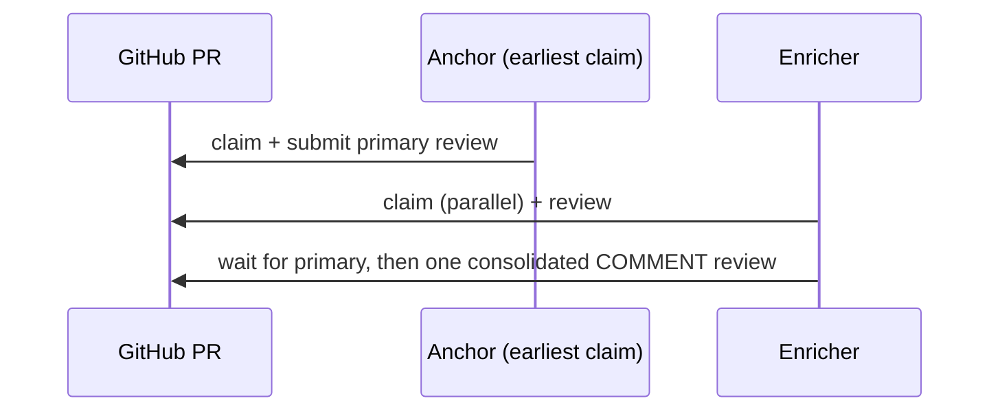

# Panel Review Implementation Plan

> **For agentic workers:** REQUIRED SUB-SKILL: Use superpowers:subagent-driven-development to implement this plan task-by-task. Steps use checkbox (`- [ ]`) syntax.

**Goal:** Add concurrent multi-reviewer ("panel") support: per-login claim markers (non-blocking), earliest-claim anchor posts the primary review, later agents review in parallel and post one consolidated `COMMENT` review after the primary lands; TTL promotion covers an abandoned anchor. Single-reviewer behavior is unchanged.

**Architecture:** Extends the existing package (`core` behind `GitHubGateway`, thin `cli`/`mcp`). Adds a new `enrich` operation (pure, single-attempt, returns `enriched|waiting|promote` — the poll/back-off loop lives in the CLI verb and orchestration skill), two read methods on the gateway, an `Enrichment` schema, and a `second-opinion` skill. Tested against the in-memory `FakeGitHubGateway` by flipping its identity to simulate multiple agents on one shared GitHub state.

**Tech Stack:** unchanged (TypeScript ESM, zod, Octokit, commander, MCP SDK, Vitest, Docusaurus).

## Global Constraints

- Everything in the base spec's Global Constraints still holds (ESM `.js` specifiers, NodeNext, strict, GPG+DCO commits `git commit -S -s`, no manual `Signed-off-by`).
- **Approved design:** anchor = earliest active claim marker; enricher output = ONE `COMMENT`-type review (consolidated body + inline new findings) submitted at the **primary review's `commit_id`**; enrichers never post approve/request-changes and never thread per-finding replies.
- **`enrich` is pure/synchronous** (no sleeps): it returns `{status}`. Polling/TTL lives in the CLI + skill.
- **Multi-identity tests:** flip `FakeGitHubGateway.login` to act as different agents against one shared fake; do NOT add a login parameter to gateway methods (real Octokit derives identity from the token).
- **Do not break existing tests:** extend the fake's `reviews` entries with new fields; keep the existing `event`/`comments`/`commitId`/`body` fields the current tests assert.
- MCP tool id uses underscore: `review_enrich`. CLI verb: `agent-review enrich`.

---

## File Structure

```text
core/model.ts        + EnrichmentSchema/Enrichment, Role, Review, ReviewComment; ReviewTask gains `role`
core/github.ts       + getReviews, listReviewComments (interface + Octokit)
test/fakes/fake-github.ts  + reviews extended, reviewComments store, getReviews/listReviewComments
core/operations/claim.ts     changed: per-login, role via earliest marker, enricher gets second-opinion
core/operations/enrich.ts    NEW: enriched|waiting|promote
core/labels.ts       SKILL_NAMES gains "second-opinion"
core/index.ts        export enrich + new types
cli/index.ts         + `enrich` verb (poll/TTL loop, promote→complete)
mcp/server.ts        + `review_enrich` tool (single attempt)
scripts/gen-schemas.ts  + enrichment entry
schemas/enrichment.schema.json  (generated)
skills/second-opinion.md  NEW; skills/orchestration.md  panel branch
docs/lifecycle.md + README.md + docs/labels.md  panel flow + retire the first-claim-wins limitation note
```

---

### Task 1: Model — Enrichment schema, Role, Review/ReviewComment types

**Files:** Modify `core/model.ts`, `core/model.test.ts`; modify `scripts/gen-schemas.ts`; generate `schemas/enrichment.schema.json`.

**Interfaces produced:** `EnrichmentSchema`, `Enrichment`, `Role = "anchor"|"enricher"`, `Review`, `ReviewComment`; `ReviewTask.role: Role`.

- [ ] **Step 1: Failing test** — append to `core/model.test.ts`:
```ts
import { EnrichmentSchema } from "./model.js";
describe("enrichment", () => {
  it("accepts a valid enrichment", () => {
    const e = EnrichmentSchema.parse({ overallVerdict: "mixed", summary: "s" });
    expect(e.newFindings).toBeUndefined();
  });
  it("rejects an unknown verdict and an empty summary", () => {
    expect(() => EnrichmentSchema.parse({ overallVerdict: "nope", summary: "s" })).toThrow();
    expect(() => EnrichmentSchema.parse({ overallVerdict: "agree", summary: "" })).toThrow();
  });
});
```

- [ ] **Step 2: Run → FAIL** (`npx vitest run core/model.test.ts`).

- [ ] **Step 3: Implement** — add to `core/model.ts`:
```ts
export const EnrichmentSchema = z.object({
  overallVerdict: z.enum(["agree", "disagree", "mixed"]),
  summary: z.string().min(1),
  newFindings: z.array(z.object({ path: z.string(), line: z.number().int().positive(), body: z.string() })).optional(),
});
export type Enrichment = z.infer<typeof EnrichmentSchema>;

export type Role = "anchor" | "enricher";

export interface Review { id: number; author: string; state: string; body: string; commitId: string; submittedAt: string; }
export interface ReviewComment { id: number; path: string; line: number | null; body: string; author: string; }
```
And add `role: Role;` to the `ReviewTask` interface (after `reviewer`).

- [ ] **Step 4: Schema gen** — in `scripts/gen-schemas.ts` add `["enrichment", EnrichmentSchema]` to the `entries` array and import `EnrichmentSchema`. Run `npm run gen:schemas` (creates `schemas/enrichment.schema.json`).

- [ ] **Step 5: Run → PASS** (`npx vitest run core/model.test.ts`) and `npm run check:schemas` exits 0 (now 6 schemas).

- [ ] **Step 6: Commit**
```bash
git add core/model.ts core/model.test.ts scripts/gen-schemas.ts schemas/enrichment.schema.json
git commit -S -s -m "feat(core): Enrichment schema + Role/Review/ReviewComment types"
```

---

### Task 2: Gateway — getReviews + listReviewComments (interface + Octokit + fake)

**Files:** Modify `core/github.ts`, `test/fakes/fake-github.ts`, `test/fakes/fake-github.test.ts`.

**Interfaces produced:** `GitHubGateway.getReviews(repo, pr): Promise<Review[]>`, `.listReviewComments(repo, pr): Promise<ReviewComment[]>`.

- [ ] **Step 1: Extend the fake + failing test.** In `test/fakes/fake-github.ts`:
  - Add fields: `private reviewSeq = 1; private reviewCommentSeq = 1; reviewComments: Array<{ repo: string; pr: number; id: number; path: string; line: number | null; body: string; author: string }> = [];`
  - **Extend** `submitReview` (keep existing pushed fields) to also record identity + comments:
```ts
async submitReview(repo, pr, review) {
  const id = this.reviewSeq++;
  const stateMap = { APPROVE: "APPROVED", REQUEST_CHANGES: "CHANGES_REQUESTED", COMMENT: "COMMENTED" } as const;
  this.reviews.push({ repo, pr, id, author: this.login, state: stateMap[review.event], event: review.event, body: review.body, commitId: review.commitId, comments: review.comments, submittedAt: `t${id}` });
  for (const c of review.comments ?? []) this.reviewComments.push({ repo, pr, id: this.reviewCommentSeq++, path: c.path, line: c.line, body: c.body, author: this.login });
  this.requested.get(this.key(repo, pr))?.delete(this.login);
  return { url: `https://github.com/${repo}/pull/${pr}#pullrequestreview-${id}` };
}
async getReviews(repo, pr) { return this.reviews.filter(r => r.repo === repo && r.pr === pr).map(r => ({ id: r.id, author: r.author, state: r.state, body: r.body, commitId: r.commitId, submittedAt: r.submittedAt })); }
async listReviewComments(repo, pr) { return this.reviewComments.filter(c => c.repo === repo && c.pr === pr).map(c => ({ id: c.id, path: c.path, line: c.line, body: c.body, author: c.author })); }
```
  (Widen the `reviews` array element type to include `id, author, state, submittedAt`. Keep `event`, `body`, `commitId`, `comments`.)
  - Add a test:
```ts
it("records reviews with author + comments and reads them back", async () => {
  const gh = new FakeGitHubGateway();
  gh.seedPr({ number: 1, title: "t", author: "a", headSha: "s", baseSha: "b", url: "u", state: "open", labels: ["agent"] }); gh.seedRequest("o/r", 1, "me");
  await gh.submitReview("o/r", 1, { commitId: "sha1234", event: "REQUEST_CHANGES", body: "primary", comments: [{ path: "a.ts", line: 3, body: "bug" }] });
  const reviews = await gh.getReviews("o/r", 1);
  expect(reviews[0]).toMatchObject({ author: "me", state: "CHANGES_REQUESTED", commitId: "sha1234" });
  expect(await gh.listReviewComments("o/r", 1)).toHaveLength(1);
});
```

- [ ] **Step 2: Run → FAIL** (`getReviews` not on the interface yet).

- [ ] **Step 3: Implement in `core/github.ts`.** Add to the `GitHubGateway` interface:
```ts
getReviews(repo: string, pr: number): Promise<Review[]>;
listReviewComments(repo: string, pr: number): Promise<ReviewComment[]>;
```
Import `Review, ReviewComment` from `./model.js`. Add to `OctokitGateway`:
```ts
async getReviews(repo: string, pr: number): Promise<Review[]> {
  const [owner, name] = split(repo);
  const items = await this.kit.paginate(this.kit.pulls.listReviews, { owner, repo: name, pull_number: pr, per_page: 100 });
  return items.map((r) => ({ id: r.id, author: r.user?.login ?? "unknown", state: r.state ?? "", body: r.body ?? "", commitId: r.commit_id ?? "", submittedAt: r.submitted_at ?? "" }));
}
async listReviewComments(repo: string, pr: number): Promise<ReviewComment[]> {
  const [owner, name] = split(repo);
  const items = await this.kit.paginate(this.kit.pulls.listReviewComments, { owner, repo: name, pull_number: pr, per_page: 100 });
  return items.map((c) => ({ id: c.id, path: c.path, line: c.line ?? null, body: c.body ?? "", author: c.user?.login ?? "unknown" }));
}
```

- [ ] **Step 4: Run → PASS**; `npm run typecheck` clean; `npm test` (pretest gate must still pass — the fake still `implements GitHubGateway`).

- [ ] **Step 5: Commit**
```bash
git add core/github.ts test/fakes/fake-github.ts test/fakes/fake-github.test.ts
git commit -S -s -m "feat(core): gateway getReviews + listReviewComments (+ fake)"
```

---

### Task 3: `claim` — per-login markers + role

**Files:** Modify `core/operations/claim.ts`, `core/operations/claim.test.ts`.

**Interfaces:** `claimReview` unchanged signature; `ReviewTask.role` now populated. Enricher instructions include `second-opinion` when that skill file exists.

- [ ] **Step 1: Update tests** (`core/operations/claim.test.ts`). Add a helper skills dir that also writes `second-opinion.md`. Replace the old "refuses when another login holds the claim" test (that behavior is intentionally removed) with panel tests:
```ts
it("lets a second login also claim; earliest is anchor, next is enricher", async () => {
  const gh = new FakeGitHubGateway();
  gh.seedPr({ number: 5, title: "t", author: "a", headSha: "deadbeef", baseSha: "b", url: "u", state: "open", labels: ["agent", "security"] });
  gh.login = "alice";
  const a = await claimReview({ gh, config: cfg(dir), machine: "m1", now: "2026-07-30T00:00:00Z" }, { repo: "o/r", pr: 5 });
  expect(a.role).toBe("anchor");
  gh.login = "bob";
  const b = await claimReview({ gh, config: cfg(dir), machine: "m2", now: "2026-07-30T00:01:00Z" }, { repo: "o/r", pr: 5 });
  expect(b.role).toBe("enricher");
  expect(b.instructions.skills.map((s) => s.name)).toContain("second-opinion"); // auto-served to enrichers
  expect(a.instructions.skills.map((s) => s.name)).not.toContain("second-opinion");
});
it("resumes the same login's claim as anchor on the pinned SHA", async () => {
  const gh = new FakeGitHubGateway();
  gh.seedPr({ number: 6, title: "t", author: "a", headSha: "cafe1234", baseSha: "b", url: "u", state: "open", labels: ["agent"] });
  gh.login = "alice";
  await claimReview({ gh, config: cfg(dir), machine: "m1", now: "2026-07-30T00:00:00Z" }, { repo: "o/r", pr: 6 });
  const again = await claimReview({ gh, config: cfg(dir), machine: "m1", now: "2026-07-30T00:05:00Z" }, { repo: "o/r", pr: 6 });
  expect(again.role).toBe("anchor");
  expect(again.headSha).toBe("cafe1234");
});
```
(`cfg(dir)` sets `githubLogin: null` so login = `gh.login`; `dir` has `review.md`, `security.md`, and `second-opinion.md`.)

- [ ] **Step 2: Run → FAIL**.

- [ ] **Step 3: Implement** — replace `core/operations/claim.ts` body:
```ts
import type { GitHubGateway } from "../github.js";
import type { Config, ReviewTask, Role } from "../model.js";
import { parseSkills } from "../labels.js";
import { serializeMarker, parseMarkers } from "../claim-marker.js";
import { composeInstructions, hasSkill, loadSkill } from "../skills.js";

export async function claimReview(
  deps: { gh: GitHubGateway; config: Config; machine: string; now: string },
  opts: { repo: string; pr: number },
): Promise<ReviewTask> {
  const { gh, config, machine, now } = deps;
  const login = config.githubLogin ?? (await gh.getAuthenticatedLogin());
  const pr = await gh.getPullRequest(opts.repo, opts.pr);
  if (pr.state !== "open") throw new Error(`PR ${opts.repo}#${opts.pr} is ${pr.state}, not open`);

  let markers = parseMarkers(await gh.listComments(opts.repo, opts.pr));
  const own = markers.filter((m) => m.marker.reviewer === login).at(-1);
  let pinnedSha: string;
  if (own) {
    pinnedSha = own.marker.sha; // resume our own claim
  } else {
    pinnedSha = pr.headSha;
    await gh.createComment(opts.repo, opts.pr, serializeMarker({ v: 1, reviewer: login, machine, sha: pinnedSha, claimedAt: now }));
    markers = parseMarkers(await gh.listComments(opts.repo, opts.pr));
  }
  const earliest = [...markers].sort((a, b) =>
    a.marker.claimedAt.localeCompare(b.marker.claimedAt) || a.comment.id - b.comment.id)[0]?.marker;
  const role: Role = earliest && earliest.reviewer === login ? "anchor" : "enricher";

  const skills = parseSkills(pr.labels);
  const instructions = composeInstructions(skills, config);
  if (role === "enricher" && hasSkill("second-opinion", config)) {
    instructions.skills.push({ name: "second-opinion", content: loadSkill("second-opinion", config) });
  }
  return {
    repo: opts.repo, pr: pr.number, url: pr.url, title: pr.title, author: pr.author,
    headSha: pinnedSha, baseSha: pr.baseSha, reviewer: login, role, skills,
    instructions, claim: { machine, claimedAt: now },
  };
}
```

- [ ] **Step 4: Run → PASS**; `npm test` green (note: the removed "refuses" test is intentional — the new tests replace it).

- [ ] **Step 5: Commit**
```bash
git add core/operations/claim.ts core/operations/claim.test.ts
git commit -S -s -m "feat(core): claim per-login markers + anchor/enricher role"
```

---

### Task 4: `enrich` operation

**Files:** Create `core/operations/enrich.ts`, `core/operations/enrich.test.ts`.

**Interfaces produced:** `enrichReview(deps: { gh: GitHubGateway; config: Config; ttlMs: number; nowMs: number }, input: { repo: string; pr: number } & Enrichment): Promise<{ status: "enriched" | "waiting" | "promote"; url?: string }>`.

- [ ] **Step 1: Failing tests** (`core/operations/enrich.test.ts`) — flip `gh.login` to act as alice (anchor) then bob (enricher):
```ts
import { describe, it, expect } from "vitest";
import { FakeGitHubGateway } from "../../test/fakes/fake-github.js";
import { enrichReview } from "./enrich.js";
import { serializeMarker } from "../claim-marker.js";
const cfg = { githubLogin: null as string | null, skillsDir: null, runChecks: false };
const TTL = 30 * 60_000;

function panelPr(gh: FakeGitHubGateway) {
  gh.seedPr({ number: 9, title: "t", author: "a", headSha: "head", baseSha: "b", url: "u", state: "open", labels: ["agent"] });
  gh.seedRequest("o/r", 9, "alice"); gh.seedRequest("o/r", 9, "bob");
}

describe("enrichReview", () => {
  it("submits ONE consolidated COMMENT review at the primary's commit when the primary exists", async () => {
    const gh = new FakeGitHubGateway(); panelPr(gh);
    // alice claims + posts primary
    gh.login = "alice";
    await gh.createComment("o/r", 9, serializeMarker({ v: 1, reviewer: "alice", machine: "m1", sha: "primsha", claimedAt: "2026-07-30T00:00:00Z" }));
    await gh.submitReview("o/r", 9, { commitId: "primsha", event: "REQUEST_CHANGES", body: "primary", comments: [{ path: "a.ts", line: 3, body: "bug" }] });
    // bob claims then enriches
    gh.login = "bob";
    await gh.createComment("o/r", 9, serializeMarker({ v: 1, reviewer: "bob", machine: "m2", sha: "head", claimedAt: "2026-07-30T00:01:00Z" }));
    const res = await enrichReview({ gh, config: cfg, ttlMs: TTL, nowMs: Date.parse("2026-07-30T00:02:00Z") },
      { repo: "o/r", pr: 9, overallVerdict: "mixed", summary: "agree on the bug; found one more", newFindings: [{ path: "b.ts", line: 7, body: "also here" }] });
    expect(res.status).toBe("enriched");
    const bobReview = gh.reviews.find((r) => r.author === "bob")!;
    expect(bobReview).toMatchObject({ event: "COMMENT", commitId: "primsha" });
    expect(await gh.listReviewComments("o/r", 9)).toHaveLength(2); // alice's + bob's new finding
    expect((await gh.listReviewRequests("o/r", "bob"))).toHaveLength(0); // de-queued
  });
  it("returns waiting when no primary yet and the anchor marker is fresh", async () => {
    const gh = new FakeGitHubGateway(); panelPr(gh);
    await gh.createComment("o/r", 9, serializeMarker({ v: 1, reviewer: "alice", machine: "m1", sha: "head", claimedAt: "2026-07-30T00:00:00Z" }));
    gh.login = "bob";
    await gh.createComment("o/r", 9, serializeMarker({ v: 1, reviewer: "bob", machine: "m2", sha: "head", claimedAt: "2026-07-30T00:01:00Z" }));
    const res = await enrichReview({ gh, config: cfg, ttlMs: TTL, nowMs: Date.parse("2026-07-30T00:02:00Z") },
      { repo: "o/r", pr: 9, overallVerdict: "agree", summary: "s" });
    expect(res.status).toBe("waiting");
  });
  it("returns promote when no primary and the anchor marker is stale past TTL", async () => {
    const gh = new FakeGitHubGateway(); panelPr(gh);
    await gh.createComment("o/r", 9, serializeMarker({ v: 1, reviewer: "alice", machine: "m1", sha: "head", claimedAt: "2026-07-30T00:00:00Z" }));
    gh.login = "bob";
    await gh.createComment("o/r", 9, serializeMarker({ v: 1, reviewer: "bob", machine: "m2", sha: "head", claimedAt: "2026-07-30T00:01:00Z" }));
    const res = await enrichReview({ gh, config: cfg, ttlMs: TTL, nowMs: Date.parse("2026-07-30T01:00:00Z") },
      { repo: "o/r", pr: 9, overallVerdict: "agree", summary: "s" });
    expect(res.status).toBe("promote");
  });
});
```

- [ ] **Step 2: Run → FAIL** (module missing).

- [ ] **Step 3: Implement `core/operations/enrich.ts`:**
```ts
import type { GitHubGateway } from "../github.js";
import type { Config, Enrichment } from "../model.js";
import { EnrichmentSchema } from "../model.js";
import { parseMarkers } from "../claim-marker.js";

export async function enrichReview(
  deps: { gh: GitHubGateway; config: Config; ttlMs: number; nowMs: number },
  input: { repo: string; pr: number } & Enrichment,
): Promise<{ status: "enriched" | "waiting" | "promote"; url?: string }> {
  const { gh, config, ttlMs, nowMs } = deps;
  const enrichment = EnrichmentSchema.parse({ overallVerdict: input.overallVerdict, summary: input.summary, newFindings: input.newFindings });
  const login = config.githubLogin ?? (await gh.getAuthenticatedLogin());

  const markers = parseMarkers(await gh.listComments(input.repo, input.pr));
  const mine = markers.filter((m) => m.marker.reviewer === login).at(-1);
  if (!mine) throw new Error(`No active claim by ${login} on ${input.repo}#${input.pr}; claim first.`);

  const reviews = await gh.getReviews(input.repo, input.pr);
  const primary = reviews.filter((r) => r.author !== login)
    .sort((a, b) => a.submittedAt.localeCompare(b.submittedAt) || a.id - b.id)[0];

  if (primary) {
    const body = `**Second opinion (${enrichment.overallVerdict}):**\n\n${enrichment.summary}`;
    const { url } = await gh.submitReview(input.repo, input.pr, { commitId: primary.commitId, event: "COMMENT", body, comments: enrichment.newFindings });
    await gh.deleteComment(input.repo, mine.comment.id);
    return { status: "enriched", url };
  }

  const earliest = [...markers].sort((a, b) =>
    a.marker.claimedAt.localeCompare(b.marker.claimedAt) || a.comment.id - b.comment.id)[0]?.marker;
  const stale = earliest && earliest.reviewer !== login && nowMs - Date.parse(earliest.claimedAt) > ttlMs;
  return { status: stale ? "promote" : "waiting" };
}
```

- [ ] **Step 4: Run → PASS** (3 tests); `npm test` green.

- [ ] **Step 5: Commit**
```bash
git add core/operations/enrich.ts core/operations/enrich.test.ts
git commit -S -s -m "feat(core): review.enrich (consolidated second opinion, TTL promote)"
```

---

### Task 5: Barrel + CLI `enrich` verb + MCP `review_enrich`

**Files:** Modify `core/index.ts`, `cli/index.ts`, `mcp/server.ts`.

- [ ] **Step 1: Barrel** — in `core/index.ts` add `export { enrichReview } from "./operations/enrich.js";` (model/types already flow via `export * from "./model.js"`).

- [ ] **Step 2: CLI verb** — in `cli/index.ts`, import `enrichReview` (and `completeReview`, already imported). Add before `program.parseAsync`:
```ts
program.command("enrich")
  .requiredOption("--repo <owner/name>").requiredOption("--pr <n>")
  .requiredOption("--verdict <agree|disagree|mixed>")
  .requiredOption("--summary <text|@file>")
  .option("--comments <@file>", "JSON array of {path,line,body} new findings")
  .option("--poll <seconds>", "5")
  .option("--timeout <seconds>", "1800")
  .action(async (o) => {
    const enrichment = { overallVerdict: o.verdict, summary: readMaybeFile(o.summary), newFindings: o.comments ? JSON.parse(readMaybeFile(o.comments)) : undefined };
    const repo = repoOf(o), pr = Number(o.pr), ttlMs = Number(o.timeout) * 1000;
    const deadline = Date.now() + ttlMs;
    for (;;) {
      const res = await enrichReview({ gh: gh(), config: cfg(), ttlMs, nowMs: Date.now() }, { repo, pr, ...enrichment });
      if (res.status === "enriched") { printJson(res); return; }
      if (res.status === "promote") {
        const event = o.verdict === "agree" ? "approve" : o.verdict === "disagree" ? "request-changes" : "comment";
        printJson(await completeReview({ gh: gh(), config: cfg() }, { repo, pr, event, summary: enrichment.summary, comments: enrichment.newFindings }));
        return;
      }
      if (Date.now() >= deadline) { printLine("Timed out waiting for the primary review."); process.exitCode = 1; return; }
      await new Promise((r) => setTimeout(r, Number(o.poll) * 1000));
    }
  });
```

- [ ] **Step 3: MCP tool** — in `mcp/server.ts` add (single attempt; the host loops):
```ts
server.registerTool("review_enrich",
  { title: "Enrich a review", description: "Post a consolidated second opinion once the primary review exists; else returns waiting/promote.",
    inputSchema: { repo: z.string(), pr: z.number(), verdict: z.enum(["agree", "disagree", "mixed"]), summary: z.string(),
      newFindings: z.array(z.object({ path: z.string(), line: z.number(), body: z.string() })).optional() } },
  async (a) => ok(await enrichReview({ gh: gh(), config: cfg(), ttlMs: 30 * 60_000, nowMs: Date.now() },
    { repo: a.repo, pr: a.pr, overallVerdict: a.verdict, summary: a.summary, newFindings: a.newFindings })));
```
Import `enrichReview` in `mcp/server.ts`.

- [ ] **Step 4: Build + smoke** — `npm run build`; `node dist/cli/index.js enrich --help` shows `--verdict`, `--summary`, `--poll`, `--timeout`; MCP `tools/list` handshake lists `review_enrich` (6 tools). `npm test` green; `npm run typecheck` clean.

- [ ] **Step 5: Commit**
```bash
git add core/index.ts cli/index.ts mcp/server.ts
git commit -S -s -m "feat(cli,mcp): enrich verb + review_enrich tool"
```

---

### Task 6: Skills — `second-opinion` + orchestration panel branch

**Files:** Create `skills/second-opinion.md`; modify `skills/orchestration.md`; modify `core/labels.ts` (SKILL_NAMES).

- [ ] **Step 1:** Add `"second-opinion"` to the `SKILL_NAMES` array in `core/labels.ts` (append after `"documentation"`).

- [ ] **Step 2:** Create `skills/second-opinion.md`:
```markdown
# Second Opinion Review

You are an enricher on a review panel: another agent posted the primary review, and you add a consolidated second opinion. Do NOT rubber-stamp.

- Read the primary review's summary and each inline finding.
- For each primary finding, decide **confirm** (you agree, ideally with one supporting detail) or **refute** (you disagree, with a concrete reason). Be specific; "looks fine" is not review.
- Add only **genuinely new** findings the primary missed (as inline comments at path:line).
- State one honest **overall verdict**: `agree` (you would approve), `disagree` (you would request changes), or `mixed`.
- Keep it one consolidated comment. You are deliberating on the primary review, not competing with it.
```

- [ ] **Step 3:** In `skills/orchestration.md`, add a panel section after the Loop (keep existing content):
```markdown
## Panel review (multiple reviewers)

`claim` returns a `role`:

- **anchor** (you claimed earliest): review and `complete` normally — you post the primary review.
- **enricher** (someone claimed before you): review the diff in parallel, then run `agent-review enrich` (MCP `review_enrich`). It waits for the primary review, then posts ONE consolidated second opinion (your `--verdict` + `--summary`, plus any new findings via `--comments`). Follow the `second-opinion` skill served in your task. If `enrich` reports `promote` (the anchor went stale), you become the anchor and post the primary review instead. The CLI verb handles the wait/promote loop for you.
```

- [ ] **Step 4:** Build + verify the loader: `npm run build && node dist/cli/index.js skills list` shows 12 names incl. `second-opinion`; `npm test` green (labels.test uses `arrayContaining`, so it still passes).

- [ ] **Step 5: Commit**
```bash
git add core/labels.ts skills/second-opinion.md skills/orchestration.md
git commit -S -s -m "docs(skills): second-opinion skill + orchestration panel branch"
```

---

### Task 7: Docs — panel flow, retire the first-claim-wins limitation, final gate

**Files:** Modify `docs/lifecycle.md`, `README.md`, `docs/labels.md`.

- [ ] **Step 1: `docs/lifecycle.md`** — add a `## Panel review (multiple reviewers)` section explaining: per-login non-blocking claims; earliest claim = anchor posts the primary review; later agents review in parallel and post one consolidated `COMMENT` review at the primary's commit; TTL promotion if the anchor stalls; single reviewer unchanged. Include this Mermaid block (no em dashes in prose):
````markdown

````

- [ ] **Step 2: Retire the limitation note.** In `README.md` and `docs/labels.md`, replace the "Known limitation: first-claim-wins" note (added during docs polish) with a positive statement: multiple requested reviewers now run a concurrent panel (anchor posts the primary review; others add consolidated second opinions). Link to the lifecycle Panel-review section. Do not leave a stale "not supported" note. **No em dashes** in the docs prose you touch.

- [ ] **Step 3: Auto-embed check.** Run `cd docs && npm run build`. The embed script globs `../schemas/*.json` and `../skills/*.md`, so `enrichment.schema.json` and `second-opinion.md` appear automatically in the generated Schema + Skills pages. Confirm the build is clean (onBrokenLinks throw) and both new items appear. If the embed script hardcodes a schema list rather than globbing, update it to glob (or add `enrichment`).

- [ ] **Step 4: Full gate.** From repo root: `npm run typecheck && npm run check:schemas && npm test && npm run build` all green. `grep -rn '—' docs/*.md` on pages you edited returns nothing.

- [ ] **Step 5: Commit**
```bash
git add docs/lifecycle.md README.md docs/labels.md
git commit -S -s -m "docs(site): panel review flow; retire first-claim-wins limitation"
```

---

## Self-Review (during planning)

- **Spec coverage:** per-login non-blocking claims (T3) ✓; earliest-claim anchor role (T3) ✓; enrich = consolidated COMMENT at primary commit_id (T4) ✓; waiting/promote TTL (T4) ✓; gateway reads (T2) ✓; Enrichment schema + drift (T1) ✓; second-opinion skill auto-served to enrichers (T3+T6) ✓; CLI/MCP (T5) ✓; docs + retire limitation (T7) ✓; single-reviewer unchanged (T3: one marker → earliest → anchor) ✓; backward-compatible fake extension (T2) ✓.
- **Type consistency:** `Role`/`Review`/`ReviewComment`/`Enrichment` defined in T1 used by T2 (gateway), T3 (claim role), T4 (enrich); gateway methods added in T2 consumed only in T4; `enrichReview` signature in T4 matches CLI/MCP call sites in T5.
- **No placeholders:** real code for T1-T4; exact snippets for T5-T7.
- **Multi-identity tests:** flip `fake.login`; `config.githubLogin: null` so login = fake identity.
