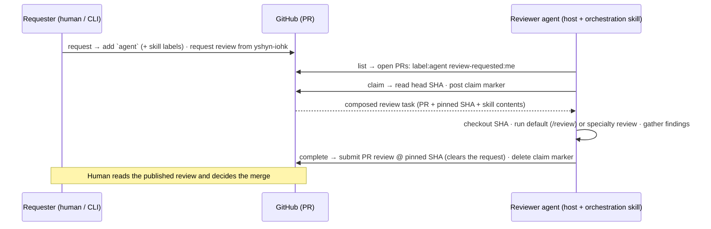

# Agent Peer Review — Design Spec

- **Date:** 2026-07-29
- **Repo:** `input-output-hk/agent-peer-review`
- **Status:** Approved for planning
- **License:** Apache-2.0

## 1. Goal & context

Provide a **minimal, asynchronous** PR-review workflow that works across **Claude Desktop, Codex Desktop, and pi.dev** without a workflow engine, queue, or database. **GitHub is the source of truth and the message bus.** Reviewers are agents running on different machines; each picks up work addressed to it, reviews a specific commit, and publishes a native GitHub PR review.

The repository ships:

- a pure **`core`** library (all GitHub + domain logic),
- a **CLI** (primary interface for agents and humans),
- an **MCP server** (secondary interface for MCP-native hosts),
- reusable **skills** (markdown) selected by labels,
- shared **JSON schemas**,
- a **Docusaurus** documentation site published to GitHub Pages.

## 2. Design principles

1. GitHub is the message bus — no external queue, DB, or scheduler.
2. Lean on native GitHub review mechanics (requested reviewers, PR reviews) before inventing artifacts.
3. Every review is pinned to a commit SHA.
4. Humans remain responsible for merge decisions.
5. Skills are composable; labels select them; unknown labels are ignored.
6. One `core`, thin adapters — the CLI and MCP are shells over the same logic.
7. New specialty = add one `skills/<name>.md` + register one bare label name.
8. Keep it small. Implement GitHub first; everything else is out of scope.

## 3. Architecture

A **single npm package** — `@input-output-hk/agent-review` — in **TypeScript (ESM)**. All GitHub and domain logic lives in a pure `core` module; the CLI and MCP server are thin adapters over it, so both stay trivial and testable.

```
core/     GitHub gateway, label logic, claim protocol, skill loader, schema validation, review-task composition
cli/      thin command layer over core (primary interface) + `serve`
mcp/      thin MCP server over core (secondary interface)
skills/   orchestration.md, review.md, and specialty skills (markdown, source of truth)
schemas/  JSON Schemas (generated from zod; rendered in the docs site)
docs/     Docusaurus site (GitHub Pages); internal specs under docs/superpowers/** are excluded from the build
examples/ sample config, sample request, sample review output
```

Two bins from one package:

- **`agent-review`** — the CLI.
- **`agent-review-mcp`** — the MCP server (stdio); also reachable via `agent-review serve`.

`core` depends on GitHub only through a `GitHubGateway` interface, so unit tests run against a fake gateway with no network.

## 4. GitHub state model (native-first)

State lives entirely on the pull request, leaning on native GitHub review mechanics. Three states, three mechanisms:

1. **Requested** — an `agent` label (the opt-in trigger, distinguishing "AI agent, review this" from a normal human review request) **plus a native requested-reviewer**: the review is requested from the engineer's GitHub login using GitHub's normal Reviewers mechanism. Optional bare skill labels (§5) select specialties. The agent finds its work by searching `is:pr is:open label:agent review-requested:<its-login>`.
2. **Claimed** — a structured **claim-marker comment** pins the head SHA at claim time, acts as the authoritative in-progress lock, and survives agent restarts:
   ```
   Claimed by yshyn-iohk's review agent (mbp-01) at 2026-07-29T10:12:00Z, pinned to abc1234.
   <!-- agent-review:claim {"v":1,"reviewer":"yshyn-iohk","machine":"mbp-01","sha":"abc1234…","claimedAt":"2026-07-29T10:12:00Z"} -->
   ```
3. **Done** — a **native GitHub PR review** (`APPROVE` / `REQUEST_CHANGES` / `COMMENT`) submitted with **`commit_id = pinned SHA`**. Submitting a review **natively clears the review request** (GitHub moves the agent out of "requested reviewers"), so the PR drops out of the agent's queue automatically — no terminal label required. The agent then deletes its own claim marker so any later re-request starts a fresh claim.

**SHA pinning:** the claim marker records the head SHA at claim time; `complete` submits against that SHA and notes if the head has since drifted.

**Restart survival:** on `list`/`claim`, `core` re-reads markers. An active claim by the agent's own login is resumable (returns the originally pinned SHA + composed task); an active claim by a different login means someone else is on it.

**Re-review:** if the author pushes new commits and re-requests the review, the PR re-enters the queue (the `agent` label persists); with no stale marker present, the agent claims fresh at the new head SHA.

## 5. Label profile ("simplest orthogonal")

Deliberately tiny. **Routing is not a label** — it is GitHub's native requested-reviewer. Labels carry only two orthogonal things:

| Purpose | Label(s) | Color | Set by |
|---|---|---|---|
| Trigger (required) | `agent` | `0e8a16` | requester |
| Skill (0..n, optional) | bare skill names: `security`, `architecture`, `performance`, `testing`, `api`, `rust`, `react-native`, `did`, `oid4vc`, `cryptography`, `documentation` | `5319e7` | requester |

There are **no** `review`, `reviewer:*`, `skill:*`, `status:*`, or `reviewed` labels. A basic request is simply `agent` + a requested reviewer; add bare skill labels only when a specific review is wanted.

**Collision handling:** skill labels are matched against a known set of skill names; any other label on the PR (`bug`, `enhancement`, GitHub's default `documentation`, …) is ignored by the agent. Because the agent only interprets labels on PRs that also carry `agent`, a `documentation` label there sensibly means "run the documentation skill" — the general-purpose default label is only consulted in the agent's own context.

The known skill names are data in `core` (`SKILL_NAMES`), so adding a specialty is a one-line change consumed by `labels.bootstrap`.

## 6. Interfaces — CLI (primary) + MCP (secondary)

Both expose the same five operations over `core`. **The CLI is primary and portable** (any host that can shell out); the MCP serves MCP-native hosts.

### 6.1 The four review operations + bootstrap

| Operation | CLI | MCP tool | Behavior |
|---|---|---|---|
| Create / request | `agent-review request --repo O/R --pr N [--skills security,rust] --reviewers yshyn-iohk[,alice] [--note …]` | `review_create` | Adds `agent` + any skill labels; requests the review from the given logins via the native Reviewers API; optional request comment. |
| List | `agent-review list --repo O/R [--reviewer <login>]` | `review_list` | Searches open PRs with `label:agent` requested from `<login>` (defaults to the agent's own login); reports claim state from markers. |
| Claim | `agent-review claim --repo O/R --pr N` | `review_claim` | Reads head SHA; refuses if another login holds an active marker; resumes if the agent's own; else posts a claim marker (earliest-wins). **Returns the composed review task** (PR metadata + pinned SHA + matched skill contents). |
| Complete | `agent-review complete --repo O/R --pr N --event approve\|request-changes\|comment --summary <text\|@file> [--comments @file]` | `review_complete` | Submits the PR review at the pinned SHA (which natively clears the review request), then deletes the agent's claim marker. Returns the review URL + drift flag. |
| Bootstrap | `agent-review labels bootstrap --repo O/R` | `labels_bootstrap` | Idempotently creates/updates the `agent` label + the skill labels (goal #5). |

Supporting CLI commands: `agent-review serve` (launch MCP), `agent-review config` (show resolved config), `agent-review skills list` (list available skills), `agent-review whoami` (show the resolved GitHub login).

### 6.2 Composed review task (returned by `claim`)

```jsonc
{
  "repo": "input-output-hk/…", "pr": 42, "url": "https://…",
  "title": "…", "author": "…", "headSha": "abc1234…", "baseSha": "def5678…",
  "reviewer": "yshyn-iohk", "skills": ["security", "rust"],
  "instructions": {
    "review": "<review.md content, served verbatim — it documents both the Claude /review path and the portable checklist; the host picks>",
    "skills": [{ "name": "security", "content": "…" }, { "name": "rust", "content": "…" }]
  },
  "claim": { "machine": "mbp-01", "claimedAt": "2026-07-29T10:12:00Z" }
}
```

`reviewer` is the acting agent's GitHub login. This is the key host-agnostic simplification: **the interface serves the skill content**, so Claude Desktop, Codex, and pi.dev all behave identically with no per-host skill installation.

## 7. Skills

```
skills/
├── orchestration.md   drives the claim → review → complete loop via CLI/MCP (the agent's operating manual)
├── review.md          default review: delegate to Claude Code /review on Claude hosts; portable checklist elsewhere
├── security.md  architecture.md  performance.md  testing.md  api.md
└── rust.md  react-native.md  did.md  oid4vc.md  cryptography.md  documentation.md
```

- **Default review** (no skill labels): on a **Claude host**, run `claude -p "/review <PR>" --dangerously-skip-permissions --setting-sources "" --output-format text` (the provided `claude-pr-review` skill); on **Codex/pi.dev**, apply the portable checklist in `review.md` (correctness, style, performance, tests, security). The review text becomes the **findings passed to `complete`**.
- **Specialty skills** (bare skill labels): layer specific guidance; when present they replace the generic pass.
- **Unknown labels are ignored.** Skills are bundled in the package (source-of-truth in `skills/`) and overridable via the `skillsDir` config for local iteration.

## 8. Identity & configuration

Config resolved in order: `--config` → `AGENT_REVIEW_CONFIG` → `~/.config/agent-review/config.json` → repo-local `.agent-review.json` → built-in defaults (all fields optional).

```json
{
  "githubLogin": null,
  "defaultRepo": "input-output-hk/some-repo",
  "skillsDir": null,
  "runChecks": false
}
```

Token from `GITHUB_TOKEN` or the local `gh` CLI; reviews and comments post as the token's owner. **`githubLogin` is optional and auto-detected** from the token (`users.getAuthenticated`) when omitted — an agent can therefore run zero-config. **Routing is native**: an agent processes PRs that carry `agent` and are review-requested from its own login. A **fine-grained PAT** is recommended: pull requests read/write (submit reviews, request reviewers), issues write (labels + comments), contents read.

## 9. End-to-end agent flow



The orchestration skill wraps run-the-review between `claim` and `complete`.

## 10. Schemas

zod is the single source of truth in `core/model.ts`; `schemas/*.json` are **generated** from it (and drift-checked in CI):

- `config.schema.json` — machine config (§8).
- `review-request.schema.json` — `create` input (`repo, pr, skills[], reviewers[], note?`).
- `claim-marker.schema.json` — the JSON embedded in the claim comment (§4).
- `review-result.schema.json` — `complete` input (event, summary, inline comments).
- `label-spec.schema.json` — a single label definition (name, color, description).

The composed **review task** (§6.2) is a documented derived structure, not an input, so it has a TypeScript type but no generated input schema.

## 11. Documentation site

**Docusaurus** (Node-native — one toolchain for the whole repo; first-class Mermaid; well-trodden GitHub-Pages deploy action), living in `docs/` and deployed to GitHub Pages via GitHub Actions. Internal specs under `docs/superpowers/**` are excluded from the site build.

Site sections: overview & principles; quick start (install, config, host wiring for Claude/Codex/pi); the label profile + native-reviewer routing; the review lifecycle (with the Mermaid flow); the skills catalog; CLI reference; MCP reference; schema reference; contributing a new skill.

## 12. Security & edge cases (gaps the original spec omitted)

- **Untrusted PR code:** claiming checks out an arbitrary commit. Default to **static review** (read the diff, reason). Running build/tests is **opt-in** via `runChecks` and flagged loudly. This is the largest unstated risk.
- **Claim race** (same person, two machines): earliest marker wins (by `claimedAt`, then comment id); the loser resumes the existing claim or aborts.
- **SHA drift:** review pinned via `commit_id`; `complete` notes if the head advanced past the pinned SHA.
- **Stale claims:** the marker's `claimedAt` drives a TTL so `list` can surface abandoned claims.
- **PR closed/merged while claimed:** `complete` reports non-open PRs rather than failing hard.
- **Idempotent bootstrap; search/list pagination; GitHub rate-limit handling.**
- **Token scopes:** least-privilege fine-grained PAT (§8). The requester must have permission to request the reviewer (the reviewer must be a repo collaborator).

## 13. Testing strategy

Unit tests on `core` against a fake `GitHubGateway` (no network):

- label composition + skill-name matching (bare labels; non-skill labels ignored),
- claim-marker serialize/parse (round-trip; malformed markers ignored),
- skill loader + label→skill mapping (unknown labels ignored; `skillsDir` override),
- config resolution order + login auto-detection,
- review-task composition,
- request/claim/complete flows (native review-request set and cleared; marker posted and deleted; result → review-event mapping).

Plus schema-drift tests, light smoke tests for the CLI and MCP adapters, and an optional live end-to-end test against a scratch repo gated by an env var. TDD during implementation.

## 14. Distribution

Publish `@input-output-hk/agent-review` to **GitHub Packages** (registry `https://npm.pkg.github.com`; the package scope must match the `input-output-hk` org). Consumers add a one-line `.npmrc` mapping and authenticate with a token carrying `read:packages` — **the same GitHub token the agent already uses for the review flow can carry that scope**, so no extra credential is introduced. A CI workflow publishes on release with `permissions: packages: write`.

Machine `.npmrc`:

```ini
@input-output-hk:registry=https://npm.pkg.github.com
//npm.pkg.github.com/:_authToken=${GITHUB_TOKEN}
```

Install via `npm i -g @input-output-hk/agent-review` (or `npx`). MCP host wiring example (registry configured as above):

```json
{ "command": "npx", "args": ["-y", "@input-output-hk/agent-review", "serve"] }
```

CLI hosts point their orchestration skill at the `agent-review` binary (or `npx`).

## 15. Acceptance criteria

- GitHub is the only transport (labels + native review requests + PR reviews + a marker comment); no DB, queue, or engine.
- Reviews survive agent restarts (claim marker persists state + SHA).
- Reviews are pinned to a commit SHA (marker + `commit_id` on submit).
- Routing uses native requested-reviewers; an agent processes only PRs labeled `agent` and requested from its own login.
- Skills are selected via bare labels; unknown labels are ignored.
- A new specialty requires only a `skills/<name>.md` file + adding the name to `SKILL_NAMES`.
- Both CLI and MCP expose the four operations + `labels_bootstrap` over one `core`.
- The orchestration skill lets Claude Desktop, Codex, and pi.dev drive the full loop.
- Default review delegates to `/review` on Claude hosts and a portable checklist elsewhere.
- `labels_bootstrap` idempotently provisions the `agent` + skill labels.
- The docs site builds and deploys to GitHub Pages with the review-flow diagram.

## 16. Out of scope

Scheduling, Slack, Discord, Jira, GitLab, multi-backend/non-GitHub transports, distributed queues, a web dashboard, auto-merge, and cross-repo fan-out orchestration beyond listing.

## 17. What the original spec was missing (goal #6)

Resolved in this design: (1) auth/identity + routing — via native requested-reviewers keyed on the auto-detected GitHub login; (2) how the claim pins the SHA and survives restarts; (3) claim concurrency/race handling; (4) SHA drift after claim; (5) skill distribution across heterogeneous hosts (interface serves skill content); (6) untrusted-PR-code execution risk; (7) label collisions — bare skill labels matched against a known set, other labels ignored; (8) an interface for non-MCP hosts (CLI + orchestration skill); (9) default-review behavior when no skill is requested; (10) config schema + resolution order + zero-config login detection; (11) idempotent bootstrap, pagination, stale-claim TTL, closed/merged handling; (12) review-outcome → GitHub-review-event mapping; (13) token scopes + reviewer-must-be-collaborator constraint.

Decided: publish to **GitHub Packages** under `@input-output-hk` (§14). No open decisions remain.

## 18. Repository layout (target)

```text
agent-peer-review/
├── core/
├── cli/
├── mcp/
├── skills/
│   ├── orchestration.md
│   ├── review.md
│   ├── security.md  architecture.md  performance.md  testing.md  api.md
│   └── rust.md  react-native.md  did.md  oid4vc.md  cryptography.md  documentation.md
├── schemas/
├── examples/
├── docs/                       # Docusaurus site (GitHub Pages)
│   └── superpowers/specs/      # internal design specs (excluded from site build)
├── .github/workflows/          # CI + Pages deploy
├── package.json
├── tsconfig.json
├── LICENSE
└── README.md
```
