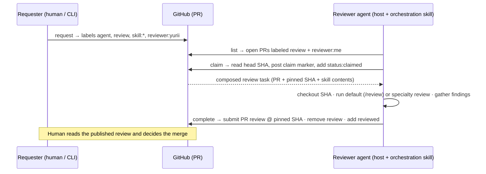

# Agent Peer Review — Design Spec

- **Date:** 2026-07-29
- **Repo:** `input-output-hk/agent-peer-review`
- **Status:** Approved for planning
- **License:** Apache-2.0

## 1. Goal & context

Provide a **minimal, asynchronous** PR-review workflow that works across **Claude Desktop, Codex Desktop, and pi.dev** without a workflow engine, queue, or database. **GitHub is the source of truth and the message bus.** Reviewers are agents running on different machines; each picks up work addressed to it, reviews a specific commit, and publishes a native GitHub PR review.

The repository ships:

- a pure **`core`** library (all GitHub + domain logic),
- a **CLI** (primary interface for agents and humans),
- an **MCP server** (secondary interface for MCP-native hosts),
- reusable **skills** (markdown) selected by labels,
- shared **JSON schemas**,
- a **Docusaurus** documentation site published to GitHub Pages.

## 2. Design principles

1. GitHub is the message bus — no external queue, DB, or scheduler.
2. Every review is pinned to a commit SHA.
3. Humans remain responsible for merge decisions.
4. Skills are composable; labels select them; unknown labels are ignored.
5. One `core`, thin adapters — the CLI and MCP are shells over the same logic.
6. New specialty = add one `skills/<name>.md` + one `skill:<name>` label.
7. Keep it small. Implement GitHub first; everything else is out of scope.

## 3. Architecture

A **single npm package** — `@input-output-hk/agent-review` — in **TypeScript (ESM)**. All GitHub and domain logic lives in a pure `core` module; the CLI and MCP server are thin adapters over it, so both stay trivial and testable.

```
core/     GitHub gateway, label logic, claim protocol, skill loader, schema validation, review-task composition
cli/      thin command layer over core (primary interface) + `serve`
mcp/      thin MCP server over core (secondary interface)
skills/   orchestration.md, review.md, and specialty skills (markdown, source of truth)
schemas/  JSON Schemas (imported by core; rendered in the docs site)
docs/     Docusaurus site (GitHub Pages); internal specs under docs/superpowers/** are excluded from the build
examples/ sample config, sample request, sample review output
```

Two bins from one package:

- **`agent-review`** — the CLI.
- **`agent-review-mcp`** — the MCP server (stdio); also reachable via `agent-review serve`.

`core` depends on GitHub only through a `GitHubGateway` interface, so unit tests run against a fake gateway with no network.

## 4. GitHub state model (all-on-PR)

State lives entirely on the pull request via three native primitives — no separate artifacts:

1. **Labels = request + routing** (composable, orthogonal — see §5). Applied by `review.create`.
2. **A structured claim-marker comment** pins the SHA and marks in-progress; it survives agent restarts and is the authoritative lock:
   ```
   Claimed by yurii's review agent (mbp-01) at 2026-07-29T10:12:00Z, pinned to abc1234.
   <!-- agent-review:claim {"v":1,"reviewer":"yurii","machine":"mbp-01","sha":"abc1234…","claimedAt":"2026-07-29T10:12:00Z"} -->
   ```
3. **A native GitHub PR review** on completion (`APPROVE` / `REQUEST_CHANGES` / `COMMENT`), submitted with **`commit_id = pinned SHA`** so it attaches to the exact reviewed commit even if the PR head has since moved.

**SHA pinning:** the claim marker records the head SHA at claim time; `review.complete` submits against that SHA and notes if the head has drifted.

**Restart survival:** on `list`/`claim`, `core` re-reads markers. An active claim by the same reviewer/machine is resumable (returns the pinned SHA + composed task).

## 5. Label profile ("simplest orthogonal")

Four **requester-owned** axes plus one **MCP-owned** axis. Compose one per axis. Labels are **namespaced** to keep axes orthogonal *and* to avoid clobbering GitHub's built-in `documentation` and `security` labels (a real collision in the original bare-label list).

| Axis | Owner | Labels | Color |
|---|---|---|---|
| Trigger | requester | `agent` | `0e8a16` |
| Action | requester | `review` | `1d76db` |
| Skill (0..n) | requester | `skill:security`, `skill:architecture`, `skill:performance`, `skill:testing`, `skill:api`, `skill:rust`, `skill:react-native`, `skill:did`, `skill:oid4vc`, `skill:cryptography`, `skill:documentation` | `5319e7` |
| Reviewer (1) | requester | `reviewer:<person>` (e.g. `reviewer:yurii`) | `fbca04` |
| Status | MCP | `status:claimed` (visibility), `reviewed` (terminal) | `d4c5f9` / `c2e0c6` |

Requesters touch only the first four axes. The MCP owns status: on claim it adds `status:claimed`; on complete it removes `review` + `status:claimed` and adds `reviewed`. `review.list`'s default filter (`agent` + `review`) therefore excludes completed requests automatically.

The profile is data (`schemas/label-profile` + a JSON file), so adding a skill/reviewer is a one-line change consumed by `labels.bootstrap`.

## 6. Interfaces — CLI (primary) + MCP (secondary)

Both expose the same five operations over `core`. **The CLI is primary and portable** (any host that can shell out); the MCP serves MCP-native hosts.

### 6.1 The four review operations + bootstrap

| Operation | CLI | MCP tool | Behavior |
|---|---|---|---|
| Create/request | `agent-review request --repo O/R --pr N --skills security,rust --reviewer yurii [--note …]` | `review.create` | Applies `agent`,`review`,`skill:*`,`reviewer:*`; optional request comment. |
| List | `agent-review list [--repo O/R] [--reviewer yurii] [--all]` | `review.list` | Open PRs labeled `agent`+`review`, filtered to my `reviewer:*` by default; reports claim state from markers. |
| Claim | `agent-review claim --repo O/R --pr N [--json]` | `review.claim` | Reads head SHA, checks for an active marker (earliest-wins), posts claim marker, adds `status:claimed`. **Returns the composed review task** (PR metadata + pinned SHA + matched skill contents). |
| Complete | `agent-review complete --repo O/R --pr N --event approve\|request-changes\|comment --summary <text\|@file> [--comments @file]` | `review.complete` | Submits the PR review at the pinned SHA, removes `review`+`status:claimed`, adds `reviewed`. Returns the review URL. |
| Bootstrap | `agent-review labels bootstrap --repo O/R [--reviewers yurii,alice]` | `labels.bootstrap` | Idempotently creates/updates the label profile + reviewer labels (goal #5). |

Supporting CLI commands: `agent-review serve` (launch MCP), `agent-review config` (show resolved config), `agent-review skills list` (list available skills).

### 6.2 Composed review task (returned by `claim`)

```jsonc
{
  "repo": "input-output-hk/…", "pr": 42, "url": "https://…",
  "title": "…", "author": "…", "headSha": "abc1234…", "baseSha": "def5678…",
  "reviewer": "yurii", "skills": ["security", "rust"],
  "instructions": {
    "review": "<review.md content, served verbatim — it documents both the Claude /review path and the portable checklist; the host picks>",
    "skills": [{ "name": "security", "content": "…" }, { "name": "rust", "content": "…" }]
  },
  "claim": { "machine": "mbp-01", "claimedAt": "2026-07-29T10:12:00Z" }
}
```

This is the key host-agnostic simplification: **the interface serves the skill content**, so Claude Desktop, Codex, and pi.dev all behave identically with no per-host skill installation.

## 7. Skills

```
skills/
├── orchestration.md   drives the claim → review → complete loop via CLI/MCP (the agent's operating manual)
├── review.md          default review: delegate to Claude Code /review on Claude hosts; portable checklist elsewhere
├── security.md  architecture.md  performance.md  testing.md  api.md
└── rust.md  react-native.md  did.md  oid4vc.md  cryptography.md  documentation.md
```

- **Default review** (label `review`, no `skill:*`): on a **Claude host**, run `claude -p "/review <PR>" --dangerously-skip-permissions --setting-sources "" --output-format text` (the provided `claude-pr-review` skill); on **Codex/pi.dev**, apply the portable checklist in `review.md` (correctness, style, performance, tests, security). The review text becomes the **findings passed to `review.complete`**.
- **Specialty skills** (`skill:*`): layer specific guidance; when present they replace the generic pass.
- **Unknown labels are ignored.** Skills are bundled in the package (source-of-truth in `skills/`) and overridable via the `skillsDir` config for local iteration.

## 8. Identity & configuration

Config resolved in order: `AGENT_REVIEW_CONFIG` → `~/.config/agent-review/config.json` → repo-local `.agent-review.json`.

```json
{
  "reviewerId": "yurii",
  "defaultRepo": "input-output-hk/some-repo",
  "skillsDir": null,
  "runChecks": false
}
```

Token from `GITHUB_TOKEN` or the local `gh` CLI. Reviews post as the token's owner. **Per-person routing** = the agent lists/claims only PRs carrying its own `reviewer:<reviewerId>` label. A **fine-grained PAT** is recommended: PR read/write, contents read, issues write (labels + comments).

## 9. End-to-end agent flow



Steps mirror the original spec's agent flow, with the orchestration skill wrapping run-the-review between `claim` and `complete`.

## 10. Schemas

JSON Schema files in `schemas/`, imported by `core` and rendered in the docs site:

- `config.schema.json` — machine config (§8).
- `label-profile.schema.json` — the orthogonal label set + colors (§5).
- `review-request.schema.json` — `create` input.
- `claim-marker.schema.json` — the JSON embedded in the claim comment (§4).
- `review-task.schema.json` — the composed payload returned by `claim` (§6.2).
- `review-result.schema.json` — `complete` input (event, summary, inline comments).

## 11. Documentation site

**Docusaurus** (Node-native — one toolchain for the whole repo; first-class Mermaid; well-trodden GitHub-Pages deploy action), living in `docs/` and deployed to GitHub Pages via GitHub Actions. Internal specs under `docs/superpowers/**` are excluded from the site build.

Site sections: overview & principles; quick start (install, config, host wiring for Claude/Codex/pi); the label profile; the review lifecycle (with the Mermaid flow + sequence diagrams); the skills catalog; CLI reference; MCP reference; schema reference; contributing a new skill.

## 12. Security & edge cases (gaps the original spec omitted)

- **Untrusted PR code:** claiming checks out an arbitrary commit. Default to **static review** (read the diff, reason). Running build/tests is **opt-in** via `runChecks` and flagged loudly. This is the largest unstated risk.
- **Claim race** (same person, two machines): earliest marker wins; the loser resumes the existing claim or aborts.
- **SHA drift:** review pinned via `commit_id`; `complete` notes if the head advanced past the pinned SHA.
- **Stale claims:** the marker's `claimedAt` drives a TTL so `list` can surface abandoned claims.
- **PR closed/merged while claimed:** `complete` detects non-open PRs and reports rather than failing hard.
- **Idempotent bootstrap; list pagination; GitHub rate-limit handling.**
- **Token scopes:** least-privilege fine-grained PAT (§8).

## 13. Testing strategy

Unit tests on `core` against a fake `GitHubGateway` (no network):

- label composition + parsing (round-trip; namespacing; collision avoidance),
- claim-marker serialize/parse (round-trip; malformed markers ignored),
- skill loader + label→skill mapping (unknown labels ignored; `skillsDir` override),
- config resolution order,
- review-task composition,
- result → GitHub review event mapping.

Plus schema-validation tests for every schema, light smoke tests for the CLI and MCP adapters, and an optional live end-to-end test against a scratch repo gated by an env var. TDD during implementation.

## 14. Distribution

Publish `@input-output-hk/agent-review` (public npm or GitHub Packages — decided at release). Usable via `npm i -g` or `npx`. MCP host wiring example:

```json
{ "command": "npx", "args": ["-y", "@input-output-hk/agent-review", "serve"] }
```

CLI hosts point their orchestration skill at the `agent-review` binary (or `npx`).

## 15. Acceptance criteria

- GitHub is the only transport (labels + comments + reviews); no DB, queue, or engine.
- Reviews survive agent restarts (claim marker persists state + SHA).
- Reviews are pinned to a commit SHA (marker + `commit_id` on submit).
- Skills are selected via labels; unknown labels are ignored.
- A new specialty requires only a `skills/<name>.md` file + a `skill:<name>` label entry.
- Both CLI and MCP expose the four operations + `labels.bootstrap` over one `core`.
- The orchestration skill lets Claude Desktop, Codex, and pi.dev drive the full loop.
- Default review delegates to `/review` on Claude hosts and a portable checklist elsewhere.
- `labels.bootstrap` idempotently provisions the label profile.
- The docs site builds and deploys to GitHub Pages with the review-flow diagrams.

## 16. Out of scope

Scheduling, Slack, Discord, Jira, GitLab, multi-backend/non-GitHub transports, distributed queues, a web dashboard, auto-merge, and cross-repo fan-out orchestration beyond listing.

## 17. What the original spec was missing (goal #6)

Resolved in this design: (1) auth/identity + per-person routing; (2) how the claim pins the SHA and survives restarts; (3) claim concurrency/race handling; (4) SHA drift after claim; (5) skill distribution across heterogeneous hosts (interface serves skill content); (6) untrusted-PR-code execution risk; (7) label collisions with GitHub defaults; (8) an interface for non-MCP hosts (CLI + orchestration skill); (9) default-review behavior when no skill is requested; (10) config schema + resolution order; (11) idempotent bootstrap, pagination, stale-claim TTL, closed/merged handling; (12) review-outcome → GitHub-review-event mapping; (13) token scopes.

Deferred (non-blocking): npm publish target (public npm vs GitHub Packages).

## 18. Repository layout (target)

```text
agent-peer-review/
├── core/
├── cli/
├── mcp/
├── skills/
│   ├── orchestration.md
│   ├── review.md
│   ├── security.md  architecture.md  performance.md  testing.md  api.md
│   └── rust.md  react-native.md  did.md  oid4vc.md  cryptography.md  documentation.md
├── schemas/
├── examples/
├── docs/                       # Docusaurus site (GitHub Pages)
│   └── superpowers/specs/      # internal design specs (excluded from site build)
├── .github/workflows/          # CI + Pages deploy
├── package.json
├── tsconfig.json
├── LICENSE
└── README.md
```
