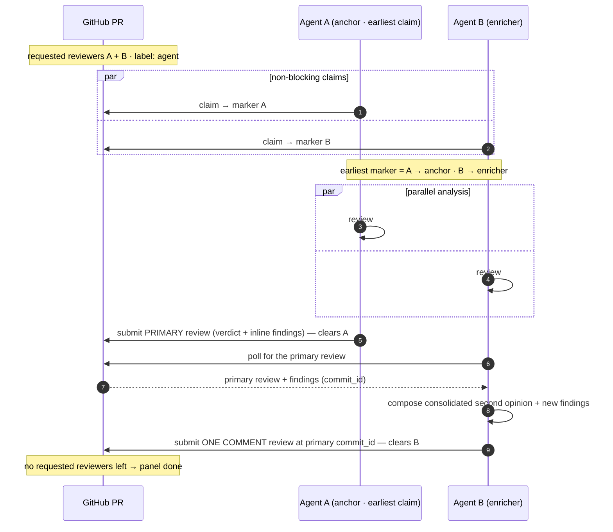
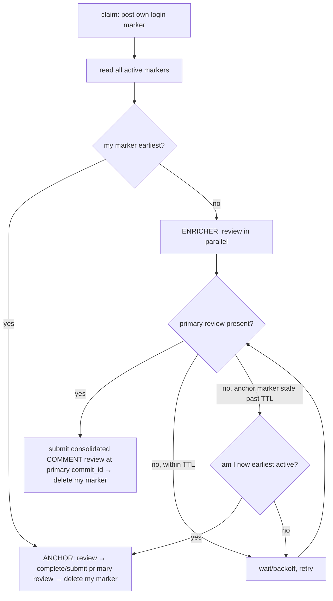

# Panel Review (Concurrent Multi-Reviewer) — Design Spec

- **Date:** 2026-07-30
- **Repo:** `input-output-hk/agent-peer-review`
- **Status:** Approved for planning
- **Builds on:** [`2026-07-29-agent-peer-review-design.md`](2026-07-29-agent-peer-review-design.md) (resolves its §17 parked multi-reviewer limitation)

## 1. Goal

When a PR requests review from more than one reviewer, **every** reviewer's agent picks it up and reviews it concurrently — even while another agent's review is already in progress. The first agent to claim posts the **primary review**; later agents review in parallel, wait for the primary to publish, then post a **single consolidated second opinion** (overall agree/disagree plus any net-new findings). A single requested reviewer behaves exactly as today.

## 2. Approved decisions

- **Anchor selection = earliest claim.** Across all active claim markers, the earliest by `(claimedAt, commentId)` is the **anchor**; everyone else is an **enricher**. Deterministic at claim time, no publish race.
- **Enricher output = one consolidated COMMENT review.** Enrichers do not post a competing approve/request-changes verdict and do not thread replies under individual findings. Each enricher submits **one** `COMMENT`-type review whose body is its consolidated second opinion and whose inline comments (if any) are its new findings. Submitting it also clears that reviewer from GitHub's requested list, so the PR drains naturally.

## 3. Model changes (from the single-lock base)

1. **Per-reviewer claim markers.** The claim marker is no longer a single PR-wide lock. Each agent posts its own marker keyed by its GitHub login. `claim` never refuses because another login holds a marker; it only resumes the agent's own prior marker or posts a fresh one. Markers coexist, one per reviewing login. (Marker shape is unchanged — it already carries `reviewer` = login.)
2. **Role via earliest claim.** After posting its marker, an agent reads all active markers; if its own is earliest it is the **anchor**, otherwise an **enricher**. Every agent computes this identically, so roles are consistent without coordination.
3. **Canonical reviewed commit = the primary review's `commit_id`.** The anchor pins its head SHA (as today) and submits the primary review against it. An enricher reviews that same commit: at enrich time it reads the primary review's `commit_id` rather than relying on its own marker SHA, so agreement lands on identical lines even if the PR head moved between claims.

## 4. Roles → GitHub primitives

| Role | Action | Primitive |
|---|---|---|
| **Anchor** (earliest claim) | Publish the primary review: verdict + inline findings | `submitReview(event, body, comments, commitId = pinned head SHA)` — clears the anchor's requested status (today's `complete`) |
| **Enricher** (later claims) | Review in parallel; await the primary; submit ONE consolidated `COMMENT` review (body = overall agree/disagree + reasoning; inline comments = new findings) at the primary's `commit_id` | `getReviews` + `listReviewComments` (read the primary) then `submitReview(event = COMMENT, …)` — clears the enricher's requested status |

The panel is complete when no requested reviewers remain (native GitHub state) — no custom status label.

## 5. Flow

## 6. Operations & gateway

- **`claim`** (changed): per-login marker; drop the cross-login refuse; return `role: "anchor" | "enricher"` computed from earliest active marker. Resume the agent's own marker if present.
- **`complete`** (unchanged): the **anchor** path — submit the primary review at the pinned SHA and delete the marker.
- **`enrich`** (new): the **enricher** path, a pure single-attempt op returning one of:
  - `{ status: "enriched", url }` — primary present: submit the consolidated COMMENT review at the primary's `commit_id`, delete the marker.
  - `{ status: "waiting" }` — no primary yet and within TTL: caller should back off and retry.
  - `{ status: "promote" }` — no primary and the anchor's marker is older than the TTL: caller should switch to the anchor path (`complete`).
  Keeping `enrich` synchronous and side-effect-light (no sleeps) makes every branch unit-testable; the **poll/back-off loop lives in the CLI verb and the orchestration skill**, not in `core`.
- **Gateway additions**: `getReviews(repo, pr): Review[]` (id, author, state, body, commitId, submittedAt) and `listReviewComments(repo, pr): ReviewComment[]` (id, path, line, body, author). `submitReview` already exists; the enricher reuses it with `event: "COMMENT"`.

## 7. Schema

- `EnrichmentSchema` — the enricher's input: `{ overallVerdict: "agree" | "disagree" | "mixed", summary: string, newFindings?: Array<{ path: string; line: number; body: string }> }`. Generated to `schemas/enrichment.schema.json` via the existing zod → JSON pipeline (and drift-gated).

## 8. Skills

- **`orchestration.md`**: add the panel branch — after `claim`, read `role`; if `enricher`, review in parallel, then loop `enrich` with back-off until `enriched` (or `promote` → run the anchor path).
- **`second-opinion.md`** (new skill, added to `SKILL_NAMES`): how to judge the primary's findings without rubber-stamping — confirm or refute each with reasoning, add only genuinely new findings, and state an honest overall verdict.

## 9. Interfaces

- **CLI**: `agent-review enrich --repo O/R --pr N [--poll <seconds>] [--timeout <seconds>]` — resolves role, and for an enricher runs the back-off loop over the `enrich` op (submitting the consolidated review once the primary lands, or promoting to anchor on TTL). Input findings via `--summary <text|@file>` + `--verdict` + `--comments @file`.
- **MCP**: `review_enrich` tool mirroring the op (single attempt; the host/skill loops).

## 10. Edge cases

- **Anchor crash** → TTL promotion: the earliest surviving enricher becomes the anchor and posts a top-level review, so the panel never deadlocks.
- **Single requested reviewer** → always the anchor; identical to current behavior (backward compatible).
- **Primary has no inline findings** → enricher gives an overall verdict in its consolidated body; no per-finding detail required.
- **Enricher finishes analysis before the primary publishes** → it holds only the *expression*; analysis already ran in parallel.
- **SHA drift between claims** → enricher uses the primary review's `commit_id`, so the panel always converges on one commit.

## 11. Acceptance criteria

- Multiple assigned reviewers' agents all claim the same PR without blocking each other (per-login markers).
- The earliest claimant posts the primary review; the rest post consolidated `COMMENT` reviews after it publishes.
- Enrichers review at the primary's `commit_id`.
- An abandoned anchor is superseded via TTL promotion.
- A single requested reviewer behaves exactly as before.
- `enrich` is unit-tested across all three branches (enriched / waiting / promote); a panel scenario (anchor + enricher) is covered end-to-end against the fake.
- New `second-opinion` skill + `enrichment` schema ship, and the docs site reflects the panel flow.

## 12. Out of scope

Per-finding threaded replies (deliberately consolidated); enricher approve/request-changes verdicts; chained enrichment (all enrichers respond to the primary, not to each other); more than the native requested-reviewer set for routing.
